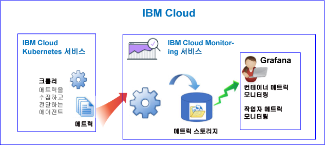
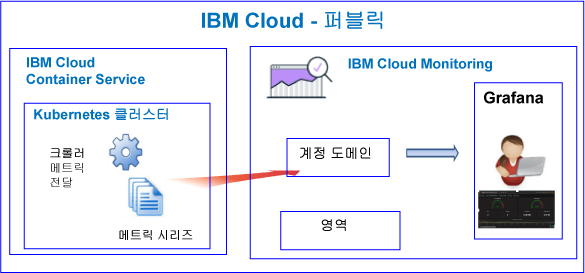
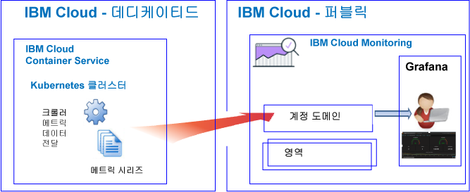

---

copyright:
  years: 2017, 2019

lastupdated: "2019-03-06"

keywords: IBM Cloud, monitoring

subcollection: cloud-monitoring

---

{:new_window: target="_blank"}
{:shortdesc: .shortdesc}
{:screen: .screen}
{:pre: .pre}
{:table: .aria-labeledby="caption"}
{:codeblock: .codeblock}
{:tip: .tip}
{:download: .download}
{:important: .important}
{:note: .note}

# {{site.data.keyword.containershort_notm}}
{: #monitoring_bmx_containers_ov}

{{site.data.keyword.Bluemix}}에서는 클러스터 메트릭이 자동으로 수집됩니다. Grafana를 사용하여 클러스터의 성능을 모니터링할 수 있습니다. 
{:shortdesc}

**참고:** 

* 메트릭은 표준 클러스터에서 실행 중인 컨테이너에 대한 {{site.data.keyword.monitoringshort}} 서비스를 통해 수집되고 모니터링에 사용될 수 있습니다.
* 클러스터 메트릭을 모니터하려면 모니터링 서비스의 인스턴스를 프로비저닝해야 합니다. 자세한 정보는 [모니터링 서비스 프로비저닝](/docs/services/cloud-monitoring/how-to/provision.html#provision)을 참조하십시오.

## 퍼블릭에서의 모니터링에 대한 정보
{: #public1}

{{site.data.keyword.Bluemix_notm}}에서 {{site.data.keyword.monitoringshort}} 서비스를 사용하여 퍼블릭에서 {{site.data.keyword.containershort}}에서 자동으로 수집한 컨테이너 메트릭 및 Kubernetes 클러스터 메트릭을 저장 및 분석할 수 있습니다.

계정에서는 하나 이상의 Kubernetes 클러스터를 보유할 수 있습니다. 메트릭은 클러스터가 프로비저닝되는 즉시 {{site.data.keyword.containershort}}에서 자동으로 수집합니다.  컨테이너 메트릭은 팟(Pod)이 배치되는 즉시 수집됩니다. 메트릭은 자동으로 {{site.data.keyword.monitoringshort}} 서비스로 전달됩니다.

클러스터를 작성하는 경우, 메트릭이 {{site.data.keyword.monitoringshort}} 서비스의 계정 도메인으로 전달됩니다. 메트릭이 계정 도메인으로 전달되려면 {{site.data.keyword.containershort}} 키 소유자가 다음 IAM 정책을 보유하고 있어야 합니다.

* {{site.data.keyword.monitoringshort}} 서비스에 대한 **편집기** 권한이 있는 IAM 정책
* {{site.data.keyword.containershort}}에 대한 **관리자** 권한이 있는 IAM 정책

다음 그림은 {{site.data.keyword.containershort}} 모니터링에 대한 상위 레벨 보기를 보여줍니다.

크롤러는 호스트에서 실행되며 메트릭에 대한 에이전트 없는 모니터링을 수행하는 프로세스입니다. 기본적으로 크롤러는 모든 컨테이너로부터 CPU 및 메모리 트릭을 지속적으로 수집합니다.

클러스터에 대한 Grafana에서 메트릭을 분석하려면, 다음 정보를 고려하십시오.

* 메트릭을 보기 위해 사용하는 {{site.data.keyword.monitoringshort}} 인스턴스가 프로비저닝되는 퍼블릭 지역에서 Grafana를 실행해야 합니다. 
* 기본 Grafana 대시보드인 **ClusterMonitoringDashboard**를 사용하여 클러스터를 모니터링할 수 있습니다.
* 또한 클러스터가 작성된 클라우드 퍼블릭 지역 내의 클러스터에 대한 메트릭 데이터를 시각화하도록 사용자 정의 Grafana 대시보드를 구성할 수 있습니다.
* 사용자 ID에 메트릭을 볼 수 있는 권한이 있어야 합니다. 

    계정 도메인에서 메트릭을 보려면 사용자에게 {{site.data.keyword.monitoringshort}} 서비스에 대한 IAM 정책이 필요합니다. 사용자에게 **뷰어** 권한이 필요합니다. 

다음 그림은 {{site.data.keyword.containershort}}에 대한 퍼블릭에서의 모니터링에 대한 상위 레벨 보기를 보여줍니다. 클러스터가 메트릭을 계정 도메인으로 전달합니다.

## 데디케이티드에서의 모니터링 정보
{: #dedicated}

{{site.data.keyword.Bluemix_notm}}에서 퍼블릭의 {{site.data.keyword.monitoringshort}} 서비스를 사용하여 데디케이티드의 {{site.data.keyword.containershort}}에서 자동으로 수집한 컨테이너 메트릭 및 Kubernetes 클러스터 메트릭을 저장 및 분석할 수 있습니다.

계정에서는 하나 이상의 Kubernetes 클러스터를 보유할 수 있습니다. 메트릭은 클러스터가 프로비저닝되는 즉시 {{site.data.keyword.containershort}}에서 자동으로 수집합니다.  컨테이너 메트릭은 팟(Pod)이 배치되는 즉시 수집됩니다. 메트릭은 자동으로 {{site.data.keyword.monitoringshort}} 서비스의 계정 도메인으로 전달됩니다.

클러스터를 작성하는 경우, 메트릭이 {{site.data.keyword.monitoringshort}} 서비스의 계정 도메인으로 전달됩니다. 메트릭이 계정 도메인으로 전달되려면 {{site.data.keyword.containershort}} 키 소유자가 다음 IAM 정책을 보유하고 있어야 합니다.

* {{site.data.keyword.monitoringshort}} 서비스에 대한 **편집기** 권한이 있는 IAM 정책
* {{site.data.keyword.containershort}}에 대한 **관리자** 권한이 있는 IAM 정책

Grafana에서 클러스터에 대한 메트릭을 보고 분석하려면 다음 정보를 고려하십시오.

* 데디케이티드에서 클러스터를 사용할 수 있는 클라우드 퍼블릭 지역에서 Grafana를 실행해야 합니다. 예를 들어, 클러스터가 미국 남부의 데디케이티드에서 프로비저닝된 경우, 미국 남부 지역의 퍼블릭에서 Grafana를 실행해야 합니다.
* 기본 Grafana 대시보드인 **ClusterMonitoringDashboard**를 사용하여 클러스터를 모니터링할 수 있습니다.
* 또한 클러스터가 작성된 클라우드 퍼블릭 지역 내의 클러스터에 대한 메트릭 데이터를 시각화하도록 사용자 정의 Grafana 대시보드를 구성할 수 있습니다.
* 사용자 ID가 {{site.data.keyword.monitoringshort}} 서비스를 사용하여 작업할 수 있는 IAM 정책을 보유하고 있어야 합니다. 계정 도메인에서 메트릭을 보려면 **뷰어** 권한이 필요합니다.  

다음 그림은 {{site.data.keyword.containershort}}에 대한 데디케이티드에서의 상위 레벨 모니터링 보기를 보여줍니다.

## 컨테이너: CPU 메트릭
{: #cpu_metrics_containers}

다음 표에는 컨테이너에 대해 자동으로 캡처되는 CPU 메트릭이 나열되어 있습니다.

|메트릭 |설명 | 단위 |
|----------|---------|---------|
| `cpu.num-cores` |이 메트릭은 컨테이너에 사용 가능한 CPU 코어의 수를 보고합니다.  기본적으로 이 메트릭은 작업자의 코어 수를 보고합니다. 컨테이너에 사용할 수 있는 코어 수에 대한 한계를 설정하면 이 메트릭이 해당 한계에서 설정한 코어 수를 보고합니다. | 10진수 |
| `cpu.usage` |이 메트릭은 모든 코어의 CPU 시간(나노초(ns))을 보고합니다.  CPU 사용량이 높은 경우에는 지연 시간이 발생할 수 있습니다. 높은 CPU 사용량은 처리 능력이 충분하지 않음을 나타냅니다. | 나노초 |
| `cpu.usage-pct` |이 메트릭은 사용되는 CPU 시간을 CPU 용량의 백분율로 보고합니다.  기본적으로 CPU 용량은 작업자의 코어 수에 따라 판별됩니다. 컨테이너 CPU 용량으로 한계를 설정하면 이 메트릭이 설정한 한계의 백분율로 CPU 사용량을 보고합니다. CPU 사용량의 백분율이 높은 경우에는 지연 시간이 발생할 수 있습니다. 높은 CPU 사용량은 처리 능력이 충분하지 않음을 나타냅니다. | 백분율 |
| `cpu.usage-pct-container-requested`  |이 메트릭은 사용된 CPU 시간을 컨테이너에서 요청된 CPU의 백분율로 보고합니다.  컨테이너에서 요청된 CPU를 설정하지 않으면 이 메트릭이 컨테이너에 대해 노출되지 않습니다. | 백분율 |
{: caption="컨테이너에 대한 CPU 메트릭" caption-side="top"} 

## 컨테이너: 메모리 메트릭
{: #memory_metrics}

다음 표에는 자동으로 캡처되는 메모리 메트릭이 나열되어 있습니다.

|메트릭 |설명 | 단위 |
|----------|---------|---------|
| `memory.current` |이 메트릭은 컨테이너가 현재 사용 중인 메모리의 바이트 수를 보고합니다. | 바이트 |
| `memory.limit` | 이 메트릭은 컨테이너의 메모리 한계를 보고합니다.  기본적으로 컨테이너는 메모리 한계가 무제한으로 설정되어 실행됩니다. 컨테이너는 자신이 실행 중인 작업자만큼의 메모리를 이용할 수 있습니다. 팟(Pod)을 배치할 때는 컨테이너가 사용할 수 있는 메모리 양에 대해 한계를 설정할 수 있습니다.  | 바이트 |
| `memory.usage-pct` |이 메트릭은 사용된 메모리를 컨테이너 메모리 한계의 백분율로 보고합니다.  컨테이너에서 사용할 수 있는 메모리의 양으로 한계를 설정하면 이 메트릭이 설정한 한계의 백분율로 메모리 사용량을 보고합니다. | 백분율 | 
| `memory.working-set` |이 메트릭은 컨테이너가 웜 캐시에서 현재 사용 중인 활성 메모리의 바이트 수를 보고합니다. | 바이트 |
{: caption="컨테이너에 대한 메모리 메트릭" caption-side="top"} 

## 팟(Pod): 네트워크 메트릭
{: #network_metrics_pods}

다음 표에는 데이터 수신과 관련되고 자동으로 캡처되는 네트워크 메트릭이 나열되어 있습니다.

|메트릭 |설명 | 단위 |
|----------|---------|---------|
| `container.namespace.podName.network.rx.bytes` | 이 메트릭은 팟에서 받는 바이트 수를 보고합니다.  | 바이트  |
| `container.namespace.podName.network.rx.error` | 이 메트릭은 프레임을 받는 중에 팟에서 발생한 오류 수를 보고합니다. | 숫자  |
| `container.namespace.podName.network.rx.packets` | 이 메트릭은 팟에서 받는 패킷 수를 보고합니다.  | 숫자  |
{: caption="팟의 RX 네트워크 메트릭" caption-side="top"} 

다음 표에는 데이터 전송과 관련되고 자동으로 캡처되는 네트워크 메트릭이 나열되어 있습니다.

|메트릭 |설명 | 단위 |
|----------|---------|---------|
| `container.namespace.podName.network.tx.bytes` | 이 메트릭은 팟으로 보낸 바이트 수를 보고합니다.  | 바이트  |
| `container.namespace.podName.network.tx.errors` | 이 메트릭은 프레임을 보내는 중에 팟에서 발생한 오류 수를 보고합니다.  | 숫자  |
| `container.namespace.podName.network.tx.packets` | 이 메트릭은 팟으로 보낸 패킷 수를 보고합니다.  | 숫자  |
{: caption="팟의 네트워크 메트릭" caption-side="top"} 

## 작업자: 디스크 메트릭
{: #disk_metrics_workers}

다음 표에는 작업자에 대해 자동으로 캡처되는 디스크 메트릭이 나열되어 있습니다.

|메트릭 |설명 | 단위 |
|----------|---------|---------|
| `worker.disk.diskDevice.read.bytes` | 이 메트릭은 디스크 디바이스의 읽기 IO 속도를 보고합니다.  | 바이트  |
| `worker.disk.diskDevice.read.io` | 이 메트릭은 디바이스의 읽기 처리량을 보고합니다.  | 초당 바이트 수  |
| `worker.disk.diskDevice.read.reads` | 이 메트릭은 디스크 디바이스의 최대 읽기 IO 속도를 보고합니다.  | 초당 바이트 수  |
| `worker.disk.diskDevice.read.waits` | 이 메트릭은 작업자가 읽기 IO 요청을 대기하는 시간을 보고합니다.  | 초당 바이트 수  |
| `worker.disk.diskDevice.write.bytes` | 이 메트릭은 디스크 디바이스의 쓰기 IO 속도를 보고합니다.  | 바이트  |
| `worker.disk.diskDevice.write.io` | 이 메트릭은 디바이스의 쓰기 처리량을 보고합니다.  | 초당 바이트 수  |
| `worker.disk.diskDevice.write.writes` | 이 메트릭은 디스크 디바이스의 최대 쓰기 IO 속도를 보고합니다.  | 초당 바이트 수  |
| `worker.disk.diskDevice.write.waits` | 이 메트릭은 작업자가 쓰기 IO 요청을 대기하는 시간을 보고합니다.  | 초당 바이트 수  |
| `worker.disk.diskDevice.size`| 이 메트릭은 디바이스의 스토리지 용량을 보고합니다.  | 바이트  |
| `worker.disk.diskDevice.used` | 이 메트릭은 디바이스에서 사용한 바이트 수를 보고합니다.  | 바이트  |
| `worker.disk.diskDevice.usedpct` | 이 메트릭은 디바이스에서 사용한 스토리지의 백분율을 보고합니다.  | 백분율  |
{: caption="작업자의 디스크 메트릭" caption-side="top"} 

## 작업자: 로드 메트릭
{: #load_metrics_workers}

다음 표에는 작업자에 대해 자동으로 캡처되는 CPU 메트릭이 나열되어 있습니다.

|메트릭 |설명 | 단위 |
|----------|---------|---------|
| `load.avg-1` |이 메트릭은 지난 1분 동안의 Kubernetes 호스트에 대한 평균 CPU 로드를 보고합니다.  평균 CPU 로드가 작업자의 코어 수보다 큰 경우 호스트에 대한 트래픽이 큐에 대기 중임을 표시합니다.  | 숫자  |
| `load.avg-5` |이 메트릭은 지난 5분 동안의 Kubernetes 호스트에 대한 평균 CPU 로드를 보고합니다.  평균 CPU 로드가 작업자의 코어 수보다 큰 경우 호스트에 대한 트래픽이 큐에 대기 중임을 표시합니다.  | 숫자  |
| `load.avg-15` |이 메트릭은 지난 15분 동안의 Kubernetes 호스트에 대한 평균 CPU 로드를 보고합니다.  평균 CPU 로드가 작업자의 코어 수보다 큰 경우 호스트에 대한 트래픽이 큐에 대기 중임을 표시합니다.  | 숫자 |
{: caption="작업자에 대한 로드 메트릭" caption-side="top"} 

## 작업자: 메모리 메트릭
{: #memory_metrics_workers}

다음 표에는 작업자에 대해 자동으로 캡처되는 메모리 메트릭이 나열되어 있습니다.

|메트릭 |설명 | 단위 |
|----------|---------|---------|
| `memory.available` | 이 메트릭은 작업자가 사용할 수 있는 메모리 바이트 수를 보고합니다.   | 바이트  |
| `memory.used` | 이 메트릭은 작업자가 현재 사용 중인 메모리의 바이트 수를 보고합니다.  | 바이트  |
{: caption="작업자의 메모리 메트릭" caption-side="top"} 

## 작업자: 네트워크 메트릭
{: #network_metrics_workers}

다음 표에는 데이터 수신과 관련되고 자동으로 캡처되는 네트워크 메트릭이 나열되어 있습니다.

|메트릭 |설명 | 단위 |
|----------|---------|---------|
| `network.interface.rx.bytes` | 이 메트릭은 작업자가 인터페이스에서 받은 바이트 수를 보고합니다.  | 바이트  |
| `network.interface.rx.errs` | 이 메트릭은 인터페이스에서 프레임을 받는 중에 작업자에서 발생한 오류 수를 보고합니다. | 숫자 |
| `network.interface.rx.packets` | 이 메트릭은 작업자가 인터페이스에서 받은 패킷 수를 보고합니다. | 숫자 |
{: caption="작업자의 RX 네트워크 메트릭" caption-side="top"} 

다음 표에는 데이터 전송과 관련되고 자동으로 캡처되는 네트워크 메트릭이 나열되어 있습니다.

|메트릭 |설명 | 단위 |
|----------|---------|---------|
| `network.interface.tx.bytes` | 이 메트릭은 작업자가 인터페이스를 통해 보낸 바이트 수를 보고합니다. | 바이트  |
| `network.interface.tx.err` | 이 메트릭은 인터페이스에서 프레임을 보내는 중에 작업자에서 발생한 오류 수를 보고합니다.  | 숫자  |
| `network.interface.tx.packets` | 이 메트릭은 작업자가 인터페이스를 통해 보낸 패킷 수를 보고합니다.  | 숫자  |
{: caption="작업자의 TX 네트워크 메트릭" caption-side="top"} 

다음 표에는 열린 소켓과 관련되고 자동으로 캡처되는 네트워크 메트릭이 나열되어 있습니다.

|메트릭 |설명 | 단위 |
|----------|---------|---------|
| `network.sockets.udp`  `network.sockets.udp6`  `network.sockets.tcp`  `network.sockets.tcp6.open` | 이 메트릭은 프로토콜의 열린 소켓 수를 보고합니다.   | 숫자  |
|`network.sockets.tcp`  `network.sockets.tcp6.timewait` | 이 메트릭은 `시간 대기` 상태에 있는 열려 있는 TCP 소켓 수를 보고합니다.  | 숫자  |
{: caption="작업자의 소켓 네트워크 메트릭" caption-side="top"} 

## Kubernetes 클러스터에서 리소스를 모니터링하기 위한 조회 정의
{: #monitoring_metrics_kube}

{{site.data.keyword.Bluemix_notm}}에서 Kubernetes 클러스터에 배치되는 컨테이너 및 작업자의 성능을 모니터링하려면 Grafana를 사용하십시오. 

{{site.data.keyword.monitoringlong}} 서비스는 오픈 소스 분석 및 시각화 플랫폼인 Grafana를 사용하여 메트릭을 모니터링하고, 검색하고, 분석하고, 다양한 그래프(예: 차트 및 표)로 시각화합니다.

Grafana는 브라우저에서 실행할 수 있습니다. 자세한 정보는 [웹 브라우저에서 Grafana 대시보드로 이동](/docs/services/cloud-monitoring/grafana/navigating_grafana.html#launch_grafana_from_browser)을 참조하십시오.

Kubernetes 클러스터에서 실행되는 컨테이너 및 작업자를 모니터링하려면 각 리소스에 대한 Grafana에서 조회를 정의해야 합니다.

* 컨테이너에 대한 CPU 메트릭을 모니터링하는 조회를 정의하려면 [Grafana에서 컨테이너에 대한 CPU 메트릭 구성](/docs/services/cloud-monitoring/containers/config_cpu_containers.html#config_cpu_containers)을 참조하십시오.
* 컨테이너에 대한 메모리 메트릭을 모니터링하는 조회를 정의하려면 [Grafana에서 컨테이너에 대한 메모리 메트릭 구성](/docs/services/cloud-monitoring/containers/config_mem_container.html#config_mem_container)을 참조하십시오.
* 작업자에 대한 로드 메트릭을 모니터링하는 조회를 정의하려면 [Grafana에서 작업자에 대한 로드 메트릭 구성](/docs/services/cloud-monitoring/containers/config_load_worker.html#config_load_worker)을 참조하십시오.

조회의 형식은 리소스 유형 및 조회 유형별로 다릅니다.

* 컨테이너에 대한 CPU를 모니터링할 조회의 형식에 대한 자세한 정보는 [컨테이너에 대한 CPU 메트릭 조회 형식](/docs/services/cloud-monitoring/reference/metrics_format_containers.html#cpu_containers)을 참조하십시오. 
* 작업자에 대한 로드를 모니터링할 조회의 형식에 대한 자세한 정보는 [작업자에 대한 로드 메트릭 조회 형식](/docs/services/cloud-monitoring/reference/metrics_format_containers.html#load_workers)을 참조하십시오.
* 컨테이너에 대한 메모리를 모니터링할 조회의 형식에 대한 자세한 정보는 [컨테이너에 대한 메모리 메트릭 조회 형식](/docs/services/cloud-monitoring/reference/metrics_format_containers.html#mem_containers)을 참조하십시오.

## {{site.data.keyword.Bluemix_notm}}에서 사용자 정의 방화벽 구성에 대한 네트워크 트래픽 구성
{: #ports}

추가 방화벽을 설정한 경우 또는 {{site.data.keyword.Bluemix_notm}} 인프라(SoftLayer)에 사용자 정의된 방화벽 설정이 있는 경우, 작업자 노드에서 {{site.data.keyword.monitoringshort}} 서비스로 출력되는 네트워크 트래픽을 허용해야 합니다. 

사용자 정의된 방화벽에서 다음 IP 주소에 대해 각 작업자에서 {{site.data.keyword.monitoringshort}} 서비스로 TCP 포트 443 및 TCP 포트 9091을 열어야 합니다.

<table>
  <tr>
    <th>지역</th>
    <th>수집 URL</th>
	<th>공인 IP 주소</th>
  </tr>
  <tr>
    <td>독일</td>
	<td>ingest-eu-fra.logging.bluemix.net</td>
	<td>158.177.88.43  159.122.87.107</td>
  </tr>
  <tr>
    <td>영국</td>
	<td>ingest.logging.eu-gb.bluemix.net</td>
	<td>169.50.115.113</td>
  </tr>
  <tr>
    <td>미국 남부</td>
	<td>ingest.logging.ng.bluemix.net</td>
	<td>169.48.79.236  169.46.186.113</td>
  </tr>
  <tr>
    <td>시드니</td>
	<td>ingest-au-syd.logging.bluemix.net</td>
	<td>130.198.76.125  168.1.209.20</td>
  </tr>
</table>

## 튜토리얼
{: #tutorial}

{{site.data.keyword.monitoringshort}} 서비스를 사용하여 컨테이너의 성능을 모니터링하는 방법을 배우려면 [Kubernetes 클러스터에 배치된 앱에 대한 Grafana에서 메트릭 분석](/docs/services/cloud-monitoring/tutorials/container_service_metrics.html#container_service_metrics)을 참조하십시오.

{{site.data.keyword.monitoringshort}} 서비스에서 Grafana 대시보드를 작성하는 방법을 배우려면 [Kubernetes 클러스터를 모니터링하기 위해 Grafana 대시보드 작성](/docs/services/cloud-monitoring/tutorials/container_grafana_dashboard.html#container_grafana_dashboard)을 참조하십시오.
