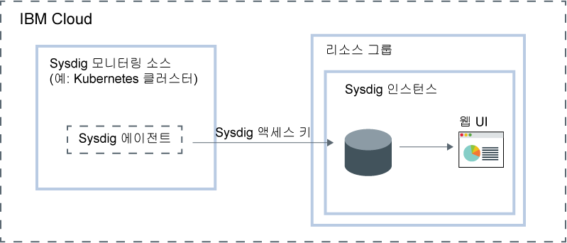

---

copyright:
  years:  2018, 2019
lastupdated: "2019-05-09"

keywords: Sysdig, IBM Cloud, monitoring, getting started

subcollection: Sysdig

---

{:new_window: target="_blank"}
{:shortdesc: .shortdesc}
{:screen: .screen}
{:pre: .pre}
{:table: .aria-labeledby="caption"}
{:codeblock: .codeblock}
{:tip: .tip}
{:download: .download}
{:important: .important}
{:note: .note}

# 시작하기 튜토리얼
{: #getting-started}

{{site.data.keyword.mon_full_notm}}은 {{site.data.keyword.cloud_notm}} 아키텍처의 일부로서 포함할 수 있는 서드파티 클라우드 고유의 컨테이너 인텔리전스 관리 시스템입니다. 이를 사용하여 애플리케이션, 서비스 및 플랫폼의 성능과 상태에 대한 운영상의 가시성을 얻을 수 있습니다. 이는 관리자, DevOps 팀과 개발자에게 모니터링 및 문제점 해결, 경보 정의 및 사용자 정의 대시보드 설계를 위한 고급 기능을 갖춘 풀스택(full-stack) 텔레메트리를 제공합니다. {{site.data.keyword.mon_full_notm}}은 {{site.data.keyword.IBM_notm}}과의 파트너십으로 Sysdig에 의해 운영됩니다.
{:shortdesc}

다음 그림은 {{site.data.keyword.cloud_notm}}에서 실행 중인 {{site.data.keyword.mon_full_notm}} 서비스에 대한 컴포넌트 개요를 보여줍니다.

## 기능
{: #features}

**성능 인시던트의 진단 및 분석을 가속화합니다.**

{{site.data.keyword.mon_full_notm}}은 서비스 레벨에서 시스템 레벨에 이르기까지의 문제점 해결 기능을 사용하여 인프라 및 애플리케이션에 대한 심층적인 가시성을 제공합니다. 사전 정의된 대시보드 및 경보는 잠재적인 위협 또는 문제점의 식별을 단순화합니다. {{site.data.keyword.mon_full_notm}}을 사용하여 개발자와 DevOps 팀은 실시간으로 성능을 모니터하고 해당 문제점을 해결하며 오류의 소스를 식별하고 문제점을 제거합니다. 

**모니터링 인프라의 비용을 제어합니다.**

{{site.data.keyword.mon_full_notm}}에는 {{site.data.keyword.cloud_notm}}에서 모니터링 인프라의 비용을 제어하는 데 도움이 되는 기능이 포함되어 있습니다. 해당 성능을 모니터하고자 하는 메트릭 소스를 구성할 수 있습니다. 사전 정의된 경보를 사용으로 설정하여 비용 청구에 영향을 줄 사용량 변경에 대해 경고하도록 할 수 있습니다. 

**전체 환경을 손쉽게 탐색하고 시각화합니다.**

{{site.data.keyword.mon_full_notm}}은 사용자 환경을 시각적으로 탐색하기 쉽도록 합니다. 동적 토폴로지 맵은 서비스 간의 종속성에 대한 보기를 제공합니다. 높은 가입자 이탈률, 높은 카디널리티, 높은 빈도 메트릭 간의 다차원 조회는 문제점 해결을 가속화합니다. 사용자 정의할 수 있는 대시보드를 사용하면 가장 큰 문제점을 시각화할 수 있습니다. 

**동적 마이크로서비스 모니터링에 대한 중요한 Kubernetes 및 컨테이너 인사이트를 가져옵니다. **

{{site.data.keyword.mon_full_notm}}은 Kubernetes 환경을 자동 감지하여 클러스터, 노드, 네임스페이스, 서비스, 배치, 팟(Pod) 등에 대한 특수 대시보드 및 경보를 제공합니다. 노드당 단일 에이전트는 Kubernetes, 호스트, 네트워크, 컨테이너, 프로세스, 애플리케이션 및 사용자 정의 메트릭(예: Prometheus, JMX 및 StatsD)을 포함하여 다양한 소스로부터 모든 마이크로서비스 및 자동 수집 메트릭과 이벤트를 동적으로 검색합니다. 

**선제적 알림으로 비정상적인 상황의 영향을 줄입니다.**

{{site.data.keyword.mon_full_notm}}에는 경보 및 다중 채널 알림이 포함되어 있으며, 이를 사용하여 사용자는 일상적인 오퍼레이션에서의 영향을 줄이고 비정상, 작동 중지 시간 및 성능 저하에 대한 사용자의 반응 및 응답 시간을 가속화할 수 있습니다. 손쉽게 구성이 가능한 알림 채널에는 *이메일*, *slack*, *PagerDuty*, *웹훅*, *OpsGenie* 및 *VictorOps* 등이 있습니다.

## 시작하기 전에
{: #prereqs}

{{site.data.keyword.cloud_notm}} 계정의 소유자 또는 구성원인 사용자 ID가 있어야 합니다. {{site.data.keyword.cloud_notm}} 사용자 ID를 가져오려면 [등록 ](https://cloud.ibm.com/login){:new_window}으로 이동하십시오.

이 서비스는 다음 지역에서 사용 가능합니다.
* *미국 남부*
* *EU-DE*
* *EU-GB*
* *JP-TOK*

지원되는 지역 중 하나에서 시작하기 단계를 완료할 수 있습니다.

## 1단계: 사용자 액세스 관리
{: #step1}

계정의 {{site.data.keyword.mon_full_notm}} 서비스에 액세스하는 모든 사용자에게는 IAM 사용자 역할이 정의된 액세스 정책이 지정되어야 합니다. 정책은 선택된 서비스 또는 인스턴스의 컨텍스트 내에서 사용자가 수행할 수 있는 조치를 판별합니다. 허용되는 조치는 서비스에서 수행될 수 있는 오퍼레이션으로서 사용자 정의 및 정의됩니다. 그리고 조치는 IAM 사용자 역할에 맵핑됩니다. 자세한 정보는 [{{site.data.keyword.cloud_notm}}에서 사용자 액세스 관리](/docs/services/Monitoring-with-Sysdig?topic=Sysdig-iam#iam)를 참조하십시오.

{{site.data.keyword.mon_full_notm}} 서비스 관련 작업을 위해 {{site.data.keyword.cloud_notm}}에서 사용자에게 권한이 부여된 경우, 해당 사용자에게는 자동으로 Sysdig 역할이 부여됩니다. 이 역할은 사용자에게 실행 권한이 있는 조치를 판별합니다. 유효한 역할은 *Sysdig admin* 및 *Sysdig 사용자*입니다. 자세한 정보는 [Sysdig 역할을 {{site.data.keyword.cloud_notm}} 역할에 맵핑](/docs/services/Monitoring-with-Sysdig?topic=Sysdig-iam#iam_sysdig)을 참조하십시오.

인스턴스를 프로비저닝하려면 우선 다음 정보를 고려하십시오.
* 계정 소유자는 {{site.data.keyword.cloud_notm}}에서 서비스 인스턴스의 작성, 보기 및 삭제를 수행할 수 있으며 {{site.data.keyword.mon_full_notm}} 서비스 관련 작업을 위해 기타 사용자에게 권한을 부여할 수 있습니다.
* *기본* 리소스 그룹의 리소스를 작성할 권한이 있어야 합니다.
* `관리자` 또는 `편집자` 권한이 있는 기타 {{site.data.keyword.cloud_notm}} 사용자는 {{site.data.keyword.cloud_notm}}에서 {{site.data.keyword.mon_full_notm}} 서비스를 관리할 수 있습니다. 이러한 사용자에게는 인스턴스를 프로비저닝할 계획인 리소스 그룹의 컨텍스트 내에서 리소스를 작성할 수 있는 플랫폼 권한도 있어야 합니다.

서비스에 대한 사용자 관리자 역할을 부여하고 계정의 리소스 그룹 내에서 인스턴스를 관리하려면 사용자에게 리소스 그룹의 컨텍스트 내에서 플랫폼 역할 **관리자**의 {{site.data.keyword.mon_full_notm}} 서비스에 대한 IAM 정책이 있어야 합니다. 

리소스 그룹의 컨텍스트 내에서 {{site.data.keyword.mon_full_notm}} 서비스에 대해 사용자 관리자 역할을 지정하려면 다음 단계를 완료하십시오. 

1. 메뉴 표시줄에서 **관리** &gt; **액세스(IAM)**를 클릭한 후에 **사용자**를 선택하십시오.
2. 액세스를 지정할 사용자에 대한 행에서 **조치** 메뉴를 선택한 후에 **액세스 지정**을 선택하십시오.
3. **리소스 그룹 내의 액세스 지정**을 선택하십시오.
4. 리소스 그룹을 선택하십시오.
5. 선택된 리소스 그룹에 대해 사용자에게 아직 역할이 부여되지 않은 경우에는 **리소스 그룹에 대한 액세스 지정** 필드에 대한 역할을 선택하십시오. 

    선택된 역할에 따라, 사용자는 대시보드에서 리소스 그룹을 보고 리소스 그룹 이름을 편집하거나 그룹에 대한 사용자 액세스를 관리할 수 있습니다. 
    
    사용자가 리소스 그룹의 {{site.data.keyword.mon_full_notm}} 서비스에 대한 액세스 권한만 갖도록 하려면 **액세스 없음**을 선택할 수 있습니다.

6. **{{site.data.keyword.mon_full_notm}}**을 선택하십시오.
7. 플랫폼 역할 **관리자**를 선택하십시오.
8. **지정**을 클릭하십시오.

## 2단계: {{site.data.keyword.mon_full_notm}} 서비스의 인스턴스 프로비저닝
{: #step2}

{{site.data.keyword.cloud_notm}}에서 {{site.data.keyword.mon_full_notm}}의 모니터링 기능을 추가하려면 {{site.data.keyword.mon_full_notm}} 서비스의 인스턴스를 프로비저닝해야 합니다. 

인스턴스를 프로비저닝하면 데이터가 서드파티에 전송됩니다.
{: tip}

사용자는 리소스 그룹의 컨텍스트 내에서 인스턴스를 프로비저닝합니다. 리소스 그룹을 사용하면 액세스 제어 및 비용 청구 용도로 서비스를 구성할 수 있습니다. *기본* 리소스 그룹 또는 사용자 정의 리소스 그룹에서 {{site.data.keyword.mon_full_notm}} 인스턴스를 프로비저닝할 수 있습니다.

인스턴스를 프로비저닝하면 *Sysdig 액세스 키*라고 하는 수집 키를 자동으로 받습니다.

{{site.data.keyword.cloud_notm}} UI를 통해 인스턴스를 프로비저닝하려면 다음 단계를 완료하십시오.

1. {{site.data.keyword.cloud_notm}} 계정에 로그인하십시오.

    [{{site.data.keyword.cloud_notm}} 대시보드 ](https://cloud.ibm.com/login){:new_window}를 클릭하여 {{site.data.keyword.cloud_notm}} 대시보드를 실행하십시오.

	사용자 ID 및 비밀번호를 사용하여 로그인하면 {{site.data.keyword.cloud_notm}} UI가 열립니다.

2. **카탈로그**를 클릭하십시오. {{site.data.keyword.cloud_notm}}에서 사용 가능한 서비스의 목록이 열립니다.

3. 표시된 서비스의 목록을 필터링하려면 **개발자 도구** 카테고리를 선택하십시오.

4. **{{site.data.keyword.mon_full_notm}}** 타일을 클릭하십시오.

5. 서비스 플랜을 선택하십시오. 기본적으로 **체험판** 플랜이 설정됩니다.

    서비스 플랜에 대한 자세한 정보는 [가격](/docs/services/Monitoring-with-Sysdig?topic=Sysdig-pricing_plans#pricing_plans)을 참조하십시오.

6. 리소스 그룹을 선택하십시오. 기본적으로 **기본** 리소스 그룹이 설정됩니다.

7. **작성**을 클릭하여 인스턴스를 프로비저닝하십시오.

서비스 UI가 열립니다.

**참고:** CLI를 통해 Sysdig의 인스턴스를 프로비저닝하려면 [{{site.data.keyword.cloud_notm}} CLI를 통해 Sysdig 프로비저닝](/docs/services/Monitoring-with-Sysdig?topic=Sysdig-provision#provision_cli)을 참조하십시오.

## 3단계: Sysdig 에이전트 구성
{: #step3}

인스턴스를 프로비저닝한 후에는 모니터하고자 하는 각 메트릭 소스에 대해 Sysdig 에이전트를 구성해야 합니다. 메트릭 소스는 해당 성능과 상태를 모니터하고 제어할 클라우드 리소스입니다. 예를 들어, 메트릭 소스는 Kubernetes 클러스터일 수 있습니다.  

Sysdig 에이전트는 사전 정의된 메트릭을 자동으로 수집하고 이에 대해 보고합니다. *Sysdig 액세스 키*를 사용하여 메트릭 데이터를 수집하고 이를 인스턴스에 전달하는 일을 담당하는 Sysdig 에이전트를 구성할 수 있습니다. 자세한 정보는 [액세스 키 관련 작업](/docs/services/Monitoring-with-Sysdig?topic=Sysdig-access_key#access_key)을 참조하십시오.

다음의 환경에 대해 Sysdig 에이전트를 구성할 수 있습니다.

* Kubernetes, GKE 및 OpenShift.
* Docker 컨테이너 또는 컨테이너화되지 않은 서비스의 경우.
* Mesos, Marathon 및 DCOS.
* Linux 설치.

예를 들어, Sysdig 인스턴스에 메트릭을 전송하도록 Kubernetes 클러스터를 구성하려면 클러스터의 각 노드에 `sysdig-agent` 팟(Pod)을 설치해야 합니다. Sysdig 에이전트는 설치된 팟(Pod)에서 데이터를 수집하며 이를 Sysdig 인스턴스에 전달합니다.

Sysdig 에이전트 배치 방법에 대해 알아보려면 다음 튜토리얼 중 하나를 완료하십시오.

| 리소스                |	 튜토리얼                        | 환경                | 시나리오   |
|-------------------------|---------------------------------|----------------------------|------------|
| {{site.data.keyword.containershort}}에서 실행 중인 컨테이너 |[Kubernetes 클러스터에 배치된 앱에 대한 메트릭 분석](/docs/services/Monitoring-with-Sysdig?topic=Sysdig-kubernetes_cluster#kubernetes_cluster) | {{site.data.keyword.cloud_notm}} 퍼블릭 |  |
|Linux Ubuntu/Debian | [Ubuntu 서버에 대한 메트릭 분석](/docs/services/Monitoring-with-Sysdig?topic=Sysdig-ubuntu#ubuntu) | 온프레미스 |  |
{: caption="표 1. {{site.data.keyword.mon_full_notm}} 관련 작업을 시작하기 위한 튜토리얼" caption-side="top"} 

자세한 정보는 [Sysdig 에이전트 구성](/docs/services/Monitoring-with-Sysdig?topic=Sysdig-config_agent#config_agent) 및 [Sysdig 에이전트 제거](/docs/services/Monitoring-with-Sysdig?topic=Sysdig-remove#remove)를 참조하십시오.

Sysdig 에이전트가 배치되면 메트릭 수집 및 인스턴스에 메트릭 전달이 자동으로 이루어집니다. Sysdig 에이전트는 사전 정의된 메트릭을 자동으로 수집하고 이에 대해 보고합니다. 사용자는 환경에서 모니터할 메트릭을 구성할 수도 있습니다. 사용자 정의 메트릭에 대한 데이터 역시 자동으로 수집됩니다.

## 4단계: 웹 UI 실행
{: #step4}

{{site.data.keyword.Bluemix}}에서 {{site.data.keyword.mon_full_notm}} 서비스의 인스턴스를 프로비저닝하고 노드에 대한 Sysdig 에이전트를 구성한 후에는 서비스의 웹 UI를 통해 데이터를 보고 모니터하며 관리할 수 있습니다.

{{site.data.keyword.cloud_notm}} UI에서, Sysdig 인스턴스의 컨텍스트 내에서 웹 UI를 실행하십시오. 

Sysdig 웹 UI를 실행하려면 다음 단계를 완료하십시오.

1. {{site.data.keyword.cloud_notm}} 계정에 로그인하십시오.

    [{{site.data.keyword.cloud_notm}} 대시보드 ](https://cloud.ibm.com/login){:new_window}를 클릭하여 {{site.data.keyword.cloud_notm}} 대시보드를 실행하십시오.

	사용자 ID 및 비밀번호를 사용하여 로그인하면 {{site.data.keyword.cloud_notm}} 대시보드가 열립니다.

2. 탐색 메뉴에서 **식별성**을 선택하십시오. 

3. **모니터링**을 선택하십시오. 

    {{site.data.keyword.cloud_notm}}에서 사용 가능한 모니터링 인스턴스의 목록이 표시됩니다.

4. 하나의 인스턴스를 선택하십시오. 그리고 **Sysdig 보기**를 클릭하십시오.

{{site.data.keyword.mon_full_notm}} 웹 UI가 열립니다. 기본적으로 *탐색* 탭이 표시됩니다.

기본적으로, 사용자는 각 {{site.data.keyword.mon_full_notm}} 인스턴스에 대해 사전 정의된 **모니터 오퍼레이션** 팀의 구성원으로서 자동으로 추가됩니다. 사용자에게는 웹 UI의 모든 데이터를 볼 수 있는 전체 권한이 있습니다. **참고:** 관리자는 팀의 사용자를 관리하고 표시되는 데이터를 제어하여 데이터에 대한 액세스를 제한할 수 있습니다. 예를 들어, 사용자 보기 권한을 제한하기 위해 관리자는 제한된 범위와 가시성을 지닌 기본 팀을 작성할 수 있습니다. 그리고 사용자를 기타 팀에 수동으로 지정합니다. 자세한 정보는 [팀 관련 작업](/docs/services/Monitoring-with-Sysdig?topic=Sysdig-teams#teams)을 참조하십시오.

## 5단계: 환경 모니터링
{: #step5}

웹 UI의 *대시보드* 탭과 *탐색* 탭에서 데이터를 분석할 수 있습니다. 메트릭 보기 및 대시보드를 통해서는 데이터를 모니터합니다. 

* 메트릭 보기를 사용하여 개별 메트릭을 모니터할 수 있습니다.
* 대시보드를 사용하여 패널을 통해 데이터를 모니터링함으로써 네트워크 데이터, 애플리케이션 데이터, 토폴로지, 서비스, 호스트 및 컨테이너에 대한 전문적 인사이트를 얻을 수 있습니다. 패널은 대시보드에서 메트릭 또는 메트릭 그룹을 표시합니다.
{: tip}

*탐색* 탭에서는 기본 메트릭 및 기본 대시보드를 사용하여 데이터를 모니터할 수 있습니다. 레이블을 사용하여 새 인프라 그룹을 정의할 수 있으며, 나중에 이를 사용하여 데이터를 다른 방식으로 집계하고 사용자 환경을 모니터할 수 있습니다. 또한 *대시보드* 탭을 통해 정의된 사용자 정의 대시보드를 사용할 수도 있습니다.

*대시보드* 탭에서는 기본 대시보드를 사용하거나 새 대시보드를 작성하여 데이터를 모니터할 수 있습니다.

자세한 정보는 [환경 모니터링](/docs/services/Monitoring-with-Sysdig?topic=Sysdig-monitoring#monitoring)을 참조하십시오.

## 6단계: 데이터 관리
{: #step6}

레이블을 사용하여 인프라 리소스를 논리 계층 구조로 그룹화하고 데이터를 필터링하여 걸러내며 집계된 데이터를 세그먼트로 분할할 수 있습니다. 그래프를 구성하거나 메트릭에 대한 경보를 작성할 때 데이터 집계 방법을 사용자 정의하십시오. 데이터 점을 필터링하여 걸러내기 위한 경보 또는 패널, 대시보드의 범위를 설정하십시오. 팀을 통한 사용자의 데이터 액세스를 관리하여 데이터에 대한 액세스를 제한하십시오. 

예를 들어, 메트릭 보기의 경우 데이터의 범위, 데이터 집계 방법 및 데이터에 적용할 시간과 그룹 필터를 정의할 수 있습니다. 

자세한 정보는 [데이터 관리](/docs/services/Monitoring-with-Sysdig?topic=Sysdig-manage#manage)를 참조하십시오.

## 다음 단계: 경보 구성 및 이벤트 탐색
{: #next}

이벤트를 사용하여 문제를 검토, 추적 및 해결할 수 있습니다. 이벤트는 {{site.data.keyword.mon_full_notm}} 인스턴스에 데이터를 전달하는 노드에서 발생한 일에 대해 알려주는 알림입니다. 

다양한 유형의 이벤트가 있습니다. 

* *경보 이벤트*는 사용자 구성된 경보에 의해 트리거되는 이벤트입니다. 예를 들어, 주의를 요하는 문제점에 대한 알림을 받도록 경보를 구성합니다. 자세한 정보는 [경보 관련 작업](/docs/services/Monitoring-with-Sysdig?topic=Sysdig-monitoring#monitoring_alerts)을 참조하십시오.
* *인프라 기반 이벤트*는 Docker 및 Kubernetes 노드에서 수집된 이벤트입니다. 기본적으로 Sysdig 에이전트는 선택된 이벤트 그룹에서 데이터를 자동으로 검색하고 수집합니다. 에이전트 구성 파일을 편집하여 추가 이벤트를 사용으로 설정할 수 있습니다.
* Slackbot, 사전 빌드된 Python 스크립트, 사용자 정의 사용자 작성된 Python 스크립트 또는 cURL 요청 등의 통합을 통해 구성하는 *사용자 정의 이벤트*.

경보를 정의할 때는 알림을 트리거하는 조건, 알림을 받을 하나 이상의 알림 채널, 경보의 심각도 및 경보의 유형을 정의해야 합니다. 

사용자는 웹 UI의 *설정* 섹션에서 하나 이상의 알림 채널을 구성합니다. 유효한 알림 채널은 *이메일*, *slack*, *PagerDuty*, *웹훅*, *OpsGenie* 및 *VictorOps*입니다. 자세한 정보는 [알림 채널 관련 작업](/docs/services/Monitoring-with-Sysdig?topic=Sysdig-notifications#notifications)을 참조하십시오.

웹 UI의 *경보* 섹션은 사전 정의된 경보의 목록을 표시합니다. 이 보기에서 사전 정의된 경보를 사용 및 사용 안함으로 설정하고 기존 경보를 수정하며 새 경보를 작성할 수 있습니다. 자세한 정보는 [경보 관련 작업 ](https://sysdigdocs.atlassian.net/wiki/spaces/Monitor/pages/205324292/Alerts){:new_window}을 참조하십시오.

그 다음에는 [사용자 정의 이벤트 관련 작업 ](https://sysdigdocs.atlassian.net/wiki/spaces/Monitor/pages/222822463/Custom+Events){:new_window}을 참조하십시오.

