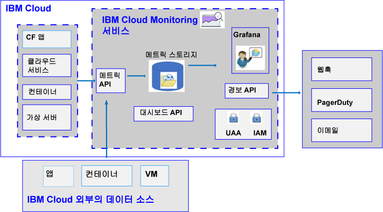

---

copyright:
  years: 2017, 2019

lastupdated: "2019-03-06"

keywords: IBM Cloud, monitoring

subcollection: cloud-monitoring

---

{:new_window: target="_blank"}
{:shortdesc: .shortdesc}
{:screen: .screen}
{:pre: .pre}
{:table: .aria-labeledby="caption"}
{:codeblock: .codeblock}
{:tip: .tip}
{:download: .download}
{:important: .important}
{:note: .note}

# 정보
{: #monitoring_ov}

메트릭에 대해 작업할 때의 수집 및 보존 기능을 확장하고 주의가 필요한 상태에 대해 알려주는 규칙 및 경보를 정의하려면 {{site.data.keyword.monitoringlong}} 서비스를 사용하십시오. 앱의 성능 및 리소스 이용에 대한 정보를 제공하는 기능을 통해 DevOps 팀의 역량을 강화하십시오. 신속하게 (상태)동향을 식별하고, 문제점을 발견 및 진단하십시오. 즉각적인 가치실현시간 및 낮은 총소유비용 또한 Bluemix를 통해 얻을 수 있는 이점입니다. 환경을 모니터하려면 Grafana를 사용하십시오. 
{:shortdesc}

다음 그림은 분석을 위해 {{site.data.keyword.monitoringshort}} 서비스에 메트릭을 전송할 수 있는 다양한 리소스에 대한 상위 레벨 보기를 보여줍니다.

{{site.data.keyword.Bluemix}}에서는 기본적으로 {{site.data.keyword.containershort}}의 CPU 사용량, 메모리 이용량 및 네트워크 I/O에 대한 메트릭을 수집하고 표시합니다. {{site.data.keyword.Bluemix_notm}}의 {{site.data.keyword.monitoringshort}} 서비스를 사용하여 환경 및 애플리케이션에서 주요 메트릭을 자동으로 수집하고 측정할 수 있습니다. 메트릭을 수집하는 데 특수 인스트루먼테이션이 필요하지는 않습니다. 예를 들면, 성능 메트릭에서 제공된 정보를 사용하여 클라우드에서 실행 중인 서비스의 상태를 모니터하고, 리소스 병목을 발견하고, 서비스 레벨 계약(SLA) 관련 내용을 지속적으로 살펴 볼 수 있습니다. 서비스의 성능 데이터를 분석하면 리소스 병목으로 발전하여 클라이언트에 대한 서비스 SLA에 영향을 줄 수 있는 상황을 발견할 수 있습니다. 조기에 조치를 취하여 비즈니스에 악영향을 줄 수 있는 상황을 방지할 수 있습니다.  

Cloud Foundry(CF) 애플리케이션 및 가상 머신(VM)에 대한 메트릭을 {{site.data.keyword.monitoringshort}} 서비스에 전송할 수 있습니다. 메트릭을 전송하는 방법에 대한 자세한 정보는 [{{site.data.keyword.monitoringshort}} 서비스에 메트릭 전송](/docs/services/cloud-monitoring/send_retrieve_metrics_ov.html#send_retrieve_metrics_ov)을 참조하십시오.

{{site.data.keyword.Bluemix_notm}} 카탈로그를 통해 {{site.data.keyword.monitoringshort}} 서비스를 프로비저닝할 수 있습니다.  

{{site.data.keyword.Bluemix_notm}} 대시보드를 통해 {{site.data.keyword.monitoringshort}} 서비스에서 수집한 메트릭을 보고 분석할 수 있습니다.  

## Monitoring 서비스를 사용하는 이유
{: #value}

1. **애플리케이션 인스트루먼테이션에 소요하는 시간을 줄이고 가치 증대에 투자하는 시간을 늘림**

    {{site.data.keyword.monitoringlong_notm}} 서비스는 자동으로 {{site.data.keyword.IBM_notm}} 클라우드 서비스에서 메트릭 데이터를 수집하므로 에이전트가 필요하지 않습니다. API는 쉽게 사용자 정의 메트릭을 추가하고 데이터를 모니터할 수 있게 해 줍니다. 
	
	{{site.data.keyword.monitoringlong_notm}} 서비스는 분당 1회의 메트릭 수집 서비스를 제공합니다.  Lite 플랜은 15일간 전체 해상도의 메트릭을 보존합니다.  프리미엄 플랜은 45일간 전체 해상도의 메트릭을 보존합니다.

2. **API를 사용하여 손쉽게 모니터링 기능을 애플리케이션으로 확장함**

    {{site.data.keyword.monitoringshort}} 서비스 API를 통해 애플리케이션 및 오퍼레이션에 모니터링 데이터를 통합하십시오. API를 사용하여 관련 애플리케이션 및 비즈니스 메트릭을 클라우드 모니터링 데이터에 추가하십시오. API를 사용하여 {{site.data.keyword.IBM_notm}} 클라우드 외부의 데이터를 {{site.data.keyword.monitoringshort}} 서비스로 전송할 수도 있습니다.

3. **신속하게 문제를 발견하고, 진단하고 식별할 수 있도록 환경에 대한 정보를 얻음**

    유연하며 사용자 정의할 수 있는 대시보드를 사용하여 애플리케이션 및 인프라의 상태를 시각화하십시오. {{site.data.keyword.monitoringlong_notm}}에서는 대시보드를 사용자의 필요에 맞춰 빠르게 빌드하고 변경할 수 있도록 사용자가 친숙한 Grafana의 기능 및 유연성을 제공합니다.
	
4. **재사용가능 대시보드 빌드 및 대화식 설정**

    {{site.data.keyword.monitoringlong_notm}} 서비스에서 호스팅하는 Grafana는 다양한 시각화 옵션을 포함하는 사용자 정의 대시보드를 빌드하는 데 필요한 지원을 제공합니다.  변수를 포함하는 메트릭 조회를 사용하여 템플리팅을 통해 동적인 대시보드를 작성하십시오.

5. **경보 받기**

    주의를 필요로 하는 상태에 대해 알려주는 규칙을 정의하십시오. {{site.data.keyword.monitoringlong_notm}} 서비스는 성능 임계값을 설정하고 이러한 임계값을 초과하는 경우 알림을 받는 데 사용할 수 있는 API를 제공합니다. 하나의 서비스 인스턴스 또는 앱 인스턴스에 대한 경보 규칙을 정의하거나, 인스턴스 세트에 대해 보고하는 경보 규칙을 정의하십시오. 경보가 트리거되면 이메일, PagerDuty 이벤트, 웹훅 알림 또는 이 세 가지 항목의 조합을 통해 알림을 받으십시오.

6. **자신에게 필요한 서비스 플랜 선택** 

    자신의 사용 필요성에 맞춰 Lite 서비스 플랜 또는 프리미엄 서비스 플랜을 선택할 수 있습니다.  Lite 플랜은 기본 플랫폼 메트릭 수집 기능과 이를 뒷받침하는 경보 기능을 제공합니다.  또는, 프리미엄 플랜을 선택하여 보존 기간이 더 긴 메트릭을 더 많이 이용하고, 여러 서비스 및 앱에 대해 보고하는 경보를 포함하는 더 많은 경보를 정의하고, 서비스 API에 대한 액세스 권한을 얻을 수 있습니다.

 
## 서비스 플랜
{: #plan}

{{site.data.keyword.monitoringshort}} 서비스는 다양한 플랜을 제공합니다. 각 플랜에는 서로 다른 메트릭 수집, 보존 및 경보 정의 기능이 있습니다. 

{{site.data.keyword.Bluemix_notm}} UI 또는 명령행을 통해 플랜을 변경할 수 있습니다. 플랜은 언제든지 업그레이드하거나 다운그레이드할 수 있습니다. {{site.data.keyword.Bluemix_notm}}의 서비스 플랜 업그레이드에 대한 자세한 정보는 [플랜 변경](/docs/services/cloud-monitoring/plan/change_plan.html#change_plan)을 참조하십시오. 

다음 표에는 영역에서 {{site.data.keyword.monitoringshort}} 서비스를 프로비저닝할 때 사용 가능한 플랜이 간략하게 설명되어 있습니다.

<table>
    <caption>표 1. 영역별 {{site.data.keyword.monitoringshort}} 서비스의 플랜 요약</caption>
      <tr>
        <th>플랜</th>
        <th>API를 사용한 메트릭 전송</th>
        <th>메트릭 보존 기간</th>
        <th>경보 수</th>
		    <th>알림 방법</th>
      </tr>
      <tr>
        <td>Lite(기본값)</td>
        <td>사용할 수 없음</td>
        <td>15일</td>
        <td>단일 메트릭 조회가 있는 최대 열 개의 경보 규칙 또는 와일드카드를 포함하는 한 개의 경보 규칙을 정의할 수 있습니다.</td>
		    <td>이메일</td>
      </tr>
      <tr>
        <td>프리미엄</td>
        <td>사용 가능</td>
        <td>45일</td>
        <td>와일드카드를 포함하는 규칙을 포함한 경보 규칙을 정의할 수 있습니다.</td>
		    <td>이메일, 웹훅, PagerDuty</td>
      </tr>
</table>

**참고:** Lite 플랜은 {{site.data.keyword.Bluemix_notm}}의 통합 모니터링 기능과 동일한 기능을 제공합니다. 계정 도메인은 Lite 플랜과 동일한 기능을 제공합니다.

## 메트릭 보존 기간
{: #metrics_retention}

다음 표에는 서비스 플랜에 따른 보존 기간이 요약되어 있습니다.

<table>
    <caption>표 2. {{site.data.keyword.monitoringshort}} 서비스의 보존 기간 요약</caption>
      <tr>
        <th>플랜</th>
        <th>보존 기간</th>
      </tr>
      <tr>
        <td>Lite(기본값)</td>
        <td>메트릭이 1분마다, 15일 동간 저장됩니다. (1m:15d)</td>
      </tr>
      <tr>
        <td>프리미엄</td>
        <td>메트릭이 1분마다, 45일 동간 저장됩니다. (1m:45d)</td>
      </tr>
</table>

최근 7일 동안 데이터를 수신하지 않은 메트릭은 삭제됩니다. {{site.data.keyword.monitoringshort}} 서비스는 지난 7일 동안 기록되지 않은 메트릭을 식별하여 임시적인 것으로 보이는 메트릭 경로의 모든 데이터를 삭제합니다. 예를 들어 다음과 같습니다.

* 컨테이너가 삭제된 경우, 해당 컨테이너와 연관된 메트릭은 메트릭이 삭제된 시점부터 7일 동안 보존됩니다.
* `<space_id>.test.statsd.gauge-hello`라는 이름의 statsd 게이지가 있으며 이 항목이 1주일 동안 기록되지 않은 경우에는 해당 메트릭이 임시적인 것으로 식별되며 이 메트릭이 모든 해당 히스토리 정보와 함께 삭제됩니다. 

## Monitoring 서비스 프로비저닝
{: #provision1}

{{site.data.keyword.Bluemix_notm}} 카탈로그에서는 **DevOps** 섹션에서 {{site.data.keyword.monitoringshort}} 서비스를 찾을 수 있습니다. {{site.data.keyword.Bluemix_notm}}에서 서비스를 프로비저닝하는 데 대한 자세한 정보는 [{{site.data.keyword.monitoringshort}} 서비스 프로비저닝](/docs/services/cloud-monitoring/how-to/provision.html#provision)을 참조하십시오.

{{site.data.keyword.monitoringshort}} 서비스에 대해 다음 정보를 고려하십시오.

* 영역당 하나의 {{site.data.keyword.monitoringshort}} 서비스 인스턴스만 프로비저닝할 수 있습니다.
* Cloud Foundry 영역에서 실행 중인 클라우드 리소스에 대한 메트릭을 수집하려면 리소스가 실행 중인 영역에 서비스를 프로비저닝해야 합니다.

## 지역
{: #regions}

다음 지역에서 {{site.data.keyword.monitoringshort}} 서비스를 사용할 수 있습니다.

* 독일
* 시드니
* 영국
* 미국 남부

## Monitoring 서비스의 URL
{: #region}

{{site.data.keyword.monitoringshort}} 서비스는 {{site.data.keyword.Bluemix_notm}} ID가 있으며 {{site.data.keyword.Bluemix_notm}}의 서비스를 사용하여 작업할 수 있는 권한이 있는 모든 사용자가 사용할 수 있습니다.

* {{site.data.keyword.monitoringshort}} 서비스가 사용 가능한 각 지역에는 서로 다른 엔드포인트 세트가 있습니다. 
* 수집 및 API/웹 UI 엔드포인트에서 공유하는 하나의 URL이 있습니다.
* 포트 443은 API 및 웹 UI(Grafana)를 통해 메트릭에 액세스하는 데 사용되는 TLS 포트입니다.

다음 표에는 지역별 URL이 나열되어 있습니다.

<table>
  <caption>표 3. {{site.data.keyword.monitoringshort}} 서비스에 대해 작업하는 데 필요한 엔드포인트 목록</caption>
  <tr>
    <th>지역</th>
	<th>엔드포인트</th>
  </tr>
  <tr>
    <td>독일</td>
	<td>[https://metrics.eu-de.bluemix.net](https://metrics.eu-de.bluemix.net)</td>
  </tr>
  <tr>
    <td>시드니</td>
	<td>[https://metrics.au-syd.bluemix.net](https://metrics.au-syd.bluemix.net)</td>
  </tr>
  <tr>
    <td>영국</td>
	<td>[https://metrics.eu-gb.bluemix.net](https://metrics.eu-gb.bluemix.net)</td>
  </tr>
  <tr>
    <td>미국 남부</td>
	<td>[https://metrics.ng.bluemix.net/](https://metrics.ng.bluemix.net/)</td>
  </tr>
</table>

