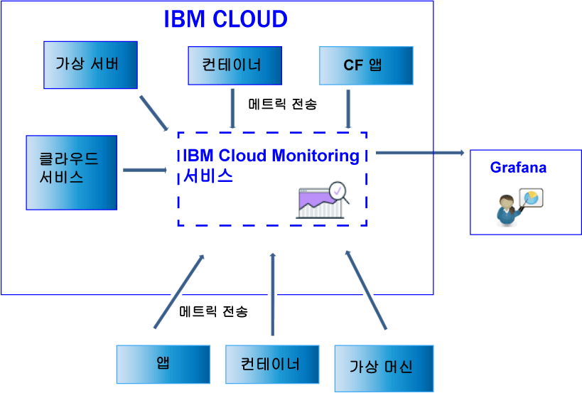

---

copyright:
  years: 2017, 2019

lastupdated: "2019-03-06"

keywords: IBM Cloud, monitoring

subcollection: cloud-monitoring

---

{:new_window: target="_blank"}
{:shortdesc: .shortdesc}
{:screen: .screen}
{:pre: .pre}
{:table: .aria-labeledby="caption"}
{:codeblock: .codeblock}
{:tip: .tip}
{:download: .download}
{:important: .important}
{:note: .note}

# 데이터 전송 및 검색
{: #send_retrieve_metrics_ov}

메트릭 API를 사용하거나 collectd 플러그인인 {{site.data.keyword.monitoringshort}} 플러그인을 구성하여 영역에 메트릭을 전송할 수 있습니다. 메트릭 API를 사용하여 메트릭을 검색할 수 있습니다.
{:shortdesc}

		
## 메트릭 전송
{: #send}

다음 그림은 {{site.data.keyword.monitoringshort}} 서비스에 메트릭을 전송할 수 있는 다양한 데이터 소스에 대한 상위 레벨 보기를 보여줍니다.

{{site.data.keyword.Bluemix_notm}}의 Kubernetes 클러스터에서 실행되는 컨테이너 및 선택한 서비스의 경우 기본 시스템 메트릭이 자동으로 수집됩니다. 
추가 메트릭을 수집하거나 {{site.data.keyword.IBM_notm}} 클라우드 외부의 메트릭을 {{site.data.keyword.monitoringshort}} 서비스로 전송할 수도 있습니다. 여러 가지 방법을 사용할 수 있습니다. 다음 표에는 메트릭 소스별 방법이 나열되어 있습니다.

<table>
  <caption>표 1. {{site.data.keyword.IBM_notm}} Cloud 리소스용 {{site.data.keyword.monitoringshort}} 서비스로 메트릭을 전송하는 방법</caption>
  <tr>
    <th>메트릭 소스</th>
	<th>메트릭 API</th>
    <th>{{site.data.keyword.monitoringshort}} 플러그인(collectd)</th>	
	<th>자세한 정보</th>
  </tr>
  <tr>
    <td>{{site.data.keyword.Bluemix_notm}}의 Kubernetes 클러스터에서 실행되는 컨테이너</td>
	<td>예</td>
	<td>예</td>
	<td>기본 시스템 메트릭은 자동으로 수집됩니다. 명시적으로 collectd를 설치하고 제공되지 않는 고급 또는 사용자 정의 메트릭을 전송할 수 있습니다.</td>
  </tr>
  <tr>
    <td>Cloud Foundry 애플리케이션</td>
	<td>예</td>
	<td>아니오</td>
	<td></td>
  </tr>
  <tr>
    <td>가상 서버 </td>
	<td>예</td>
	<td>예</td>
	<td>**참고:** Windows에는 지원되지 않습니다.</td>
  </tr>
</table>

<table>
  <caption>표 2. {{site.data.keyword.IBM_notm}} Cloud 외부의 {{site.data.keyword.monitoringshort}} 서비스로 메트릭을 전송하는 방법</caption>
  <tr>
    <th>메트릭 소스</th>
	<th>메트릭 API</th>
    <th>{{site.data.keyword.monitoringshort}} 플러그인(collectd)</th>	
	<th>자세한 정보</th>
  </tr>
  <tr>
    <td>컨테이너</td>
	<td>예</td>
	<td>예</td>
	<td>*supervisord*를 컨테이너 엔드포인트로 사용하여 앱과 collectd 모두를 실행하고 관리할 수 있습니다.</td>
  </tr>
  <tr>
    <td>애플리케이션</td>
	<td>예</td>
	<td>아니오</td>
	<td></td>
  </tr>
  <tr>
    <td>서비스</td>
	<td>예</td>
	<td>아니오</td>
	<td></td>
  </tr>
  <tr>
    <td>가상 머신(VM)</td>
	<td>예</td>
	<td>예</td>
	<td>**참고:** Windows에는 지원되지 않습니다.</td>
  </tr>
</table>

{{site.data.keyword.monitoringshort}} 서비스에 메트릭을 전송하려는 경우에는 다음 정보를 고려하십시오. 

* 메트릭을 전송하려는 영역을 지정해야 합니다.

* {{site.data.keyword.monitoringshort}} 서비스를 사용한 작업에 필요한 보안 토큰 또는 API 키를 제공해야 합니다. 

* 메트릭을 전송하는 사용자의 {{site.data.keyword.IBM_notm}} ID에는 {{site.data.keyword.monitoringshort}} 서비스에 대해 지정된 IAM 정책이 있어야 합니다. *관리자*, *편집자* 또는 *운영자* IAM 역할이 사용자가 메트릭을 전송하도록 허용합니다.

* 메트릭을 전송 중인 API 엔드포인트를 지정해야 합니다. 지역당 하나의 엔드포인트가 있습니다. 예를 들어, 미국 남부 지역의 경우 엔드포인트는 `https://metrics.ng.bluemix.net/v1/metrics`입니다. 엔드포인트에 대한 자세한 정보는 [{{site.data.keyword.monitoringshort}} 서비스의 URL](/docs/services/cloud-monitoring/monitoring_ov.html#region){: new_window}을 참조하십시오.

다음 방법 중 하나를 사용하여 메트릭을 {{site.data.keyword.monitoringshort}} 서비스에 전송할 수 있습니다.

* *방법 1: {{site.data.keyword.monitoringshort}} 플러그인을 구성합니다.*

    자세한 정보는 [{{site.data.keyword.monitoringshort}} 플러그인 구성](/docs/services/cloud-monitoring/send-metrics/conf_monitoring_plugin.html#conf_monitoring_plugin)을 참조하십시오.

    다음 그림은 {{site.data.keyword.monitoringshort}} 플러그인을 사용하여 {{site.data.keyword.monitoringshort}} 서비스에 메트릭을 전송하는 방법에 대한 상위 레벨 보기를 보여줍니다.

    

* *방법 2: 메트릭 API를 사용합니다.*

    자세한 정보는 [메트릭 API를 사용하여 메트릭 전송](/docs/services/cloud-monitoring/send-metrics/send_data_api.html#send_data_api)을 참조하십시오.

## 메트릭 검색
{: #retrieve}

{{site.data.keyword.monitoringshort}} 서비스 외부에서 추가 분석을 수행해야 하거나 애플리케이션에서 메트릭을 사용하여 의사결정을 내리려는 경우 메트릭 API를 사용하여 요청당 최대 5개의 메트릭을 검색할 수 있습니다. 

* 메트릭을 검색하는 방법에 대한 자세한 정보는 [도메인에서 메트릭 검색](/docs/services/cloud-monitoring/retrieve-metrics/retrieve_data_api.html#retrieve_data_api)을 참조하십시오.
* 메트릭 API에 대한 자세한 정보는 [메트릭 API](https://console.bluemix.net/apidocs/927-ibm-cloud-monitoring-rest-api?&language=node#introduction){: new_window}를 참조하십시오.

메트릭을 검색하려는 경우에는 다음 정보를 고려하십시오. 

* 데이터를 검색할 영역을 설정해야 합니다. 
* {{site.data.keyword.monitoringshort}} 서비스를 사용한 작업에 필요한 보안 토큰 또는 API 키를 제공해야 합니다. 
* 하나 이상의 메트릭에 대한 경로를 지정해야 합니다. 자세한 정보는 [메트릭 정의](/docs/services/cloud-monitoring/retrieve-metrics/retrieve_data_api.html#metrics)를 참조하십시오.
* 선택적으로 사용자 정의 기간을 지정할 수 있습니다. 기본적으로, 기간을 지정하지 않는 경우 검색되는 데이터는 최근 24시간에 해당하는 데이터입니다. 자세한 정보는 [기간 구성](/docs/services/cloud-monitoring/retrieve-metrics/retrieve_data_api.html#time)을 참조하십시오.

## 메트릭 나열
{: #show_metrics}

영역에서 사용 가능한 메트릭을 나열할 수 있습니다.

메트릭을 나열하려는 경우에는 다음 정보를 고려하십시오. 

* 사용 가능한 메트릭을 나열할 {{site.data.keyword.Bluemix_notm}} 영역을 설정해야 합니다.

* {{site.data.keyword.monitoringshort}} 서비스를 사용한 작업에 필요한 보안 토큰 또는 API 키를 제공해야 합니다. 

* 메트릭을 나열할 경로를 정의하는 조회를 지정해야 합니다. 예를 들어, 영역 내의 모든 메트릭을 나열하려는 경우에는 조회를 `query=*`로 설정할 수 있습니다. 

    기본값은 `*`이며 이는 시작점을 영역의 루트 레벨로 지정합니다.
	
* API 호출 `Endpoint/v1/metrics/list`를 사용할 수 있습니다. 여기서 Endpoint는 서비스에 대한 시작점을 나타냅니다. 

    각 지역의 URL은 서로 다릅니다. 예를 들어, 미국 남부 지역의 경우 API 엔드포인트 `https://metrics.ng.bluemix.net/v1/metrics/list`를 사용할 수 있습니다. 

    지역별 엔드포인트 목록을 가져오려면 [엔드포인트](/docs/services/cloud-monitoring/send_retrieve_metrics_ov.html#endpoints)를 참조하십시오.

    API에 대한 자세한 정보는 [메트릭 API](https://console.bluemix.net/apidocs/927-ibm-cloud-monitoring-rest-api?&language=node#introduction){: new_window}를 참조하십시오.

## 메트릭을 전송할 엔드포인트
{: #endpoints}

 다음 표에는 지역별 엔드포인트가 나열되어 있습니다.
	
<table>
    <caption>엔드포인트 목록</caption>
	<tr>
	  <th>지역</th>
	  <th>URL</th>
	  <th>collectd 포트</th>
	</tr>
	<tr>
	  <td>독일</td>
	  <td>[https://metrics.eu-de.bluemix.net](https://metrics.eu-de.bluemix.net)</td>
	  <td>9095</td>
	</tr>
	<tr>
	  <td>시드니</td>
	  <td>[https://metrics.au-syd.bluemix.net](https://metrics.au-syd.bluemix.net)</td>
	  <td>9095</td>
	</tr>
	<tr>
	  <td>영국</td>
	  <td>[https://metrics.eu-gb.bluemix.net](https://metrics.eu-gb.bluemix.net)</td>
	  <td>9095</td>
	</tr>
	<tr>
	  <td>미국 남부</td>
	  <td>[https://metrics.ng.bluemix.net](https://metrics.ng.bluemix.net)</td>
	  <td>9095</td>
	</tr>
</table>

 
