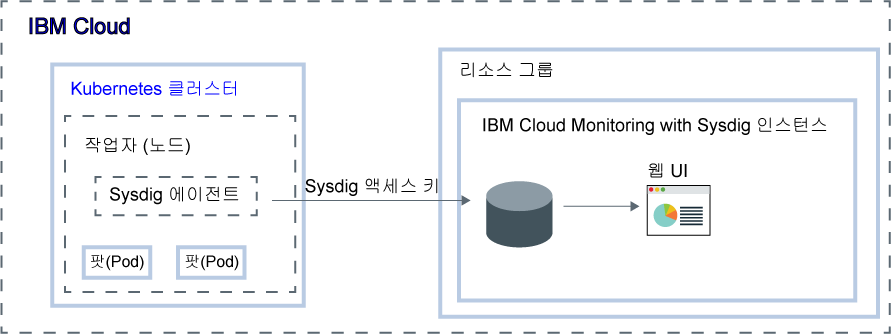

---

copyright:
  years:  2018, 2019
lastupdated: "2019-03-06"

keywords: Sysdig, IBM Cloud, monitoring, kubernetes, analyze metrics

subcollection: Sysdig

---

{:new_window: target="_blank"}
{:shortdesc: .shortdesc}
{:screen: .screen}
{:pre: .pre}
{:table: .aria-labeledby="caption"}
{:codeblock: .codeblock}
{:tip: .tip}
{:download: .download}
{:important: .important}
{:note: .note}


# Kubernetes 클러스터에 배치된 앱에 대한 메트릭 분석
{: #kubernetes_cluster}

이 튜토리얼을 사용하여 {{site.data.keyword.cloud_notm}}에서 {{site.data.keyword.mon_full_notm}} 서비스에 메트릭을 전달하도록 클러스터를 구성하는 방법을 알아볼 수 있습니다.
{:shortdesc}

{{site.data.keyword.mon_full_notm}} 서비스를 사용하여 Kubernetes 클러스터를 모니터할 수 있습니다.

메트릭을 전달하도록 클러스터를 구성하려면 DaemonSet를 사용하여 Kubernetes 클러스터의 각 작업자 노드에 에이전트를 설치해야 합니다. Sysdig 에이전트는 액세스 키(토큰)를 사용하여 {{site.data.keyword.mon_full_notm}} 인스턴스를 인증합니다. Sysdig 에이전트는 데이터 콜렉터의 역할을 수행합니다. 이는 *작업자 CPU* 및 작업자 메모리*, *컨테이너 내부/외부로의 HTTP 트래픽* 및 여러 가지의 공통 인프라 소프트웨어와 같은 메트릭을 자동으로 수집합니다. 또한 에이전트는 Prometheus 호환 가능 스크레이퍼 또는 statsd Facade를 사용하여 사용자 정의 애플리케이션 메트릭을 수집할 수 있습니다. 

사용자는 Sysdig의 웹 기반 사용자 인터페이스를 통해 메트릭을 봅니다.




## 시작하기 전에
{: #kubernetes_cluster_prereqs}

이 시작하기 튜토리얼의 단계를 완료하기 위해 미국 남부 지역에서 {{site.data.keyword.mon_full_notm}}의 인스턴스를 프로비저닝하기 위한 지시사항이 제공됩니다. 기존 클러스터를 사용하거나 새 **클러스터 버전 1.10**을 사용할 수 있습니다. 클러스터는 다른 지역에서도 사용 가능합니다.  

{{site.data.keyword.mon_full_notm}}에 대해 읽으십시오. 자세한 정보는 [제품 정보](/docs/services/Monitoring-with-Sysdig?topic=Sysdig-about#about)를 참조하십시오.

{{site.data.keyword.cloud_notm}} 계정의 소유자 또는 구성원인 사용자 ID를 사용하십시오. {{site.data.keyword.cloud_notm}} 사용자 ID를 가져오려면 [등록 ](https://cloud.ibm.com/login){:new_window}으로 이동하십시오.

{{site.data.keyword.IBM_notm}} ID에는 각각의 다음 리소스에 대한 IAM 정책이 지정되어 있어야 합니다. 

| 리소스                             | 액세스 정책의 범위 | 역할    | 지역    | 정보                  |
|--------------------------------------|----------------------------|---------|-----------|------------------------------|
| 리소스 그룹 **기본**           | 리소스 그룹            | 뷰어  | us-south  | 이 정책은 사용자가 기본 리소스 그룹의 서비스 인스턴스를 볼 수 있도록 허용하기 위해 필요합니다.    |
| {{site.data.keyword.mon_full_notm}} 서비스 | 리소스 그룹            | 편집자  | us-south  | 이 정책은 사용자가 기본 리소스 그룹의 {{site.data.keyword.mon_full_notm}} 서비스를 프로비저닝하고 관리할 수 있도록 허용하기 위해 필요합니다.   |
| Kubernetes 클러스터 인스턴스          | 리소스                 | 편집자  | us-south  | 이 정책은 Kubernetes 클러스터의 Sysdig 에이전트 및 시크릿을 구성하기 위해 필요합니다. |
{: caption="표 1. 튜토리얼 완료에 필요한 IAM 정책의 목록" caption-side="top"} 

{{site.data.keyword.containerlong}} IAM 역할에 대한 자세한 정보는 [사용자 액세스 권한](/docs/containers?topic=containers-access_reference#access_reference)을 참조하십시오.

{{site.data.keyword.cloud_notm}} CLI 및 Kubernetes CLI 플러그인을 설치하십시오. 자세한 정보는 [{{site.data.keyword.cloud_notm}} CLI 설치](/docs/cli?topic=cloud-cli-ibmcloud-cli#ibmcloud-cli)를 참조하십시오.


## 1단계: {{site.data.keyword.mon_full_notm}} 인스턴스 프로비저닝
{: #kubernetes_cluster_step1}

{{site.data.keyword.cloud_notm}} UI를 통해 {{site.data.keyword.mon_full_notm}}의 인스턴스를 프로비저닝하려면 다음 단계를 완료하십시오.

1. {{site.data.keyword.cloud_notm}} 계정에 로그인하십시오.

    [{{site.data.keyword.cloud_notm}} 대시보드 ](https://cloud.ibm.com/login){:new_window}를 클릭하여 {{site.data.keyword.cloud_notm}} 대시보드를 실행하십시오.

	사용자 ID 및 비밀번호를 사용하여 로그인하면 {{site.data.keyword.cloud_notm}} UI가 열립니다.

2. **카탈로그**를 클릭하십시오. {{site.data.keyword.cloud_notm}}에서 사용 가능한 서비스의 목록이 열립니다.

3. 표시된 서비스의 목록을 필터링하려면 **개발자 도구** 카테고리를 선택하십시오.

4. **{{site.data.keyword.mon_full_notm}}** 타일을 클릭하십시오. *식별성* 대시보드가 열립니다.

5. **인스턴스 작성**을 선택하십시오. 

6. 서비스 인스턴스의 이름을 입력하십시오.

7. **기본** 리소스 그룹을 선택하십시오. 

    기본적으로 **기본** 리소스 그룹이 설정됩니다.

8. **체험판** 서비스 플랜을 선택하십시오. 

    기본적으로 **체험판** 플랜이 설정됩니다.

    기타 서비스 플랜에 대한 자세한 정보는 [가격 플랜](/docs/services/Monitoring-with-Sysdig?topic=Sysdig-pricing_plans#pricing_plans)을 참조하십시오.

9. 로그인된 {{site.data.keyword.cloud_notm}} 리소스 그룹에서 {{site.data.keyword.mon_full_notm}} 서비스를 프로비저닝하려면 **작성**을 클릭하십시오.

인스턴스가 프로비저닝되면 *식별성* 대시보드가 열립니다. 


**참고:** CLI를 통해 인스턴스를 프로비저닝하려면 [{{site.data.keyword.cloud_notm}} CLI를 통해 인스턴스 프로비저닝](/docs/services/Monitoring-with-Sysdig?topic=Sysdig-provision#provision_cli)을 참조하십시오.


## 2단계: 인스턴스에 메트릭을 전송하도록 Kubernetes 클러스터 구성
{: #kubernetes_cluster_step2}

{{site.data.keyword.mon_full_notm}} 인스턴스에 메트릭을 전송하도록 Kubernetes 클러스터를 구성하려면 클러스터의 각 노드에 Sysdig 에이전트 팟(Pod)을 설치해야 합니다. Sysdig 에이전트는 모든 작업자 노드에서 에이전트의 인스턴스가 실행되도록 보장하는 DaemonSet를 통해 설치됩니다. Sysdig 에이전트는 설치된 팟(Pod)에서 메트릭을 수집하고 데이터를 인스턴스에 전달합니다.

**참고:** 전체 시스템 메트릭 스위트를 제공하려면 Sysdig 에이전트에 권한 부여된 상태가 있어야 합니다.

{{site.data.keyword.mon_full_notm}} 인스턴스에 메트릭을 전달하도록 Kubernetes 클러스터를 구성하려면 명령행에서 다음 단계를 완료하십시오.

1. 터미널을 여십시오. 그리고 {{site.data.keyword.cloud_notm}}에 로그인하십시오. 다음 명령을 실행하고 프롬프트의 지시를 따르십시오.

    ```
    ibmcloud login -a api.ng.bluemix.net
    ```
    {: codeblock}

    {{site.data.keyword.mon_full_notm}} 인스턴스가 프로비저닝된 계정을 선택하십시오.

2. 클러스터 환경을 설정하십시오. 다음 명령을 실행하십시오.

    우선 환경 변수를 설정하는 명령을 가져오고 Kubernetes 구성 파일을 다운로드하십시오.

    ```
    ibmcloud ks cluster-config <cluster_name_or_ID>
    ```
    {: codeblock}

    구성 파일의 다운로드가 완료되면 환경 변수로서 로컬 Kubernetes 구성 파일에 대한 경로 설정에 사용할 수 있는 명령이 표시됩니다.

    그리고 터미널에 표시된 명령을 복사하여 붙여넣어서 KUBECONFIG 환경 변수를 설정하십시오.

    **참고:** 클러스터 관련 작업을 위해 {{site.data.keyword.containerlong}} CLI에 로그인할 때마다 이러한 명령을 실행하여 세션 변수로서 클러스터의 구성 파일에 대한 경로를 설정해야 합니다. Kubernetes CLI는 이 변수를 사용하여 {{site.data.keyword.cloud_notm}}에서 클러스터와 연결하는 데 필요한 로컬 구성 파일과 인증서를 찾습니다.

3. Sysdig 액세스 키를 가져오십시오. 자세한 정보는 [{{site.data.keyword.cloud_notm}} UI를 통해 액세스 키 가져오기](/docs/services/Monitoring-with-Sysdig?topic=Sysdig-access_key#access_key_ibm_cloud_ui)를 참조하십시오.

4. 수집 URL을 가져오십시오. 자세한 정보는 [Sysdig 콜렉터 엔드포인트](/docs/services/Monitoring-with-Sysdig?topic=Sysdig-endpoints#endpoints_ingestion)를 참조하십시오.

5. Sysdig 에이전트를 배치하십시오. 다음 명령을 실행하십시오.

    ```
    curl -sL https://raw.githubusercontent.com/draios/sysdig-cloud-scripts/master/agent_deploy/IBMCloud-Kubernetes-Service/install-agent-k8s.sh | bash -s -- -a SYSDIG_ACCESS_KEY -c COLLECTOR_ENDPOINT -t TAG_DATA -ac 'sysdig_capture_enabled: false'
    ```
    {: codeblock}

    여기서

    * SYSDIG_ACCESS_KEY는 인스턴스에 대한 수집 키입니다.

    * COLLECTOR_ENDPOINT는 모니터링 인스턴스가 사용 가능한 지역에 대한 수집 URL입니다.

    * TAG_DATA는 *TAG_NAME:TAG_VALUE* 형식의 쉼표로 구분된 태그입니다. 사용자는 하나 이상의 태그를 자신의 Sysdig 에이전트에 연관시킬 수 있습니다. 예: *role:serviceX,location:us-south*. 나중에 이러한 태그를 사용하여 에이전트가 실행 중인 환경에서 메트릭을 식별할 수 있습니다.

    * Sysdig 캡처 기능을 사용 안함으로 설정하려면 **sysdig_capture_enabled**를 *false*로 설정하십시오. 기본적으로는 *true*로 설정됩니다. 자세한 정보는 [캡처 관련 작업](/docs/services/Monitoring-with-Sysdig?topic=Sysdig-captures#captures)을 참조하십시오.

6. Sysdig 에이전트의 작성이 완료되었는지와 해당 상태를 확인하십시오. 다음 명령을 실행하십시오.

    ```
    kubectl get pods
    ```
    {: codeblock}


## 3단계: Sysdig 웹 UI 실행
{: #kubernetes_cluster_step3}

웹 UI를 실행하려면 다음 단계를 완료하십시오.

1. {{site.data.keyword.cloud_notm}} 계정에 로그인하십시오.

    [{{site.data.keyword.cloud_notm}} 대시보드 ](https://cloud.ibm.com/login){:new_window}를 클릭하여 {{site.data.keyword.cloud_notm}} 대시보드를 실행하십시오.

	사용자 ID 및 비밀번호를 사용하여 로그인하면 {{site.data.keyword.cloud_notm}} 대시보드가 열립니다.

2. 탐색 메뉴에서 **식별성**을 선택하십시오. 

3. **모니터링**을 선택하십시오. 

    {{site.data.keyword.cloud_notm}}에서 사용 가능한 인스턴스의 목록이 표시됩니다.

4. 인스턴스를 선택하십시오. 그리고 **Sysdig 보기**를 클릭하십시오.

Sysdig 에이전트의 구성이 완료되면 *탐색* 보기가 열립니다.

그러나 Sysdig 에이전트가 제대로 설치되지 않았거나 잘못된 수집 엔드포인트를 지시하거나 액세스 키가 올바르지 않으면 열려 있는 페이지에서 다음 수행 작업을 알려줍니다.

브라우저당 하나의 웹 UI 세션만 열려 있을 수 있습니다.
{: tip}


## 4단계: 클러스터 모니터링
{: #kubernetes_cluster_step4}

웹 UI를 통해 사용 가능한 **탐색** 보기에서 클러스터를 모니터할 수 있습니다. 이 보기는 인프라를 모니터하고 해당 문제점을 해결하기 위한 시작점입니다. 이는 사용자에 대한 웹 UI의 기본 홈 페이지입니다.

*호스트 및 컨테이너* 섹션에서 모니터링 인스턴스에 메트릭을 전달 중인 클러스터의 작업자 목록을 볼 수 있습니다. 각 작업자 항목은 해당 작업자의 관련 인프라 오브젝트 그룹을 표시합니다.

**호스트 및 컨테이너** 를 클릭하여 데이터 소스를 전환하십시오. 그리고 작업자를 선택하십시오. 표시되는 데이터는 선택된 작업자와 대응됩니다.

**테이블 탐색으로 돌아가기**를 클릭하면 *테이블 탐색*이 표시됩니다. 각 열은 상이한 메트릭을 표시합니다. 각 메트릭을 개별적으로 구성할 수 있습니다. 열 순서를 변경할 수 있습니다. 참고로, 기존 열의 순서를 변경하는 경우 변경은 로그인 중에 서로 다른 그룹화 간에 지속됩니다. 열을 추가 또는 제거하는 경우 변경은 지속됩니다. 값을 강조표시하고 가독성을 높이기 위해 색상을 구성할 수도 있습니다.

예를 들어, 열의 색상 코딩을 구성하려면 다음 단계를 완료하십시오.

1. 열을 선택하십시오. 열 제목 위에 마우스 커서를 올려놓으십시오. 그리고 연필 아이콘을 선택하십시오.
2. 막대를 토글하여 색상 코딩을 사용으로 설정하십시오.
3. 서로 다른 임계값에 대한 값을 설정하십시오.

작업자를 선택하면 기본 대시보드가 표시됩니다. 을 클릭하고 다양한 기본 대시보드와 메트릭을 탐색하십시오. 참고로, 선택된 작업자와 관련된 대시보드와 메트릭만 선택이 가능합니다.


## 다음 단계
{: #kubernetes_cluster_next_steps}

사용자 정의 대시보드를 작성하십시오. 자세한 정보는 [대시보드 관련 작업](/docs/services/Monitoring-with-Sysdig?topic=Sysdig-dashboards#dashboards)을 참조하십시오.

경보에 대해 알아볼 수도 있습니다. 자세한 정보는 [경보 관련 작업](/docs/services/Monitoring-with-Sysdig?topic=Sysdig-monitoring#monitoring_alerts)을 참조하십시오. 


