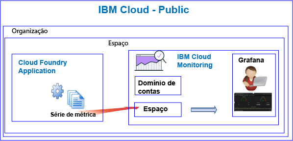

---

copyright:
  years: 2017, 2019

lastupdated: "2019-03-06"

keywords: IBM Cloud, monitoring

subcollection: cloud-monitoring

---

{:new_window: target="_blank"}
{:shortdesc: .shortdesc}
{:screen: .screen}
{:pre: .pre}
{:table: .aria-labeledby="caption"}
{:codeblock: .codeblock}
{:tip: .tip}
{:download: .download}
{:important: .important}
{:note: .note}


# Apps Cloud Foundry
 {:#monitoring_bluemix_apps}

No {{site.data.keyword.Bluemix}}, as métricas são coletadas automaticamente para os apps Cloud Foundry (CF) que são executados na região do Public e encaminhadas ao serviço {{site.data.keyword.monitoringlong}}. É possível usar o Grafana para análise a fim de monitorar o desempenho do seu aplicativo CF. Também é possível usar a API Metrics para consultar as métricas de app CF e executar ação com base nos dados.
{:shortdesc}


## Monitorando apps CF em execução no Public
{: #public}


Considere as informações a seguir ao usar o serviço do {{site.data.keyword.monitoringshort}} para monitorar um app CF:

* Deve-se fornecer o serviço do {{site.data.keyword.monitoringshort}} no mesmo espaço em que o app CF está em execução.
* As métricas que são coletadas para um app CF são encaminhadas automaticamente para o domínio de espaço em um serviço do {{site.data.keyword.monitoringshort}}. 
* As métricas são encaminhadas para um domínio de espaço. O domínio de espaço corresponde ao que o app CF está em execução. 
* Também é possível usar a API Metrics para consultar as métricas e executar ação com base nos dados. Por exemplo, é possível criar uma automação que consulta a utilização da CPU de seu app CF e ajusta a escala dele, caso a CPU esteja ficando alta.

A figura a seguir mostra uma visualização de alto nível de monitoramento de apps CF no {{site.data.keyword.Bluemix_notm}}:



## Monitorando apps CF em execução fora do {{site.data.keyword.Bluemix_notm}}
{: #outside}

Para monitorar apps CF que são executados fora do {{site.data.keyword.Bluemix_notm}}, é possível usar a API Metrics para encaminhar suas métricas do app CF para o serviço do {{site.data.keyword.monitoringshort}}.

* Para obter mais informações sobre a API, consulte [API Metrics](https://console.bluemix.net/apidocs/927-ibm-cloud-monitoring-metrics-api?&language=node#introduction).
* Para obter mais informações sobre como usar a API, consulte [Enviando dados usando a API Metrics](/docs/services/cloud-monitoring/send-metrics?topic=cloud-monitoring-send_data_api#send_data_api).


## Visualizando e analisando métricas de apps CF
{: #monitoring_cfapps}

Para monitorar o desempenho de aplicativos CF no {{site.data.keyword.Bluemix_notm}}, use o Grafana. 

O serviço do {{site.data.keyword.monitoringlong}} usa o Grafana, uma plataforma de software livre para análise de dados e visualização, que pode ser usada para monitorar, procurar, analisar e visualizar suas métricas em uma variedade de gráficos, por exemplo, diagramas e tabelas.

É possível ativar o Grafana em um navegador. Para obter mais informações, veja [Navegando para o painel do Grafana por meio de um navegador da web](/docs/services/cloud-monitoring/grafana?topic=cloud-monitoring-navigating_grafana#launch_grafana_from_browser).

**Nota:** deve-se ativar o Grafana na mesma região do {{site.data.keyword.Bluemix_notm}} na qual a instância do app CF está em execução.


Para monitorar aplicativos CF, deve-se definir uma ou mais consultas no Grafana. Para obter mais informações, consulte [Configurando uma consulta de métrica no Grafana](/docs/services/cloud-monitoring/grafana?topic=cloud-monitoring-define_query#define_query). 

Também é possível definir alertas em consultas. Para obter mais informações, consulte [Configurando alertas](/docs/services/cloud-monitoring?topic=cloud-monitoring-config_alerts_ov#config_alerts_ov).


## Métricas da CPU
{: #cpu_metrics}

A série de métricas que são coletadas automaticamente para cada aplicativo CF inclui dados sobre a utilização da CPU.


<table>
  <caption>Métricas da CPU coletadas para um aplicativo CF</caption>
  <tr>
    <th>de Métrica</th>
    <th>Descrição</th>
  </tr>
  <tr>
    <td>cpu-utilization</td>
    <td>Porcentagem de utilização da CPU até o limite do contêiner.</td>
  </tr>
</table>


## Métricas de disco
{: #disk_metrics}

A série de métricas que são coletadas automaticamente para cada aplicativo CF inclui dados sobre o tamanho do disco que é usado, o tamanho do disco total que está disponível e a porcentagem de disco que é usada.


<table>
  <caption>Métricas de disco coletadas para um aplicativo CF</caption>
  <tr>
    <th>de Métrica</th>
    <th>Descrição</th>
  </tr>
  <tr>
    <td>disk-bytes-total</td>
    <td>Tamanho do disco do contêiner no qual o app CF está em execução. O valor é definido em bytes.</td>
  </tr>
  <tr>
    <td>disk-bytes-used</td>
    <td>Tamanho do disco do contêiner que é usado no disco pelo app CF. O valor é definido em bytes.</td>
  </tr>
  <tr>
    <td>disk-utilization</td>
    <td>Porcentagem de disco que é usada pelo app CF.</td>
  </tr>
</table>

**Nota:** 

* Você especifica o tamanho do disco ao enviar por push o app CF.
* Quando a utilização de seu disco atinge 90%, considere ajustar a escala do app CF.

## Métricas da memória
{: #mem_metrics}

A série de métricas que são coletadas automaticamente para cada aplicativo CF inclui dados sobre a memória que é usada, a memória total que está disponível e a porcentagem de memória que é usada.

<table>
  <caption>Métricas da memória coletadas para um aplicativo CF</caption>
  <tr>
    <th>de Métrica</th>
    <th>Descrição</th>
  </tr>
  <tr>
    <td>memory-bytes-total</td>
    <td>Memória em bytes que está disponível para o app CF.</td>
  </tr>
  <tr>
    <td>memory-bytes-used</td>
    <td>Memória em bytes que é usada pela instância do app CF.</td>
  </tr>
  <tr>
    <td>memory-utilization</td>
    <td>Porcentagem de memória que é usada pelo app CF.</td>
  </tr>
</table>


## Formato de consulta de métricas
{: #query_format}


As consultas que você define no Grafana para monitorar um aplicativo Cloud Foundry devem estar em conformidade com o formato a seguir: 

```
{Source}.{Cloud Type}.{Service Name}.{Region}.{CFapp Name}.{CFapp Index}.{CFapp container}.{Metric Type}.{Metric Subtype}.[Functions]
```
{: codeblock}

Por exemplo, consulte as amostras da série de métricas que são coletadas para uma instância do app CF nomeada como logtester na região de Sydney:

```
ibmcloud.public.cloud-foundry.au-syd.logtester.0.container.cpu.utilization
ibmcloud.public.cloud-foundry.au-syd.logtester.0.container.disk.bytes-total
ibmcloud.public.cloud-foundry.au-syd.logtester.0.container.disk.bytes-used
ibmcloud.public.cloud-foundry.au-syd.logtester.0.container.disk.utilization
ibmcloud.public.cloud-foundry.au-syd.logtester.0.container.memory.bytes-total
ibmcloud.public.cloud-foundry.au-syd.logtester.0.container.memory.bytes-used
ibmcloud.public.cloud-foundry.au-syd.logtester.0.container.memory.utilization
```
{: screen}

Para obter mais informações, consulte [Formato de métricas de apps CF](/docs/services/cloud-monitoring/reference?topic=cloud-monitoring-cfapps_metrics_format#cfapps_metrics_format).

**Nota:** nem todos os caracteres que são permitidos em nomes de app CF são permitidos nos nomes de série de métricas. Por exemplo, letras maiúsculas não são permitidas. O nome do app CF que pode ser visto no Grafana ao definir uma consulta é mudado para tudo em letras minúsculas.


