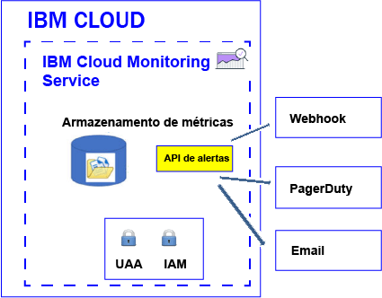

---

copyright:
  years: 2017, 2019

lastupdated: "2019-03-06"

keywords: IBM Cloud, monitoring

subcollection: cloud-monitoring

---

{:new_window: target="_blank"}
{:shortdesc: .shortdesc}
{:screen: .screen}
{:pre: .pre}
{:table: .aria-labeledby="caption"}
{:codeblock: .codeblock}
{:tip: .tip}
{:download: .download}
{:important: .important}
{:note: .note}


# Configurar alertas
{: #config_alerts_ov}

O serviço {{site.data.keyword.monitoringshort}} fornece um sistema de alerta baseado em consulta. É possível configurar alertas usando a API {{site.data.keyword.monitoringshort}} ou por meio do Grafana. Para configurar um alerta, deve-se definir as regras e os métodos de notificação de cada consulta de métrica que você deseja monitorar. É possível notificar enviando um e-mail, acionando um webhook ou enviando um alerta para o PagerDuty.
{:shortdesc}

É possível definir um alerta para acionar uma notificação para uma métrica. Um alerta é definido por uma regra que descreve a consulta de métrica a ser monitorada, o valor do limite e a ação que deverá ser tomada quando o limite for ultrapassado, bem como um ou mais métodos de notificação.  

A tabela a seguir lista os diferentes métodos e ações suportadas que podem ser usados para trabalhar com alertas:

<table>
  <caption>Métodos para trabalhar com alertas</caption>
	<tr>
    <th>Method</th>
		<th>Definir um alerta</th>
		<th>Atualizar um alerta</th>
		<th>Excluir um alerta</th>
	</tr>
	<tr>
    <td>API de alertas</td>
		<td>Sim</td>
		<td>Sim</td>
		<td>Sim</td>
	</tr>
	<tr>
    <td>Grafana</td>
		<td>Sim</td>
		<td>Sim</td>
		<td>Sim</td>
	</tr>
</table>

**Nota:** os alertas que você define usando a API Alerts não são mostrados no painel do Grafana.


A figura a seguir mostra os diferentes tipos de notificação que podem ser configurados no serviço do {{site.data.keyword.monitoringshort}} para alertar você:



É possível definir alertas para uma única instância ou para múltiplas instâncias. Quando uma consulta que você monitorar através de uma regra de alerta incluir um curinga, ele identificará múltiplos destinos, ou seja, múltiplas instâncias de serviço ou do aplicativo. A cada 5 minutos, o serviço do {{site.data.keyword.monitoringshort}} executará a consulta configurada em uma regra de alerta e verificará os últimos pontos de dados que serão retornados para cada instância ou múltiplas instâncias. O serviço do {{site.data.keyword.monitoringshort}} manterá o controle do último estado para cada instância e gerará um novo alerta se o estado do alerta mudar. 


## Trabalhando com alertas usando a API Alerts
{: #api}

É possível definir, atualizar ou excluir alertas usando a API Alerts.

Para definir um alerta em uma consulta de métrica usando a API Alerts, deve-se:

1. Definir uma ou mais consultas de métrica em um painel do Grafana. 

    **Nota:** não é possível definir alertas em painéis do Grafana que usam variáveis de modelo.

2. Configure um alerta em uma consulta de métrica que seja definida no painel do Grafana.

    * [Configurando um alerta que envia um e-mail](/docs/services/cloud-monitoring/alerts/configure_email_alert.html#configure_email_alert).
    * [Configurando um alerta que envia uma notificação do PagerDuty](/docs/services/cloud-monitoring/alerts/configure_pagerduty_alert.html#configure_pagerduty_alert).
    * [Configurando um alerta que envia uma notificação do webhook](/docs/services/cloud-monitoring/alerts/configure_webhook_alert.html#configure_webhook_alert).

    **Nota:** é possível definir notificações por e-mail somente para consultas de métrica definidas no domínio de métrica da conta.


## Trabalhando com alertas usando o Grafana
{: #grafana}

É possível definir e excluir alertas diretamente em um painel do Grafana. Também é possível atualizar definições de regra. No entanto, quaisquer mudanças no canal de notificação devem ser feitas usando a API Alerts.

Considere as informações a seguir ao trabalhar com alertas no Grafana:

* Para modificar os canais de notificação designados a uma regra, deve-se usar a API Alerts.
* Ao excluir um canal de notificação em um domínio de espaço, as regras que possuem o canal configurado não são atualizadas. Deve-se usar a API Alerts para modificar a regra e remover esse canal de notificação dela. 

Para definir um alerta em uma consulta de métrica diretamente em um painel do Grafana, deve-se:

1. Definir uma ou mais consultas de métrica em um painel do Grafana. 

    **Nota:** não é possível definir alertas em painéis do Grafana que usam variáveis de modelo.

2. Configure um alerta em uma consulta de métrica que seja definida no painel do Grafana.

    Para obter mais informações, consulte [Configurando alertas no Grafana](/docs/services/cloud-monitoring/alerts/config_alerts_grafana.html#config_alerts_grafana).


## Estados do Alerta
{: #status}

Um alerta poderá ter qualquer um dos estados a seguir quando a regra estiver ativada:

* *OK*: o estado de uma regra será configurado como *OK* quando:
    
	* Os dados estiverem disponíveis no serviço do {{site.data.keyword.monitoringshort}} para a consulta de métrica associada com essa regra. Você configurou um limite de aviso e um limite de erro. O valor dos dados não cruzará o valor do limite.
	 
	* Não houver dados no serviço do {{site.data.keyword.monitoringshort}} para a consulta de métrica associada com essa regra e você configurar a propriedade de regra `allow_no_data` como *true*.           
	 
* *AVISO*: o estado da regra será configurado como *AVISO* quando os dados estiverem disponíveis no serviço do {{site.data.keyword.monitoringshort}} para a consulta de métrica associada com essa regra. Você configurou um limite de aviso e um limite de erro. O valor dos dados estará entre o valor de limite de aviso e o valor do limite de erro.
	
* *ERRO*: o estado da regra será configurado como *ERRO* quando os dados estiverem disponíveis no serviço do {{site.data.keyword.monitoringshort}} para a consulta de métrica associada com essa regra. Você configurou um limite de aviso e um limite de erro. O valor do limite de erro foi alcançado.  

* *DESCONHECIDO*: o estado da regra será configurado como *DESCONHECIDO* quando não houver dados no serviço do {{site.data.keyword.monitoringshort}} para a consulta de métrica associada com essa regra. Será possível configurar se se deve ou não receber uma notificação com base na propriedade `allow_no_data` que você configurar para a regra. Se configurar essa propriedade como `false`, você será notificado de que nenhum dado foi localizado para a regra.


	
## Histórico de alerta
{: #history}

Toda vez que o estado de um alerta muda, o registro de histórico do alerta é atualizado. É possível usar a API de Alertas (*/v1/alert/history*) para recuperar informações sobre o histórico de uma métrica.

O estado de um alerta é usado para definir o status em qualquer um dos seguintes cenários:

* Status da consulta antes da regra acionar uma notificação.
* Status da consulta após a regra ser acionada. 

Por exemplo, se um limite de aviso for excedido, então, será gerado um registro de histórico que registrará a transição de *OK* para *AVISO*. Da mesma forma, quando o valor ficar abaixo do limite, será gerado um registro de histórico para registrar a transição de *AVISO* para *OK*.

Para obter mais informações, veja [Recuperando o histórico de uma regra](/docs/services/cloud-monitoring/alerts/retrieve_history.html#retrieve_history).


## Rules
{: #rules1}

Uma regra descreve a consulta de métrica a ser monitorada, o valor do limite e a ação a ser executada quando o limite é cruzado. 

* É possível criar, excluir, atualizar e mostrar os detalhes para uma regra, além de listar todas as regras usando a API de Alertas. Para obter mais informações, consulte [Trabalhando com regras](/docs/services/cloud-monitoring/alerts/rules.html#rules).

    * Para criar uma regra, veja [Criando uma regra](/docs/services/cloud-monitoring/alerts/rules.html#create).
	* Para excluir uma regra, veja [Excluindo uma regra](/docs/services/cloud-monitoring/alerts/rules.html#delete).
	* Para atualizar uma regra, veja [Atualizando uma regra](/docs/services/cloud-monitoring/alerts/rules.html#update).
	* Para listar todas as regras, veja [Listando todas as regras](/docs/services/cloud-monitoring/alerts/rules.html#list).
	* Para mostrar informações sobre uma regra, veja [Mostrando os detalhes de uma regra](/docs/services/cloud-monitoring/alerts/rules.html#showing-the-details-of-a-rule).

* O sistema de alerta verificará a cada 5 minutos as regras que estiverem ativadas no espaço.

* Por padrão, uma regra será ativada quando você a criar. No entanto, é possível definir a regra e desativá-la, configurando o campo *ativar* como `false`.

* Quando o parâmetro de regra *comparison* estiver configurado como abaixo, o valor error_level deverá ser menor que o valor de nível de aviso. Quando o parâmetro de regra *comparison* estiver configurado como acima, o valor error_level deverá ser mais alto que o valor de nível de aviso.

* Por padrão, uma regra será criada com o campo *allow_no_data* configurado como `true`. Quando nenhum ponto de dados estiver disponível, as notificações não serão enviadas, a menos que a condição da regra esteja acionada. Se desejar receber uma notificação para informar que nenhum dado foi localizado para a regra X, você deverá configurar o campo *allow_no_data* como `false`. 

**Dica:** verifique a consulta que você monitora através de uma regra de alerta no Grafana. Verifique se ela não atinge o tempo limite. Por exemplo, uma consulta pode atingir o tempo limite
como resultado da configuração de um longo período de tempo ou se você define uma consulta que inclua um
curinga. Observe que quando a consulta atingir o tempo limite no Grafana, um alerta configurado para essa consulta não será acionado.

Os campos a seguir são necessários para definir uma regra:

<table>
  <caption>Tabela 1. Lista de campos que são usados para definir uma regra.</caption>
  <tr>
    <th>Nome do campo</th>
	<th>Descrição</th>
  </tr>
  <tr>
    <td>Nome</td>
	<td>Nome da regra. Esse nome deve ser exclusivo.</td>
  </tr>
  <tr>
    <td>Descrição</td>
	<td>Resumo da regra.</td>
  </tr>
  <tr>
    <td>Expressão</td>
	<td>Consulta da métrica que você deseja monitorar e enviar um alerta se um limite for ultrapassado. <br>As expressões válidas são: um único nome de métrica, múltiplas métricas identificadas com curingas ou funções para agregar dados. <br>**Dica:** é possível copiar uma consulta verificada do Grafana.</td>
  </tr>
  <tr>
    <td>ativado</td>
	<td>Descreve o status da regra: <br>Configure como `true` para ativar a regra. <br>Configure como `false` para desativar a regra. <br>Por padrão, ele é configurado como `true`.</td>
  </tr>
  <tr>
    <td>De</td>
	<td>Momento inicial que é usado para analisar os dados com base nos valores de limite que você configurou para a consulta definida no campo de expressão. Por exemplo: `"de": "-5min"`</td>
  </tr>
  <tr>
    <td>Até</td>
	<td>Momento final no tempo que é usado para analisar os dados com base nos valores de limite que você configurou para a consulta definida no campo de expressão. Por exemplo: `"até": "agora"`</td>
  </tr>
  <tr>
    <td>Comparação</td>
	<td>A operação de comparação que é usada para identificar o tipo de verificação a ser feita. Os valores válidos são: *abaixo*, e *acima*. </td>
  </tr>
  <tr>
    <td>Comparison_scope</td>
	<td>Define o escopo dos dados que são analisados. <br>Configure como *last* para ver o último valor na série (os dados que estão disponíveis para sua consulta).</td>
  </tr>
  <tr>
    <td>error_level</td>
	<td>Define o limite que você configura para acionar um alerta de erro. <br>Configure o valor que, caso seja atingido, fará um alerta de erro ser gerado. Por exemplo: `"error_level": 27,94`</td>
  </tr>
  <tr>
    <td>Warning_level</td>
	<td>Define o limite que você configura para acionar um alerta de aviso. <br>Configure o valor que, caso seja atingido, fará um alerta de aviso ser gerado. Por exemplo: `"warning_level": 24`</td>
  </tr>
  <tr>
    <td>Frequência</td>
	<td>Define a frequência com que a verificação será executada. <br>Ela é medida em minutos, horas ou dias; por exemplo, 5min, 1h, 7d. <br>Por exemplo, para verificar cada minuto, é possível configurar `"frequency": "1min"`. <br>**Nota:** atualmente, a frequência é fixada em 5 minutos.</td>
  </tr>
  <tr>
    <td>Dashboard_url</td>
	<td>Define a URL para um painel do Grafana no qual a consulta que é monitorada é definida.</td>
  </tr>
    <tr>
    <td>allow_no_data</td>
	<td>Define a condição pela qual uma notificação será enviada quando nenhum dado estiver disponível. <br>Por padrão, ele é configurado como `true`. <br>Configure como `false` se você quiser ser notificado de que nenhum dado foi localizado para a regra X.</td>
  </tr>
  <tr>
    <td>notificações</td>
	<td>O nome de uma notificação que define a ação que você deseja acionar para a regra. <br>**Nota:** é possível definir 1 ou mais notificações por regra, listando os nomes de notificação separados por vírgula.</td>
  </tr>
</table>

Por exemplo, o seguinte é uma amostra de uma regra:

```
{
  "name": "checkbytesin1",
  "description": "MH check Bytes In per second",
  "expression": "movingAverage(messagehub.65ad9211-1234-5678-a751-c82123411eee.1.kafka-java-console-sa
mple-topic.BytesInPerSec.15MinuteRate,\"5min\")",
  "enabled": true,
  "from": "-5min",
  "until": "now",
  "comparison": "below",
  "comparison_scope": "last",
   "error_level" : 22.94,
   "warning_level" : 25,
  "frequency": "1min",
  "dashboard_url": "https://metrics.ng.bluemix.net",
  "notifications": [
    "EmailXXX"
  ]
}
```
{: screen}


## Notificações
{: #alert_notifications}

Uma notificação descreve o método e os detalhes usados para notificar quando um alerta é acionado. Por exemplo, para obter uma notificação de aviso e uma notificação de erro para uma métrica, defina uma regra que monitore o limite de aviso e defina uma regra que monitore o limite de erro. 

* Uma notificação será enviada somente quando o estado do alerta mudar; por exemplo, quando o estado de um alerta para uma métrica mudar de "OK" para "ERRO" ou de "ERRO" para "AVISO". 

    **Nota:** se uma regra de alerta permanecer no mesmo estado, *OK*, *AVISO*, *ERRO* ou *DESCONHECIDO*, ela não será acionada novamente na próxima iteração.

* Notificações são consideradas como eventos de 24 horas. Não é possível especificar um intervalo de tempo quando uma notificação pode ser acionada.

* É possível configurar 1 ou mais métodos de notificação por regra, listando nomes de notificação separados por vírgula. 

* É possível usar a [API de REST de Alertas](https://console.bluemix.net/apidocs/940-ibm-cloud-monitoring-alerts-api?&language=node#introduction){: new_window} para criar, excluir e atualizar uma notificação, para mostrar os detalhes para uma notificação e
para listar as notificações que são definidas em um espaço.

    * Para criar uma notificação, veja [Criando uma notificação](/docs/services/cloud-monitoring/alerts/notifications.html#notifications_create).
	* Para excluir uma notificação, veja [Excluindo uma notificação](/docs/services/cloud-monitoring/alerts/notifications.html#notifications_delete).
	* Para atualizar uma notificação, veja [Atualizando uma notificação](/docs/services/cloud-monitoring/alerts/notifications.html#notifications_update).
	* Para listar todas as notificações, veja [Listando todas as notificações](/docs/services/cloud-monitoring/alerts/notifications.html#notifications_list).
	* Para mostrar informações sobre uma notificação, veja [Mostrando os detalhes de uma notificação](/docs/services/cloud-monitoring/alerts/notifications.html#show).

* É possível configurar uma notificação por e-mail, uma configuração do PagerDuty e uma notificação de webhook. 

**Observação:** você define as notificações de alerta independentemente de regras, para que seja possível reutilizar as notificações com várias regras.

	
## Notificação - modelos JSON
{: #notification_template}
	
Uma notificação é um arquivo JSON. 

A tabela a seguir inclui um modelo de notificação para o tipo de método de notificação:

<table>
  <caption>Tabela 3. Modelos de notificação</caption>
  <tr>
    <th>Tipo</th>
	<th>Modelo</th>
	<th>Amostra</th>
  </tr>
  <tr>
    <td>Email</td>
	<td>
	```
	{
	"name": "Template_Name",
	"type": "Email",
	"description" : "Description",
	"detail": "EmailAddress"
	}
	```
	{: screen}
	</td>
	<td>
	```
	{
	"name": "my-email", 	"type": "Email", 	"description" : "Send email notification when there is an infrastructure problem.", "detalhe": "xxx@yyy.com " }
	```
	{: screen}
	</td>
  </tr>
  <tr>
    <td>Webhook</td>
	<td>
	```
	{
	"name": "Template_Name", 	"type": "Webhook", 	"description" : "Description", 	"detail": "Endpoint" 	}
	```
	{: codeblock}
	</td>
	<td>
	```
	{
	"name": "my-webhook", 	"type": "Webhook", 	"description" : "Fire a webhook when there is an infrastructure problem..", "detail": "https://myendpoint.bluemix.net?key=abcd1234" }
	```
	{: screen}
	</td>
  </tr>
  <tr>
    <td>Pagerduty</td>
	<td>
	```
	"name": "Template_Name", 	"type": "PagerDuty", 	"description" : "Description", 	"detail": "Pagerduty_APIkey" 	}
	```
	{: codeblock}
	</td>
	<td>
	```
	{
	"name": "my-pagerduty",
	"type": "PagerDuty",
	"description" : "Fire a PagerDuty alert when there is an infrastructure problem..", 	"detail": "abcd1234" 	}
	```
	{: screen}
	</td>
  </tr>
</table>

Em que

* O *Template_Name* define o nome do modelo de notificação.
* A *Description* explica quando esse tipo de notificação é usado.
* O *EmailAddress* define o endereço de e-mail do destinatário da notificação.
* O *Endpoint* define a URL na qual o POST deve ser feito. 
* A *Pagerduty_APIkey* define uma chave API exclusiva. Essa chave API é gerada por um administrador ou um proprietário de conta do PagerDuty.


## Regras - modelo JSON
{: #rules_template}

Uma regra é descrita usando um arquivo JSON. 

O código a seguir é um modelo para uma regra:

```
{
"name": "Enter rule name",
"description": "Desccribe rule",
"expression": "Add metric query",
"enabled": true,
"from": "-5min",
"until": "now",
"comparison": "below",
"comparison_scope": "last",
"error_level" : xxxx,
"warning_level" : xxxx,
"frequency": "1min",
"dashboard_url": "https://metrics.ng.bluemix.net",
"notifications": [
 "List of Notifications by name. Include all the motification methods for this rule separated by commas."
 ]
}
```
{: screen}


