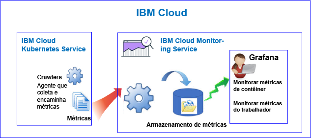
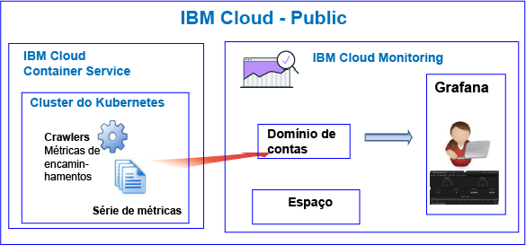

---

copyright:
  years: 2017, 2019

lastupdated: "2019-03-06"

keywords: IBM Cloud, monitoring

subcollection: cloud-monitoring

---

{:new_window: target="_blank"}
{:shortdesc: .shortdesc}
{:screen: .screen}
{:pre: .pre}
{:table: .aria-labeledby="caption"}
{:codeblock: .codeblock}
{:tip: .tip}
{:download: .download}
{:important: .important}
{:note: .note}

# {{site.data.keyword.containershort_notm}}
{: #monitoring_bmx_containers_ov}

No {{site.data.keyword.Bluemix}}, as métricas do cluster são coletadas automaticamente. É
possível usar o Grafana para monitorar o desempenho de seu cluster. 
{:shortdesc}

**Nota:** 

* As métricas são coletadas e ficam disponíveis para monitoramento por meio do serviço de {{site.data.keyword.monitoringshort}} para contêineres em execução em clusters padrão.
* Para monitorar as métricas do cluster, deve-se provisionar uma instância do serviço de Monitoramento. Para obter mais informações, consulte [Fornecendo o serviço de Monitoramento](/docs/services/cloud-monitoring/how-to/provision.html#provision).

## Sobre monitoramento no Public
{: #public1}

No {{site.data.keyword.Bluemix_notm}}, é possível usar o
serviço do {{site.data.keyword.monitoringshort}} para armazenar e analisar métricas do contêiner e métricas do cluster do Kubernetes que são coletadas automaticamente pelo
{{site.data.keyword.containershort}} no Public.

É possível ter 1 ou mais clusters do Kubernetes em uma conta. As métricas são coletadas automaticamente
pelo {{site.data.keyword.containershort}} assim que o cluster é fornecido.  As métricas do contêiner são coletadas assim que o pod é implementado. As métricas são encaminhadas
automaticamente para o serviço do {{site.data.keyword.monitoringshort}}:

Ao criar um cluster, as métricas são encaminhadas ao domínio de contas no serviço {{site.data.keyword.monitoringshort}}. Para que as métricas sejam encaminhadas ao domínio de contas, o proprietário da chave do {{site.data.keyword.containershort}} deverá ter as políticas do IAM a seguir:

* Política do IAM com permissões de **editor** para o serviço {{site.data.keyword.monitoringshort}}.
* Política do IAM com permissões de **administrador** para o {{site.data.keyword.containershort}}.

A figura a seguir mostra uma visualização de alto nível de monitoramento para o {{site.data.keyword.containershort}}:

O crawler é um processo que está em execução no host e executa o monitoramento sem agente para métricas. O crawler coleta constantemente as métricas da CPU e da memória de todos os contêineres por padrão.

Para analisar as métricas no Grafana para um cluster, considere as informações a seguir:

* Deve-se ativar o Grafana na região do Public na qual a instância do
{{site.data.keyword.monitoringshort}}
que você usa para visualizar métricas é fornecida. 
* É possível usar o painel padrão do Grafana **ClusterMonitoringDashboard** para monitorar seu cluster.
* Também é possível configurar painéis customizados do Grafana para visualizar dados de métrica de um
cluster na região do Cloud Public na qual o cluster é criado.
* Seu ID do usuário deve ter permissões para visualizar métricas. 

    Para ver métricas no domínio de contas, um usuário precisa de uma política do IAM para o
serviço do {{site.data.keyword.monitoringshort}}. O usuário precisa de permissões de **Visualizador**. 

A figura a seguir mostra uma visualização de alto nível do monitoramento no Public para o {{site.data.keyword.containershort}}. O cluster encaminha métricas ao domínio de contas:

## Sobre o monitoramento no Dedicated
{: #dedicated}

No {{site.data.keyword.Bluemix_notm}}, é possível usar o serviço do
{{site.data.keyword.monitoringshort}} no Public para armazenar e analisar métricas do contêiner e
métricas do cluster do Kubernetes que são coletadas automaticamente pelo {{site.data.keyword.containershort}} no
Dedicated.

É possível ter 1 ou mais clusters do Kubernetes em uma conta. As métricas são coletadas automaticamente
pelo {{site.data.keyword.containershort}} assim que o cluster é fornecido.  As métricas do contêiner são coletadas assim que o pod é implementado. As métricas são encaminhadas
automaticamente para o domínio de contas do serviço do {{site.data.keyword.monitoringshort}}.

Ao criar um cluster, as métricas são encaminhadas ao domínio de contas no serviço {{site.data.keyword.monitoringshort}}. Para que as métricas sejam encaminhadas ao domínio de contas, o proprietário da chave do {{site.data.keyword.containershort}} deverá ter as políticas do IAM a seguir:

* Política do IAM com permissões de **editor** para o serviço {{site.data.keyword.monitoringshort}}.
* Política do IAM com permissões de **administrador** para o {{site.data.keyword.containershort}}.

Para visualizar e analisar métricas de um cluster no Grafana, considere as informações a seguir:

* Deve-se ativar o Grafana na região do Cloud Public na qual o cluster está disponível no
Dedicated. Por exemplo, se um cluster é fornecido no Dedicated no Sul dos EUA, deve-se ativar o Grafana
na região Sul dos EUA no Public.
* É possível usar o painel padrão do Grafana **ClusterMonitoringDashboard** para monitorar seu cluster.
* Também é possível configurar painéis customizados do Grafana para visualizar dados de métrica de um
cluster na região do Cloud Public na qual o cluster é criado.
* Seu ID do usuário deve ter uma política do IAM para trabalhar com o
serviço do {{site.data.keyword.monitoringshort}}. É necessário ter as permissões
**Visualizador** para ver as métricas no domínio de contas.  

A figura a seguir mostra uma visualização de alto nível de monitoramento no Dedicated para o
{{site.data.keyword.containershort}}:

## Contêineres: Métricas de CPU
{: #cpu_metrics_containers}

A tabela a seguir lista as métricas da CPU que são capturadas automaticamente para um contêiner:

| de Métrica | Descrição | Unidades |
|----------|---------|---------|
| `cpu.num-cores` | Essa métrica relata o número de núcleos da CPU que estão disponíveis para o contêiner.  Por padrão, esta métrica relata o número de núcleos no trabalhador. Se você configurar um limite no número de núcleos disponíveis para o contêiner, esta métrica relatará o número de núcleos configurado nesse limite. | Número Decimal |
| `cpu.usage` | Essa métrica relata os nanossegundos de tempo de CPU em todos os núcleos.  Quando o uso de CPU está alto, você pode experimentar atrasos. O uso alto de CPU indica energia de processamento insuficiente. | Nanosegundos |
| `cpu.usage-pct` | Essa métrica relata o tempo de CPU que é usado como uma porcentagem da capacidade da CPU.  Por padrão, a capacidade da CPU é determinada pelo número de núcleos no trabalhador. Se você configurar limites para a capacidade da CPU do contêiner, esta métrica relatará o uso de CPU como uma porcentagem dos limites configurados. Quando a porcentagem de uso de CPU está alta, você pode experimentar atrasos. O uso alto de CPU indica energia de processamento insuficiente. | Percentual |
| `cpu.usage-pct-container-requested`  | Essa métrica relata o tempo de CPU que é usado como uma porcentagem da CPU solicitada do contêiner.  Se você não configurar a CPU solicitada em um contêiner, essa métrica não será exposta para o contêiner. | Percentual |
{: caption="Métricas da CPU para contêineres" caption-side="top"} 

## Contêineres: Métricas de Memória
{: #memory_metrics}

A tabela a seguir lista as métricas de memória capturadas automaticamente:

| de Métrica | Descrição | Unidades |
|----------|---------|---------|
| `memory.current` | Essa métrica relata os bytes de memória que o contêiner está usando atualmente. | bytes |
| `memory.limit` | Essa métrica relata o limite de memória do contêiner. Por padrão, os contêineres são executados com limites de memória ilimitados. Um contêiner poderá consumir tanta memória quanto houver no trabalhador no qual ele está em execução. Ao implementar um pod, será possível configurar limites para a quantia de memória que seus contêineres podem usar.  | bytes |
| `memory.usage-pct` | Essa métrica relata a memória que é usada como uma porcentagem do limite de memória do contêiner.  Se você configurar limites para a quantia de memória que um contêiner pode usar, esta métrica relatará o uso de memória como uma porcentagem dos limites configurados. | Percentual | 
| `memory.working-set` | Essa métrica relata os bytes da memória ativa que o contêiner está usando atualmente no cache quente. | bytes |
{: caption="Métricas da memória para contêineres" caption-side="top"} 

## Pods: Métricas de rede
{: #network_metrics_pods}

A tabela a seguir lista as métricas de rede relacionadas à recepção de dados e capturadas automaticamente:

| de Métrica | Descrição | Unidades |
|----------|---------|---------|
| `container.namespace.podName.network.rx.bytes` | Essa métrica relata o número de bytes que o pod recebe.  | bytes  |
| `container.namespace.podName.network.rx.error` | Essa métrica relata o número de erros que o pod teve ao receber quadros. | N£mero  |
| `container.namespace.podName.network.rx.packets` | Essa métrica relata o número de pacotes que o pod recebe.  | N£mero  |
{: caption="Métricas de rede RX para os pods" caption-side="top"} 

A tabela a seguir lista as métricas de rede relacionadas à transmissão de dados e capturadas automaticamente:

| de Métrica | Descrição | Unidades |
|----------|---------|---------|
| `container.namespace.podName.network.tx.bytes` | Essa métrica relata o número de bytes que são enviados para o pod.  | bytes  |
| `container.namespace.podName.network.tx.errors` | Essa métrica relata o número de erros que o pod teve ao enviar quadros.  | N£mero  |
| `container.namespace.podName.network.tx.packets` | Essa métrica relata o número de pacotes que são enviados para o pod.  | N£mero  |
{: caption="Métricas de rede TX para os pods" caption-side="top"} 

## Trabalhadores: Métricas de Disco
{: #disk_metrics_workers}

A tabela a seguir lista as métricas de disco capturadas automaticamente para um trabalhador:

| de Métrica | Descrição | Unidades |
|----------|---------|---------|
| `worker.disk.diskDevice.read.bytes` | Essa métrica relata a velocidade de E/S de leitura do dispositivo de disco.  | bytes  |
| `worker.disk.diskDevice.read.io` | Essa métrica relata o rendimento de leitura do dispositivo.  | Bytes por segundo  |
| `worker.disk.diskDevice.read.reads` | Essa métrica relata a velocidade máxima de E/S de leitura do dispositivo de disco.  | Bytes por segundo  |
| `worker.disk.diskDevice.read.waits` | Essa métrica relata o tempo que o trabalhador aguarda por uma solicitação de E/S de leitura.  | Bytes por segundo  |
| `worker.disk.diskDevice.write.bytes` | Essa métrica relata a velocidade de E/S de gravação para um dispositivo de disco.  | bytes  |
| `worker.disk.diskDevice.write.io` | Essa métrica relata o rendimento de gravação do dispositivo.  | Bytes por segundo  |
| `worker.disk.diskDevice.write.writes` | Essa métrica relata a velocidade máxima de E/S de gravação do dispositivo de disco.  | Bytes por segundo  |
| `worker.disk.diskDevice.write.waits` | Essa métrica relata o tempo que o trabalhador aguarda por uma solicitação de E/S de gravação.  | Bytes por segundo  |
| ` worker.disk.diskDevice.size `| Essa métrica relata a capacidade de armazenamento do dispositivo.  | bytes  |
| `worker.disk.diskDevice.used` | Essa métrica relata o número de bytes usados no dispositivo.  | bytes  |
| `worker.disk.diskDevice.usedpct` | Essa métrica relata a porcentagem de armazenamento usada no dispositivo.  | Percentual  |
{: caption="Métricas de disco para trabalhadores" caption-side="top"} 

## Trabalhadores: Métricas de Carreg
{: #load_metrics_workers}

A tabela a seguir lista as métricas da CPU que são capturadas automaticamente para um trabalhador:

| de Métrica | Descrição | Unidades |
|----------|---------|---------|
| `load.avg-1` | Essa métrica relata o carregamento médio de CPU para o host do Kubernetes no último 1 minuto.  Uma carga média de CPU maior que o número de núcleos no trabalhador indica que o tráfego para o host está sendo enfileirado  | Número  |
| `load.avg-5` | Essa métrica relata o carregamento médio de CPU para o host do Kubernetes nos últimos 5 minutos.  Uma carga de CPU média que é maior que o número de núcleos no trabalhador indica que o tráfego para o host está enfileirando.  | N£mero  |
| `load.avg-15` | Essa métrica relata o carregamento médio de CPU para o host do Kubernetes nos últimos 15 minutos.  Uma carga de CPU média que é maior que o número de núcleos no trabalhador indica que o tráfego para o host está enfileirando.  |  Número |
{: caption="Métricas de carregamento para os trabalhadores" caption-side="top"} 

## Trabalhadores: Métricas de Memória
{: #memory_metrics_workers}

A tabela a seguir lista as métricas de memória capturadas automaticamente para um trabalhador:

| de Métrica | Descrição | Unidades |
|----------|---------|---------|
| `memory.available` | Essa métrica relata os bytes de memória grátis para uso de um trabalhador.   | bytes  |
| `memory.used` | Essa métrica relata os bytes de memória que o trabalhador está usando atualmente.  | bytes  |
{: caption="Métricas de memória para trabalhadores" caption-side="top"} 

## Trabalhadores: Métricas de rede
{: #network_metrics_workers}

A tabela a seguir lista as métricas de rede relacionadas à recepção de dados e capturadas automaticamente:

| de Métrica | Descrição | Unidades |
|----------|---------|---------|
| `network.interface.rx.bytes` | Essa métrica relata o número de bytes que o trabalhador recebeu na interface.  | bytes  |
| `network.interface.rx.errs` | Essa métrica relata o número de erros que o trabalhador teve ao receber quadros na interface. | N£mero |
| `network.interface.rx.packets` | Essa métrica relata o número de pacotes que o trabalhador recebeu na interface. | N£mero |
{: caption="Métricas de rede RX para trabalhadores" caption-side="top"} 

A tabela a seguir lista as métricas de rede relacionadas à transmissão de dados e capturadas automaticamente:

| de Métrica | Descrição | Unidades |
|----------|---------|---------|
| `network.interface.tx.bytes` | Essa métrica relata o número de bytes que o trabalhador enviou por meio da interface. | bytes  |
| `network.interface.tx.err` | Essa métrica relata o número de erros que o trabalhador teve ao enviar quadros na interface.  | N£mero  |
| `network.interface.tx.packets` | Essa métrica relata o número de pacotes que o trabalhador enviou por meio da interface.  | N£mero  |
{: caption="Métricas de rede TX para trabalhadores" caption-side="top"} 

A tabela a seguir lista as métricas de rede relacionadas a soquetes abertos e capturadas automaticamente:

| de Métrica | Descrição | Unidades |
|----------|---------|---------|
| `network.sockets.udp`  ` network.sockets.udp6 `  `network.sockets.tcp`  `network.sockets.tcp6.open` | Essa métrica relata o número de soquetes abertos para um protocolo.   | N£mero  |
| `network.sockets.tcp`  `network.sockets.tcp6.timewait` | Essa métrica relata o número de soquetes TCP abertos no estado `time wait`.  | N£mero  |
{: caption="Métricas de rede de soquetes para trabalhadores" caption-side="top"} 

## Definindo consultas para monitoramento de recursos em um cluster do Kubernetes
{: #monitoring_metrics_kube}

Para monitorar o desempenho dos contêineres e dos trabalhadores que são implementados em um cluster do
Kubernetes no {{site.data.keyword.Bluemix_notm}}, use o Grafana. 

O serviço do {{site.data.keyword.monitoringlong}} usa o Grafana, uma plataforma de software livre para análise de dados e visualização, que pode ser usada para monitorar, procurar, analisar e visualizar suas métricas em uma variedade de gráficos, por exemplo, diagramas e tabelas.

É possível ativar o Grafana em um navegador. Para obter mais informações, veja [Navegando para o painel do Grafana por meio de um navegador da web](/docs/services/cloud-monitoring/grafana/navigating_grafana.html#launch_grafana_from_browser).

Para monitorar contêineres e trabalhadores que são executados em um cluster do Kubernetes, deve-se definir
uma consulta no Grafana para cada recurso:

* Para definir uma consulta que monitora uma métrica de CPU para um contêiner, consulte [Configurando métricas de CPU para um contêiner no Grafana](/docs/services/cloud-monitoring/containers/config_cpu_containers.html#config_cpu_containers).
* Para definir uma consulta que monitora uma métrica de memória para um contêiner, consulte
[Configurando
métricas da memória para um contêiner no Grafana](/docs/services/cloud-monitoring/containers/config_mem_container.html#config_mem_container).
* Para definir uma consulta que monitora uma métrica de carregamento para um trabalhador, consulte
[Configurando
métricas de carregamento para um trabalhador no Grafana](/docs/services/cloud-monitoring/containers/config_load_worker.html#config_load_worker).

O formato da consulta é diferente por tipo de recurso e tipo de consulta:

* Para obter mais informações sobre o formato de consultas para monitorar a CPU de um contêiner,
consulte [Formato
de consulta de métrica de CPU para um contêiner](/docs/services/cloud-monitoring/reference/metrics_format_containers.html#cpu_containers). 
* Para obter mais informações sobre o formato de consultas para monitorar o carregamento de um
trabalhador, consulte
[Formato de
consulta de métrica de carregamento para um trabalhador](/docs/services/cloud-monitoring/reference/metrics_format_containers.html#load_workers).
* Para obter mais informações sobre o formato de consultas para monitorar a memória de um contêiner,
consulte
[Formato
de consulta de métrica de memória para um contêiner](/docs/services/cloud-monitoring/reference/metrics_format_containers.html#mem_containers).

## Configurando o tráfego de rede para configurações de firewall customizado no {{site.data.keyword.Bluemix_notm}}
{: #ports}

Quando você tiver um firewall adicional configurado ou tiver customizado as configurações de firewall na infraestrutura do {{site.data.keyword.Bluemix_notm}} (SoftLayer), será necessário permitir o tráfego de rede de saída do nó do trabalhador para o serviço {{site.data.keyword.monitoringshort}}. 

Deve-se abrir a porta TCP 443 e a porta TCP 9091 de cada trabalhador para o serviço {{site.data.keyword.monitoringshort}} para os endereços IP a seguir em seu firewall customizado:

<table>
  <tr>
    <th>Região</th>
    <th>URL de ingestão</th>
	<th>Endereço IP público</th>
  </tr>
  <tr>
    <td>Alemão</td>
	<td>ingest-eu-fra.logging.bluemix.net</td>
	<td>158.177.88.43  159.122.87.107</td>
  </tr>
  <tr>
    <td>Reino Unido</td>
	<td>ingest.logging.eu-gb.bluemix.net</td>
	<td>169.50.115.113</td>
  </tr>
  <tr>
    <td>Sul dos Estados Unidos</td>
	<td>ingest.logging.ng.bluemix.net</td>
	<td>169.48.79.236  169.46.186.113</td>
  </tr>
  <tr>
    <td>Sydney</td>
	<td>ingest-au-syd.logging.bluemix.net</td>
	<td>130.198.76.125  168.1.209.20</td>
  </tr>
</table>

## Tutorials
{: #tutorial}

Para aprender como usar o serviço {{site.data.keyword.monitoringshort}} para monitorar o desempenho do seu contêiner, consulte [Analisar métricas no Grafana para um app que é implementado em um cluster do Kubernetes](/docs/services/cloud-monitoring/tutorials/container_service_metrics.html#container_service_metrics).

Para aprender como criar um painel do Grafana no serviço {{site.data.keyword.monitoringshort}} para monitorar o desempenho do seu cluster, consulte [Criar um painel do Grafana para monitorar um cluster do Kubernetes](/docs/services/cloud-monitoring/tutorials/container_grafana_dashboard.html#container_grafana_dashboard).
