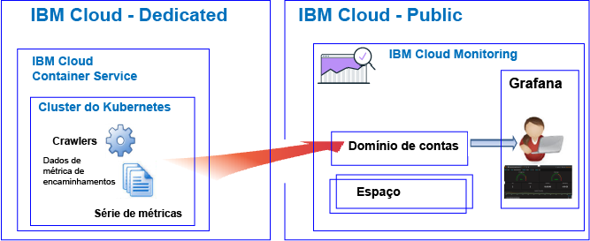

---

copyright:
  years: 2017, 2019

lastupdated: "2019-03-06"

keywords: IBM Cloud, monitoring

subcollection: cloud-monitoring

---

{:new_window: target="_blank"}
{:shortdesc: .shortdesc}
{:screen: .screen}
{:pre: .pre}
{:table: .aria-labeledby="caption"}
{:codeblock: .codeblock}
{:tip: .tip}
{:download: .download}
{:important: .important}
{:note: .note}

# Tutorial de Introdução
{: #getting-started-with-ibm-cloud-monitoring}

Use este tutorial para aprender como começar a trabalhar com o serviço do {{site.data.keyword.monitoringlong}} no {{site.data.keyword.Bluemix}}.
{:shortdesc}

Por padrão, o {{site.data.keyword.Bluemix_notm}} oferece recursos de monitoramento integrados para os serviços selecionados. É possível usar o serviço do {{site.data.keyword.monitoringlong_notm}} para expandir seus recursos de coleção e de retenção ao trabalhar com métricas e para ser capaz de definir regras e alertas que notifiquem você sobre as condições que requerem atenção. O serviço do {{site.data.keyword.monitoringshort}} oferece recursos que fornecem insight sobre como seus apps estão executando e consumindo recursos e que ajudam a identificar rapidamente tendências, detectar e diagnosticar problemas; tudo com time to value imediato e baixo custo total de propriedade. É possível monitorar seu ambiente por meio do Grafana. 

## Antes de Começar
{: #cm_prereqs}

É preciso ter um ID do usuário que seja membro ou proprietário de uma conta do {{site.data.keyword.Bluemix_notm}}. Para obter um ID do usuário do {{site.data.keyword.Bluemix_notm}}, acesse: [Registro ](https://console.bluemix.net/registration/){:new_window}

## Etapa 1: Escolher um recurso em nuvem que você deseja monitorar
{: #cm_step1}

No {{site.data.keyword.Bluemix_notm}}, aplicativos CF, contêineres que são executados no {{site.data.keyword.containershort}} e serviços selecionados coletam dados de série de métricas automaticamente e os encaminham para o serviço do {{site.data.keyword.monitoringshort}}.

A tabela a seguir lista diferentes recursos em nuvem. Conclua o tutorial para um recurso para começar a trabalhar com o serviço do {{site.data.keyword.monitoringshort}}:

<table>
  <caption>Tutoriais para começar a trabalhar com o serviço do {{site.data.keyword.monitoringshort}} </caption>
  <tr>
    <th>Recurso</th>
    <th>Tutorial</th>
    <th>Ambiente de nuvem</th>
    <th>Cenário</th>
  </tr>
  <tr>
    <td>Contêineres em execução no {{site.data.keyword.containershort}}</td>
    <td>[Analisar métricas no Grafana para um app que é implementado em um cluster do Kubernetes](/docs/services/cloud-monitoring/tutorials/container_service_metrics.html#container_service_metrics)</td>
    <td>Público  Dedicado</td>
    <td></td>
  </tr>
  <tr>
    <td>Apps CF</td>
    <td>[Analisar métricas no Grafana para um app CF](/docs/services/cloud-monitoring/tutorials/cfapps_metrics.html#cfapps_metrics)</td>
    <td>Público</td>
    <td></td>
  </tr>
</table>

## Etapa 2: Configurar permissões para um usuário para visualizar métricas
{: #cm_step2}

Para controlar as ações do {{site.data.keyword.monitoringshort}} que um usuário tem permissão para executar, é possível designar funções e políticas para um usuário. 

Há dois tipos de permissões de segurança no {{site.data.keyword.Bluemix_notm}} que controlam as ações que os usuários podem executar quando eles trabalham com o serviço do {{site.data.keyword.monitoringshort}}:

* Funções do Cloud Foundry (CF): conceda a um usuário uma função do CF para definir as permissões que o usuário possui para visualizar métricas em um espaço.
* Funções do IAM: conceda a um usuário uma política do IAM para definir as permissões que o usuário possui para visualizar métricas no domínio de contas.

Conclua as etapas a seguir para conceder a um usuário permissões para visualizar métricas em um espaço:

1. Efetue login no console do {{site.data.keyword.Bluemix_notm}}.

    Abra um navegador da web e ative o painel do {{site.data.keyword.Bluemix_notm}}: [http://bluemix.net ](http://bluemix.net){:new_window}
	
	Após você efetuar login com o seu ID do usuário e senha, a UI do {{site.data.keyword.Bluemix_notm}} será aberta.

2. Na barra de menus, clique em **Gerenciar > Conta > Usuários**. 

    A janela *Usuários* exibe uma lista de usuários com seus endereços de e-mail para a conta selecionada atualmente.
	
3. Se o usuário é um membro da conta, selecione o nome do usuário na lista ou clique em **Gerenciar usuário** no menu *Ações*.

    Se o usuário não é um membro da conta, veja [Convidando usuários](/docs/iam/iamuserinv.html#iamuserinv).

4. Selecione **Acesso ao Cloud Foundry**, em seguida, selecione a organização.

    A lista de espaços disponíveis na organização é exibida.

5. Escolha o espaço no qual você forneceu o serviço do {{site.data.keyword.monitoringshort}}. Em seguida, no menu de ação, selecione **Editar função de espaço**.

6. Selecione *Auditor*. 

    É possível selecionar 1 ou mais funções de espaço. Todas as funções a seguir permitem que um usuário visualize logs: *Manager*, *Developer* e *Auditor*
	
7. Clique em **Salvar função**.

Para obter mais informações, consulte [Concedendo permissões](/docs/services/cloud-monitoring/security/assign_policy.html#grant_permissions).

Para verificar se o usuário pode visualizar dados de métrica, ative o Grafana na região do Cloud na qual você concluiu um dos tutoriais. Por exemplo, para a região Sul dos EUA, abra um navegador da web e insira a URL a seguir: [https://metrics.ng.bluemix.net/](https://metrics.ng.bluemix.net/)

Para obter mais informações sobre como ativar o Grafana em outras regiões, consulte [Navegando para o Grafana por meio de um navegador da web](/docs/services/cloud-monitoring/grafana/navigating_grafana.html#navigating_grafana).

**Nota:** ao ativar o Grafana, se você receber uma mensagem indicando *token de acesso não válido*, verifique suas permissões no espaço. Essa mensagem é uma indicação de que seu ID de usuário não tem permissões para ver métricas.
    

## Etapas Seguintes 
{: #cm_next_steps}

Defina um alerta para uma métrica. Para obter mais informações, consulte [Configurando alertas](/docs/services/cloud-monitoring/config_alerts_ov.html#config_alerts_ov).
