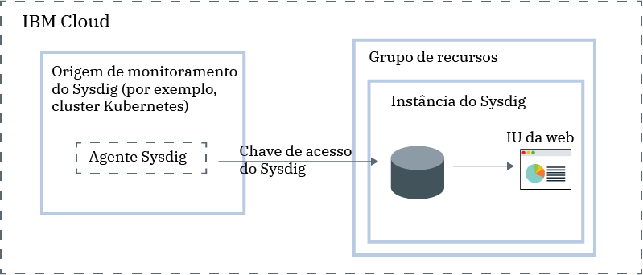

---

copyright:
  years:  2018, 2019
lastupdated: "2019-05-09"

keywords: Sysdig, IBM Cloud, monitoring, overview

subcollection: Sysdig

---

{:new_window: target="_blank"}
{:shortdesc: .shortdesc}
{:screen: .screen}
{:pre: .pre}
{:table: .aria-labeledby="caption"}
{:codeblock: .codeblock}
{:tip: .tip}
{:download: .download}
{:important: .important}
{:note: .note}

# {{site.data.keyword.mon_full_notm}}
{: #about}

O {{site.data.keyword.mon_full}} é um sistema de gerenciamento de terceiros de inteligência de contêiner e de nuvem nativa que pode ser incluído como parte de sua arquitetura {{site.data.keyword.cloud_notm}}. Use-o para obter visibilidade operacional para o desempenho e o funcionamento de seus aplicativos, serviços e plataformas. Ele oferece administradores, equipes do DevOps
e desenvolvedores de telemetria de pilha integral com recursos avançados para monitorar e solucionar problemas,
definir alertas e projetar painéis customizados. O {{site.data.keyword.mon_full_notm}} é operado pelo Sysdig em parceria com a {{site.data.keyword.IBM_notm}}.
{:shortdesc}

Para incluir recursos de monitoramento com o {{site.data.keyword.mon_full_notm}} no {{site.data.keyword.cloud_notm}}, deve-se provisionar uma instância do serviço {{site.data.keyword.mon_full_notm}}.

Antes de provisionar uma instância, considere as informações a seguir:

* Seus dados são enviados a um terceiro.
* O proprietário da conta pode criar, visualizar e excluir uma instância de um serviço no {{site.data.keyword.cloud_notm}}. Esse usuário também pode conceder permissões a outros usuários
para trabalhar com o serviço {{site.data.keyword.mon_full_notm}}.
* Outros usuários do {{site.data.keyword.cloud_notm}} com as permissões `administrator` ou `editor` podem gerenciar o serviço {{site.data.keyword.mon_full_notm}} no {{site.data.keyword.cloud_notm}}. Esses usuários também devem ter permissões de plataforma para criar recursos no contexto do grupo de recursos no qual planejam provisionar a instância.

Você provisiona uma instância no contexto de um grupo de recursos. Você usa um grupo de recursos
para organizar seus serviços para propósitos de controle de acesso e faturamento. É possível provisionar a instância do {{site.data.keyword.mon_full_notm}} no grupo de recursos *padrão* ou em um grupo de recursos customizados.

Ao [provisionar uma instância](/docs/services/Monitoring-with-Sysdig?topic=Sysdig-provision#provision), você obtém automaticamente uma chave de ingestão, conhecida como [Chave de acesso do Sysdig](/docs/services/Monitoring-with-Sysdig?topic=Sysdig-access_key#access_key).

Depois de provisionar uma instância, deve-se configurar um agente do {{site.data.keyword.mon_full_notm}} para cada origem de métrica. Uma origem de métrica é um recurso de nuvem do qual você deseja monitorar e controlar seu desempenho e funcionamento. Deve-se configurar um agente do {{site.data.keyword.mon_full_notm}} em
cada ambiente que você deseja monitorar. Por exemplo, uma origem de métrica pode ser um cluster Kubernetes. Você usa a chave de acesso para configurar o agente Sysdig que é responsável por coletar e encaminhar dados de métrica para a sua instância.

Depois que o agente {{site.data.keyword.mon_full_notm}} é implementado em uma origem de métrica, a coleta e o encaminhamento de métricas para a instância são automáticas. O agente do {{site.data.keyword.mon_full_notm}} coleta e relata automaticamente as métricas predefinidas. É possível configurar quais métricas devem ser monitoradas em um ambiente.

É possível [monitorar](/docs/services/Monitoring-with-Sysdig?topic=Sysdig-monitoring#monitoring) e [gerenciar](/docs/services/Monitoring-with-Sysdig?topic=Sysdig-manage#manage) dados por meio da IU da web do {{site.data.keyword.mon_full_notm}}.  

A figura a seguir mostra a visão geral dos componentes para o serviço {{site.data.keyword.mon_full_notm}} que está em execução no {{site.data.keyword.cloud_notm}}:

## Coleta de Dados
{: #overview_collection}

Ao configurar um agente Sysdig para coletar e encaminhar dados para uma instância do {{site.data.keyword.mon_full_notm}}, os dados são coletados automaticamente e estão disponíveis para análise por meio da IU da web.

Os dados são coletados em uma frequência de 10 segundos. 

## Disponibilidade de dados
{: #overview_availability}

Os dados estão disponíveis por um máximo de 15 meses.

Depois de remover um agente Sysdig de um host ou de contêiner, os dados históricos não serão excluídos. Os dados estarão disponíveis para análise por meio da IU da web para o período de tempo em que o agente foi instalado e para relatório.

Depois de excluir uma instância do serviço {{site.data.keyword.mon_full_notm}}, os dados não estarão disponíveis para procura e análise.

## Retenção de dados
{: #overview_retention}

Os dados são retidos para cada instância com base em uma política de *sintetização*.

À medida que o tempo progride, os dados são sintetizados da baixa à alta granularidade até o término de 3 meses.

A política de sintetização descreve a granularidade dos dados ao longo do tempo:

* Os dados são retidos em uma resolução de 10 segundos para as primeiras seis horas.
* Os dados são retidos em uma resolução de um minuto para dois dias.
* Os dados são retidos em uma resolução de 10 minutos para duas semanas.
* Os dados são retidos em uma resolução de uma hora para três meses.
* Os dados são retidos em uma resolução de um dia para um ano.

## Exclusão de dados
{: #overview_data_deletion}

Quando você exclui uma instância de {{site.data.keyword.mon_full_notm}} do {{site.data.keyword.cloud_notm}}, deve-se abrir um caso por meio do suporte para solicitar que os dados sejam excluídos. Para obter mais informações, veja [entrando em contato com
o suporte](/docs/services/Monitoring-with-Sysdig?topic=Sysdig-gettinghelp#gettinghelp).

Quando você exclui uma captura, o arquivo de dados para essa captura é excluído automaticamente.

A exclusão de dados que são coletados de um único agente Sysdig em uma instância do {{site.data.keyword.mon_short}} não é suportada.
{: note}

## Local de dados
{: #overview_data_location}

O {{site.data.keyword.mon_full_notm}}  coleta e agrega métricas. 

* Os dados de métrica são hospedados no {{site.data.keyword.cloud_notm}}.
* Cada local de multi-zone region (MZR) coleta e agrega métricas para cada instância do {{site.data.keyword.mon_full_notm}} que é executada nesse local.
* Os dados são colocados em colocação na região na qual a instância do {{site.data.keyword.mon_full_notm}} é provisionada. Por exemplo, os dados de métrica de uma
instância provisionada no sul dos EUA estão hospedados na região sul dos EUA.

## Agentes {{site.data.keyword.mon_full_notm}}
{: #overview_sysdig_agent}

O agente do {{site.data.keyword.mon_full_notm}} coleta e relata automaticamente as métricas predefinidas. 

A lista a seguir descreve os agentes do {{site.data.keyword.mon_full_notm}} que estão disponíveis:

* {{site.data.keyword.mon_full_notm}}  agente para Kubernetes, GKE e OpenShift.
* Agente do {{site.data.keyword.mon_full_notm}} para contêineres do Docker ou para serviços não conteinerizados.
* {{site.data.keyword.mon_full_notm}}  agent for Mesos, Marathon e DCOS.
* {{site.data.keyword.mon_full_notm}}  agente para instalações manuais do Linux.

Para obter mais informações, consulte [Configurando um agente Sysdig](/docs/services/Monitoring-with-Sysdig?topic=Sysdig-config_agent#config_agent) e [Removendo um agente Sysdig](/docs/services/Monitoring-with-Sysdig?topic=Sysdig-remove#remove).

## Visualizando o uso
{: #overview_usage}

Para monitorar o uso e os custos de seu serviço, consulte [Visualizando seu uso](/docs/billing-usage/viewing_usage.html#viewingusage).

## Planos de serviço
{: #overview_plans}

Há diferentes planos de precificação disponíveis para uma instância do {{site.data.keyword.mon_full_notm}}. [Saiba mais](/docs/services/Monitoring-with-Sysdig?topic=Sysdig-pricing_plans#pricing_plans).

## Considerações de segurança
{: #overview_security}

**Capturas**

Uma captura é um arquivo de rastreio que pode ser gerado para analisar o que acontece em um host durante um prazo. As capturas contêm chamadas de sistema e outros eventos do S.O. É possível ativar ou desativar esse recurso por nó quando você configura o agente Sysdig que coleta métricas desse nó. Por padrão, as *Capturas* são ativadas quando você configura um agente Sysdig. Um nó pode ser um host, um contêiner, uma máquina virtual, um bare metal ou qualquer origem de métrica na qual você instala um agente Sysdig.

Quando as Capturas estiverem ativadas, observe que o Sysdig terá uma visibilidade profunda em suas operações. Para evitar um incidente de segurança e potencialmente expor os dados fora de sua organização, verifique as políticas de segurança de sua organização antes de ativar capturas em um nó. Considere desativar o recurso *Captura* para todos os agentes Sysdig.
{: important}

