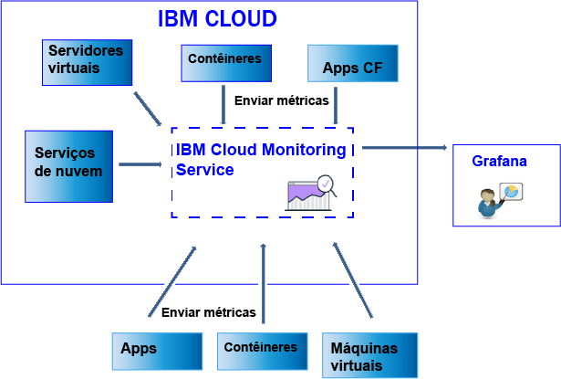

---

copyright:
  years: 2017, 2019

lastupdated: "2019-03-06"

keywords: IBM Cloud, monitoring

subcollection: cloud-monitoring

---

{:new_window: target="_blank"}
{:shortdesc: .shortdesc}
{:screen: .screen}
{:pre: .pre}
{:table: .aria-labeledby="caption"}
{:codeblock: .codeblock}
{:tip: .tip}
{:download: .download}
{:important: .important}
{:note: .note}

# Enviando e recuperando dados
{: #send_retrieve_metrics_ov}

É possível enviar métricas para um espaço usando a API Metrics ou configurando o
plug-in do {{site.data.keyword.monitoringshort}}, que é um plug-in collectd. É possível recuperar métricas usando a API de Métricas.
{:shortdesc}

		
## Enviando métricas
{: #send}

A figura a seguir mostra uma visualização de alto nível das diferentes origens de dados de onde é possível enviar métricas para o serviço {{site.data.keyword.monitoringshort}}:

Para contêineres que são executados em um cluster do Kubernetes no {{site.data.keyword.Bluemix_notm}} e para serviços selecionados, as métricas do sistema básico são coletadas automaticamente. 
Também é possível coletar mais métricas ou enviar métricas de fora do {{site.data.keyword.IBM_notm}} Cloud para o serviço. {{site.data.keyword.monitoringshort}} Métodos diferentes estão disponíveis. As tabelas a seguir listam os métodos de origem de métricas:

<table>
  <caption>Tabela 1. Métodos para enviar métricas para o serviço {{site.data.keyword.monitoringshort}} para recursos do {{site.data.keyword.IBM_notm}} Cloud.</caption>
  <tr>
    <th>Origem de métricas</th>
	<th>API de métricas</th>
    <th>Plug-in do {{site.data.keyword.monitoringshort}} (coletado)</th>	
	<th>Mais informações</th>
  </tr>
  <tr>
    <td>Contêineres que são executados em um cluster do Kubernetes no
{{site.data.keyword.Bluemix_notm}}</td>
	<td>Sim</td>
	<td>Sim</td>
	<td>As métricas do sistema básico são coletadas automaticamente. É possível instalar o collectd explicitamente e enviar métricas avançadas ou customizadas que não são fornecidas por padrão.</td>
  </tr>
  <tr>
    <td>Aplicativos Cloud Foundry</td>
	<td>Sim</td>
	<td>Não</td>
	<td></td>
  </tr>
  <tr>
    <td>Servidores virtuais</td>
	<td>Sim</td>
	<td>Sim</td>
	<td>**Nota:** não suportado para o Windows.</td>
  </tr>
</table>

<table>
  <caption>Tabela 2. Métodos para enviar métricas para o serviço {{site.data.keyword.monitoringshort}} de fora do {{site.data.keyword.IBM_notm}} Cloud.</caption>
  <tr>
    <th>Origem de métricas</th>
	<th>API de métricas</th>
    <th>Plug-in do {{site.data.keyword.monitoringshort}} (coletado)</th>	
	<th>Mais informações</th>
  </tr>
  <tr>
    <td>Contêineres</td>
	<td>Sim</td>
	<td>Sim</td>
	<td>É possível usar *supervisord* como terminal de contêiner para executar e gerenciar o seu app e o collectd.</td>
  </tr>
  <tr>
    <td>Aplicativos</td>
	<td>Sim</td>
	<td>Não</td>
	<td></td>
  </tr>
  <tr>
    <td>Serviços</td>
	<td>Sim</td>
	<td>Não</td>
	<td></td>
  </tr>
  <tr>
    <td>Máquinas Virtuais (VM)</td>
	<td>Sim</td>
	<td>Sim</td>
	<td>**Nota:** não suportado para o Windows.</td>
  </tr>
</table>

Para enviar métricas para o serviço do {{site.data.keyword.monitoringshort}}, considere as informações a seguir: 

* Deve-se especificar o espaço no qual você deseja enviar as métricas.

* Deve-se fornecer um token de segurança ou uma chave de API para trabalhar com o serviço do {{site.data.keyword.monitoringshort}}. 

* O ID do {{site.data.keyword.IBM_notm}} do usuário que envia as métricas deve ter uma política do IAM designada ao serviço {{site.data.keyword.monitoringshort}}. As funções do IAM a seguir permitem que um usuário envie métricas: *Administrador*, *Editor* e *Operador*.

* Deve-se especificar o terminal de API no qual você está enviando métricas. Há um terminal por região. Por exemplo, para a região Sul dos EUA, o terminal é o seguinte: `https://metrics.ng.bluemix.net/v1/metrics`. Para obter mais informações sobre os terminais, consulte [URLs para o serviço {{site.data.keyword.monitoringshort}} ](/docs/services/cloud-monitoring?topic=cloud-monitoring-monitoring_ov#region){: new_window}.

É possível enviar métricas para o serviço {{site.data.keyword.monitoringshort}} usando qualquer um dos métodos a seguir:

* *Método 1: configure o plug-in do {{site.data.keyword.monitoringshort}}. *

    Para obter mais informações, consulte [Configurando o plug-in do {{site.data.keyword.monitoringshort}}](/docs/services/cloud-monitoring/send-metrics?topic=cloud-monitoring-conf_monitoring_plugin#conf_monitoring_plugin).

    A figura a seguir mostra uma visualização de alto nível de como usar o plug-in do {{site.data.keyword.monitoringshort}} para enviar métricas para o serviço do {{site.data.keyword.monitoringshort}}:

    

* *Método 2: use a API de Métricas. *

    Para obter mais informações, veja [Enviando métricas usando a API de Métricas](/docs/services/cloud-monitoring/send-metrics?topic=cloud-monitoring-send_data_api#send_data_api).

## Recuperando métricas
{: #retrieve}

Se você precisa executar análise adicional fora do serviço {{site.data.keyword.monitoringshort}} ou se seu aplicativo deseja usar métricas para tomar decisões, é possível usar a API Metrics para recuperar um máximo de cinco métricas por solicitação. 

* Para obter mais informações sobre como recuperar métricas, consulte
[Recuperando
métricas de um domínio](/docs/services/cloud-monitoring/retrieve-metrics?topic=cloud-monitoring-retrieve_data_api#retrieve_data_api)
* Para obter mais informações sobre a API de Métricas, veja [API de Métricas](https://console.bluemix.net/apidocs/927-ibm-cloud-monitoring-rest-api?&language=node#introduction){: new_window}.

Para recuperar métricas, considere as informações a seguir: 

* Deve-se configurar o espaço de onde você deseja recuperar os dados. 
* Deve-se fornecer um token de segurança ou uma chave de API para trabalhar com o serviço do {{site.data.keyword.monitoringshort}}. 
* Deve-se especificar um caminho para 1 ou mais métricas. Para obter mais informações, veja [Definindo as métricas](/docs/services/cloud-monitoring/retrieve-metrics?topic=cloud-monitoring-retrieve_data_api#metrics).
* Como opção, é possível especificar um período customizado. Por padrão, se você não especificar um período, os dados recuperados serão aqueles que corresponderem às últimas 24 horas. Para obter mais informações, veja [Configurando um período de tempo](/docs/services/cloud-monitoring/retrieve-metrics?topic=cloud-monitoring-retrieve_data_api#time).

## Listando as métricas
{: #show_metrics}

Será possível listar as métricas que estiverem disponíveis em um espaço.

Para listar as métricas, considere as informações a seguir: 

* Deve-se configurar o espaço do {{site.data.keyword.Bluemix_notm}} para o qual você deseja listar as métricas que estão disponíveis.

* Deve-se fornecer um token de segurança ou uma chave de API para trabalhar com o serviço do {{site.data.keyword.monitoringshort}}. 

* Deve-se especificar uma consulta que defina o caminho por meio do qual listar as métricas. Por exemplo, para listar todas as métricas em um espaço, é possível configurar a consulta para: `query=*` 

    O padrão é `*` que especifica o ponto de início no nível raiz para o espaço.
	
* Também é possível usar a chamada API `Endpoint/v1/metrics/list`, em que Endpoint representa o ponto de entrada para o serviço. 

    Cada região possui uma URL diferente. Por exemplo, para a região Sul dos EUA, é possível usar o terminal de API `https://metrics.ng.bluemix.net/v1/metrics/list` 

    Para obter a lista de terminais por região, consulte [Terminais](/docs/services/cloud-monitoring?topic=cloud-monitoring-send_retrieve_metrics_ov#endpoints).

    Para obter mais informações sobre a API, veja [a API de Métricas](https://console.bluemix.net/apidocs/927-ibm-cloud-monitoring-rest-api?&language=node#introduction){: new_window}.

## Terminais para enviar métricas
{: #endpoints}

 A tabela a seguir lista os terminais por região:
	
<table>
    <caption>Lista de terminais</caption>
	<tr>
	  <th>Região</th>
	  <th>Url</th>
	  <th>Porta collectd</th>
	</tr>
	<tr>
	  <td>Alemão</td>
	  <td>[https://metrics.eu-de.bluemix.net](https://metrics.eu-de.bluemix.net)</td>
	  <td>9095</td>
	</tr>
	<tr>
	  <td>Sydney</td>
	  <td>[https://metrics.au-syd.bluemix.net](https://metrics.au-syd.bluemix.net)</td>
	  <td>9095</td>
	</tr>
	<tr>
	  <td>Reino Unido</td>
	  <td>[https://metrics.eu-gb.bluemix.net](https://metrics.eu-gb.bluemix.net)</td>
	  <td>9095</td>
	</tr>
	<tr>
	  <td>Sul dos Estados Unidos</td>
	  <td>[https://metrics.ng.bluemix.net](https://metrics.ng.bluemix.net)</td>
	  <td>9095</td>
	</tr>
</table>

 
