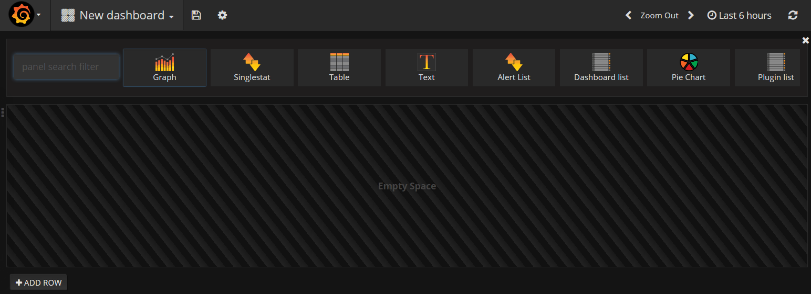

---

copyright:
  years: 2017, 2019

lastupdated: "2019-03-06"

keywords: IBM Cloud, monitoring

subcollection: cloud-monitoring

---

{:new_window: target="_blank"}
{:shortdesc: .shortdesc}
{:screen: .screen}
{:pre: .pre}
{:table: .aria-labeledby="caption"}
{:codeblock: .codeblock}
{:tip: .tip}
{:download: .download}
{:important: .important}
{:note: .note}

# Crie um painel do Grafana para monitorar um cluster do Kubernetes
{: #container_grafana_dashboard}

Use este tutorial para aprender como criar um painel do Grafana no
serviço do {{site.data.keyword.monitoringlong}} para monitorar o desempenho de seu cluster. 
{:shortdesc}

## Objetivos
{: #cgd_objectives}

Aprenda como procurar e analisar métricas do contêiner para um app que é implementado em um cluster
do Kubernetes:

1. Ative o Grafana e configure o domínio do {{site.data.keyword.monitoringshort}} em que é possível visualizar as métricas do cluster.
2. Crie um painel do Grafana e defina uma métrica que monitore o uso da CPU de um contêiner.

## Suposições
{: #cgd_assumptions}

O tutorial supõe que:

* Um cluster está disponível na região Sul dos EUA. 
* Seu ID do usuário tem uma política do IAM para o serviço {{site.data.keyword.monitoringshort}} com permissões de **visualizador**.

Para concluir este tutorial, deve-se concluir o tutorial
[Analisar
métricas no Grafana para um app que é implementado em um cluster do Kubernetes](/docs/services/cloud-monitoring/tutorials/container_service_metrics.html#container_service_metrics) ou ter um cluster
fornecido com pelo menos 1 aplicativo implementado.

## Etapa 1: Ativar o Grafana
{: #cgd_step1}

Ative o Grafana em um navegador e configure o domínio do {{site.data.keyword.monitoringshort}}
no qual é possível visualizar as métricas do cluster.

Para analisar métricas para um cluster, deve-se acessar o Grafana na região Pública de nuvem na qual o cluster estiver criado. Para obter mais informações, veja [Navegando para o painel do Grafana por meio de um navegador da web](/docs/services/cloud-monitoring/grafana/navigating_grafana.html#launch_grafana_from_browser).

1. Em um navegador, ative o Grafana. 

    Insira a URL de serviço do {{site.data.keyword.monitoringshort}} para a região em que você criou o cluster. 
    
    Para obter as URLs por região, consulte
[URLs para o serviço de
monitoramento](/docs/services/cloud-monitoring/monitoring_ov.html#region).

    Por exemplo, para a região Sul dos EUA, ative:
[https://metrics.ng.bluemix.net/](https://metrics.ng.bluemix.net/).

2. Configure o domínio do {{site.data.keyword.monitoringshort}} como **conta**.

    No Grafana, selecione seu ID. Em seguida, verifique se você está na conta correta e escolha
`Domain = account`.

## Etapa 2: Criar um painel do Grafana
{: #cgd_step2}

Conclua as etapas a seguir para criar um novo painel:

1. Selecione a alternância de barra de menus lateral .
2. Selecione **Painéis**.
3. Clique em **Novo**

Um painel se abre. O painel inclui uma linha vazia que está pronta para configuração.

No Grafana, você inclui linhas para dividir o painel em seções. Uma linha agrupa um ou mais painéis. Dentro de uma linha, um painel é a menor unidade de visualização que pode ser configurada para exibir dados para uma métrica; por exemplo, é possível escolher um painel de gráfico ou um painel de tabela. É possível arrastar e soltar painéis para reorganizá-los em um dashboard. Os dados que um painel exibe são configurados por meio de consultas. É possível definir uma ou mais consultas em um painel. Cada consulta representa um conjunto diferente de dados. Também é possível configurar o intervalo de tempo para um painel. Normalmente, o intervalo de tempo é configurado pelo selecionador de tempo do *Dashboard*.

## Etapa 3: Incluir um Gráfico no painel para monitorar uma métrica
{: #cgd_step3}

Conclua as etapas a seguir:

1. Selecione **Gráfico**.

2. Clique no título do gráfico e, em seguida, selecione **Editar**.

    O *Métricas* guia é aberta. É possível ver aqui a origem de dados padrão.

## Etapa 4: Definir uma consulta de métrica
{: #cgd_step4}

Defina a consulta que filtra os dados que são exibidos no gráfico. Essa consulta monitora os
nanossegundos de tempo de CPU em todos os núcleos de um contêiner.

Para obter informações sobre o formato da consulta, veja [Formato de consulta para métricas de CPU coletadas para contêineres](/docs/services/cloud-monitoring/reference/metrics_format_containers.html#cpu_containers).
 
Na guia *Métricas*, selecione **Incluir consulta**.  Uma entrada de consulta é incluído. Cada consulta é rotulada com uma letra. 

 
	
Conclua as etapas a seguir para definir a consulta:
        
1. Clique em **Selecionar métrica** para especificar a origem e, em seguida,
escolha `ibmcloud`.
    
2. Clique em **Selecionar métrica** para especificar o tipo de nuvem e, em
seguida, escolha `public`.
    
3. Clique em **Selecionar métrica** para especificar o nome do serviço e, em seguida, escolha `containers-kubernetes`.
	
4. Clique em **Selecionar métrica** para especificar a região e, em seguida,
escolha a região em que seu cluster está em execução. Por exemplo, `us-south`.
    
5. Clique em **Selecionar métrica** para especificar o nome do cluster e, em
seguida, escolha o nome do cluster no qual o contêiner está em execução.
		
6. Clique em **Selecionar métrica** para especificar a origem da métrica. Selecione
**contêiner**.
		
7. Clique em **Selecionar métrica** para especificar o namespace. Em seguida,
insira o nome do namespace em seu cluster que está associado ao seu contêiner.
		
8. Clique em **Selecionar métrica** para especificar o nome do pod.
	
9. Clique em **Selecionar métrica** para especificar o nome do contêiner
que você deseja monitorar.
	
10. Clique em **Selecionar métrica** para especificar o tipo de métrica e, em
seguida, clique em **Selecionar métrica** para especificar o subtipo de métrica.
	
    Por exemplo, para monitorar os nanossegundos de tempo de CPU em todos os núcleos de um
contêiner, selecione **cpu** para o tipo e **usage** para o subtipo.
		
	Para obter uma lista de métricas da CPU, consulte
[Métricas da CPU para contêineres](/docs/services/cloud-monitoring/containers/monitoring_containers_ov.html#cpu_metrics_containers).
    
11. Clique na imagem de mais  e escolha uma função. Será possível incluir uma função para transformar, combinar e executar cálculos nos dados que estiverem disponíveis para uma métrica.

    Por exemplo, é possível incluir a função **alias(newName)** para incluir um alias para uma métrica. Esse alias é usado para imprimir uma sequência em vez do nome da métrica na legenda que é exibida no gráfico.

    Para incluir um alias para sua métrica, conclua as etapas a seguir:

    1. Clique no símbolo de mais.
    2. Selecione **Especial**.
    3 Selecione **alias**.
    4. Insira uma sequência, por exemplo, `My sample metric`.

## Etapa 5: Salvar o painel
{: #cgd_step5}

Salve o painel para reutilização posterior.

1. Clique na imagem de painel salvar .

    

2. Insira o nome do painel.
3. Clique em **Salvar**.

## Etapas Seguintes
{: #cgd_next_steps}

Defina um alerta para uma métrica. Para obter mais informações, consulte [Configurando alertas](/docs/services/cloud-monitoring/config_alerts_ov.html#config_alerts_ov).
