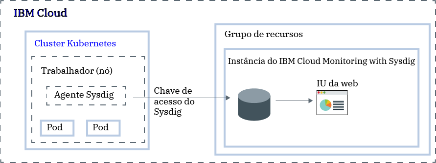

---

copyright:
  years:  2018, 2019
lastupdated: "2019-03-06"

keywords: Sysdig, IBM Cloud, monitoring, kubernetes, analyze metrics

subcollection: Sysdig

---

{:new_window: target="_blank"}
{:shortdesc: .shortdesc}
{:screen: .screen}
{:pre: .pre}
{:table: .aria-labeledby="caption"}
{:codeblock: .codeblock}
{:tip: .tip}
{:download: .download}
{:important: .important}
{:note: .note}


# Analisar métricas para um app que é implementado em um cluster Kubernetes
{: #kubernetes_cluster}

Use este tutorial para saber como configurar um cluster para encaminhar métricas para o serviço {{site.data.keyword.mon_full_notm}} no {{site.data.keyword.cloud_notm}}.
{:shortdesc}

É possível usar o serviço {{site.data.keyword.mon_full_notm}} para monitorar clusters Kubernetes.

Para configurar um cluster para encaminhar métricas, deve-se instalar um agente em cada nó do trabalhador em seu cluster Kubernetes usando um DaemonSet. O agente Sysdig usa uma chave de acesso (token) para autenticar com a instância do {{site.data.keyword.mon_full_notm}}. O agente Sysdig age como um coletor de dados. Ele coleta automaticamente métricas como *CPU do trabalhador* e memória do trabalhador *, *tráfego HTTP dentro e fora de seus contêineres* e várias partes de software de infraestrutura comum. Além disso, o agente pode coletar métricas de aplicativo customizado usando um extrator compatível com Prometheus ou uma fachada statsd. 

Você visualiza métricas por meio da interface com o usuário baseada na web do Sysdig.




## Antes de iniciar
{: #kubernetes_cluster_prereqs}

Para concluir as etapas neste tutorial de introdução, instruções são fornecidas para provisionar uma instância do {{site.data.keyword.mon_full_notm}} na região sul dos EUA. É possível usar um cluster de saída ou um novo **cluster versão 1.10**. O cluster pode estar disponível em uma região diferente.  

Leia sobre o {{site.data.keyword.mon_full_notm}}. Para obter mais informações, consulte [Sobre](/docs/services/Monitoring-with-Sysdig?topic=Sysdig-about#about).

Use um ID do usuário que seja membro ou proprietário de uma conta do {{site.data.keyword.cloud_notm}}. Para obter um ID do usuário do {{site.data.keyword.cloud_notm}}, acesse: [Registro ](https://cloud.ibm.com/login){:new_window}.

Seu ID da {{site.data.keyword.IBM_notm}} deve ter designado políticas do IAM para cada um dos recursos a seguir: 

| Recurso                             | Escopo da política de acesso | Função    | Região    | Informações                  |
|--------------------------------------|----------------------------|---------|-----------|------------------------------|
| Grupo de recursos **Padrão**           |  Grupo de recursos            | Visualizador  | Sul dos EUA  | Essa política é necessária para permitir que o usuário veja instâncias de serviço no grupo de recursos Padrão.    |
| Serviço {{site.data.keyword.mon_full_notm}} |  Grupo de recursos            | Editor  | Sul dos EUA  | Essa política é necessária para permitir que o usuário provisione e administre o serviço {{site.data.keyword.mon_full_notm}} no grupo de recursos Padrão.   |
| Instância de cluster do Kubernetes          |  Recurso                 | Editor  | Sul dos EUA  | Essa política é necessária para configurar o segredo e o agente Sysdig no cluster Kubernetes. |
{: caption="Tabela 1. Lista de políticas do IAM necessárias para concluir o tutorial" caption-side="top"} 

Para obter mais informações sobre as funções do IAM do {{site.data.keyword.containerlong}}, consulte [Permissões de acesso de usuário](/docs/containers?topic=containers-access_reference#access_reference).

Instale a CLI do {{site.data.keyword.cloud_notm}} e o plug-in da CLI do Kubernetes. Para obter mais informações, consulte [Instalando a CLI do {{site.data.keyword.cloud_notm}}](/docs/cli?topic=cloud-cli-ibmcloud-cli#ibmcloud-cli).


## Step1: provisionar uma instância do {{site.data.keyword.mon_full_notm}}
{: #kubernetes_cluster_step1}

Para provisionar uma instância do {{site.data.keyword.mon_full_notm}} por meio da IU do {{site.data.keyword.cloud_notm}}, conclua as etapas a seguir:

1. Efetue login em sua conta do  {{site.data.keyword.cloud_notm}} .

    Clique em [Painel do {{site.data.keyword.cloud_notm}} ](https://cloud.ibm.com/login){:new_window} para ativar o painel do {{site.data.keyword.cloud_notm}}.

	Depois de efetuar login com seu ID de usuário e senha, a IU do {{site.data.keyword.cloud_notm}} é aberta.

2. Clique em  ** Catálogo **. A lista dos serviços disponíveis no {{site.data.keyword.cloud_notm}} é aberta.

3. Para filtrar a lista de serviços exibida, selecione a categoria **Ferramentas do desenvolvedor**.

4. Clique no quadro  ** {{site.data.keyword.mon_full_notm}} ** . O painel *Observabilidade* é aberto.

5. Selecione **Criar instância**. 

6. Insira um nome para a instância de serviço.

7. Selecione o grupo de recursos **Padrão**. 

    Por padrão, o grupo de recursos **Padrão** é configurado.

8. Selecione o plano de serviço  ** Experimental ** . 

    Por padrão, o plano de **Experiência** é configurado.

    Para obter mais informações sobre outros planos de serviços, consulte [Planos de precificação](/docs/services/Monitoring-with-Sysdig?topic=Sysdig-pricing_plans#pricing_plans).

9. Para provisionar o serviço {{site.data.keyword.mon_full_notm}} no grupo de recursos do {{site.data.keyword.cloud_notm}} ao qual você está conectado, clique em **Criar**.

Depois que você provisiona uma instância, o painel *Observabilidade* é aberto. 


**Nota:** para provisionar uma instância por meio da CLI, consulte [Provisionando uma instância por meio da CLI do {{site.data.keyword.cloud_notm}}](/docs/services/Monitoring-with-Sysdig?topic=Sysdig-provision#provision_cli).


## Etapa 2: configurar seu cluster Kubernetes para enviar métricas para sua instância
{: #kubernetes_cluster_step2}

Para configurar seu cluster Kubernetes para enviar métricas para sua instância do {{site.data.keyword.mon_full_notm}}, deve-se instalar um pod do agente Sysdig em cada nó de seu cluster. O agente Sysdig é instalado por meio de um DaemonSet, que assegura que uma instância do agente esteja em execução em cada nó do trabalhador. O agente Sysdig coleta métricas do pod no qual ele está instalado e encaminha os dados para sua instância.

**Nota:** para fornecer o conjunto completo de métricas do sistema, o agente Sysdig precisa ter um status privilegiado.

Para configurar seu cluster Kubernetes para encaminhar métricas para a sua instância do {{site.data.keyword.mon_full_notm}}, conclua as etapas a seguir por meio da linha de comandos:

1. Abra um terminal. Em seguida, efetue login no {{site.data.keyword.cloud_notm}}. Execute o comando a seguir e siga os prompts:

    ```
    ibmcloud login -a api.ng.bluemix.net
    ```
    {: codeblock}

    Selecione a conta na qual você provisionou a instância do {{site.data.keyword.mon_full_notm}}.

2. Configure o ambiente em cluster. Execute os comandos a seguir:

    Primeiro, obtenha o comando para configurar a variável de ambiente e fazer download dos arquivos de configuração do Kubernetes.

    ```
    ibmcloud ks cluster-config <cluster_name_or_ID>
    ```
    {: codeblock}

    Quando o download dos arquivos de configuração estiver concluído, será exibido um comando que poderá ser usado para configurar o caminho para o seu arquivo de configuração local do Kubernetes como uma variável de ambiente.

    Em seguida, copie e cole o comando exibido em seu terminal para configurar a variável de ambiente KUBECONFIG.

    **Nota:** toda vez que você efetua login na CLI do {{site.data.keyword.containerlong}} para trabalhar com clusters, deve-se executar esses comandos para configurar o caminho para o arquivo de configuração do cluster como uma variável de sessão. O Kubernetes CLI usa essa variável para localizar um arquivo de configuração local e certificados que são necessárias para se conectar ao cluster no {{site.data.keyword.cloud_notm}}.

3. Obtenha a chave de acesso do Sysdig. Para obter mais informações, consulte [Obtendo a chave de acesso por meio da IU do {{site.data.keyword.cloud_notm}}](/docs/services/Monitoring-with-Sysdig?topic=Sysdig-access_key#access_key_ibm_cloud_ui).

4. Obtenha a URL de ingestão. Para obter mais informações, consulte [Terminais do coletor Sysdig](/docs/services/Monitoring-with-Sysdig?topic=Sysdig-endpoints#endpoints_ingestion).

5. Implemente o agente Sysdig. Execute o seguinte comando:

    ```
    curl -sL https://raw.githubusercontent.com/draios/sysdig-cloud-scripts/master/agent_deploy/IBMCloud-Kubernetes-Service/install-agent-k8s.sh | bash -s -- -a SYSDIG_ACCESS_KEY -c COLLECTOR_ENDPOINT -t TAG_DATA -ac 'sysdig_capture_enabled: false'
    ```
    {: codeblock}

    sendo

    * SYSDIG_ACCESS_KEY é a chave de ingestão para a instância.

    * COLLECTOR_ENDPOINT é a URL de ingestão da região na qual a instância de monitoramento está disponível.

    * TAG_DATA são tags separadas por vírgulas formatadas como *TAG_NAME:TAG_VALUE*. É possível associar uma ou mais tags a seu agente Sysdig. Por exemplo: *role:serviceX,location:us-south*. Posteriormente, será possível usar essas tags para identificar métricas no ambiente em que o agente está em execução.

    * Configure **sysdig_capture_enabled** como *false* para desativar o recurso de captura de Sysdig. Por padrão, é configurado como *true*. Para obter mais informações, consulte [Trabalhando com capturas](/docs/services/Monitoring-with-Sysdig?topic=Sysdig-captures#captures).

6. Verifique se o agente Sysdig foi criado com êxito e seu status. Execute o seguinte comando:

    ```
    kubectl get pods
    ```
    {: codeblock}


## Etapa 3: Ativar a IU da web Sysdig
{: #kubernetes_cluster_step3}

Conclua as etapas a seguir para ativar a IU da web:

1. Efetue login em sua conta do  {{site.data.keyword.cloud_notm}} .

    Clique em [Painel do {{site.data.keyword.cloud_notm}} ](https://cloud.ibm.com/login){:new_window} para ativar o painel do {{site.data.keyword.cloud_notm}}.

	Depois que você efetua login com seu ID do usuário e senha, o Painel do {{site.data.keyword.cloud_notm}} é aberto.

2. No menu de navegação, selecione **Observabilidade**. 

3. Selecione **Monitorando**. 

    A lista de instâncias disponíveis no {{site.data.keyword.cloud_notm}} é exibida.

4. Selecione sua instância. Em seguida, clique em **Visualizar Sysdig**.

Se o agente Sysdig for configurado com êxito, a visualização *EXPLORAR* será aberta.

No entanto, se o agente Sysdig não for instalado com êxito, apontar para o terminal de ingestão errado ou a chave de acesso estiver incorreta, a página aberta informará o que fazer a seguir.

É possível ter apenas uma sessão de IU da web aberta por navegador.
{: tip}


## Etapa 4: Monitorar seu cluster
{: #kubernetes_cluster_step4}

É possível monitorar seu cluster na visualização **EXPLORAR** que está disponível por meio da IU da web. Essa visualização é o ponto de início para solucionar problemas e monitorar sua infraestrutura. É a página inicial padrão da IU da web para usuários.

Na seção *Host e contêineres*, é possível ver a lista de trabalhadores em seu cluster que estão encaminhando métricas para a instância de monitoramento. Cada entrada do trabalhador representa um grupo de objetos de infraestrutura relacionados para esse trabalhador.

Clique em **Host e contêineres**  para alternar origens de dados. Em seguida, selecione um trabalhador. Os dados que são exibidos correspondem ao trabalhador que você selecionou.

Se você clicar em **Voltar para a tabela de exploração**, a *Tabela de exploração* será exibida. Cada coluna mostra uma métrica diferente. É possível configurar cada métrica individualmente. É possível mudar a ordem das colunas. Observe que ao fazer mudanças na ordem das colunas existentes, a mudança é persistente entre os diferentes agrupamentos enquanto você está com login efetuado. Se você incluir ou remover uma coluna, a mudança será persistente. Também é possível configurar cores para destacar valores e melhorar a capacidade de leitura.

Por exemplo, para configurar a codificação de cores para uma coluna, conclua as etapas a seguir:

1. Selecione uma coluna. Passe o mouse sobre o título da coluna. Em seguida, selecione o ícone de lápis.
2. Alternar a barra para ativar a codificação de cores.
3. Configure valores para os diferentes limites.

Se você selecionar um trabalhador, um painel padrão será exibido. Clique no  e explore os diferentes painéis e métricas padrão. Observe que é possível selecionar somente métricas e painéis que são relevantes para o trabalhador selecionado.


## Próximos passos
{: #kubernetes_cluster_next_steps}

Crie um painel customizado. Para obter mais informações, consulte [Trabalhando com painéis](/docs/services/Monitoring-with-Sysdig?topic=Sysdig-dashboards#dashboards).

Também é possível saber mais sobre alertas. Para obter mais informações, consulte [Trabalhando com alertas](/docs/services/Monitoring-with-Sysdig?topic=Sysdig-monitoring#monitoring_alerts). 


