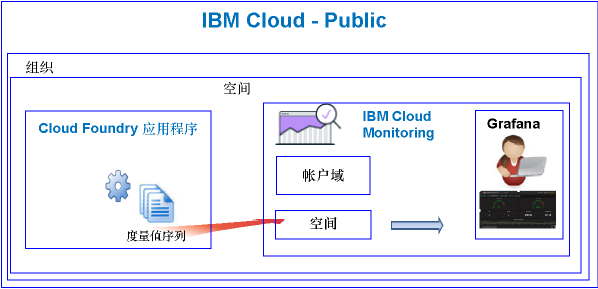

---

copyright:
  years: 2017, 2019

lastupdated: "2019-03-06"

keywords: IBM Cloud, monitoring

subcollection: cloud-monitoring

---

{:new_window: target="_blank"}
{:shortdesc: .shortdesc}
{:screen: .screen}
{:pre: .pre}
{:table: .aria-labeledby="caption"}
{:codeblock: .codeblock}
{:tip: .tip}
{:download: .download}
{:important: .important}
{:note: .note}


# Cloud Foundry 应用程序
 {:#monitoring_bluemix_apps}

在 {{site.data.keyword.Bluemix}} 中，将针对 Public 区域中运行的 Cloud Foundry (CF) 应用程序自动收集度量值，并将其转发到 {{site.data.keyword.monitoringlong}} 服务。您可以使用 Grafana 进行分析，以监视 CF 应用程序的性能。还可以使用度量值 API 来查询 CF 应用程序度量值，并根据这些数据执行操作。
{:shortdesc}


## 监视在 Public 上运行的 CF 应用程序
{: #public}


使用 {{site.data.keyword.monitoringshort}} 服务监视 CF 应用程序时，请考虑以下信息：

* 您必须在运行 CF 应用程序的同一空间中供应 {{site.data.keyword.monitoringshort}} 服务。
* 针对 CF 应用程序收集的度量值会自动转发到 {{site.data.keyword.monitoringshort}} 服务中的空间域。 
* 度量值会转发到空间域。该空间域对应于运行 CF 应用程序的空间域。 
* 还可以使用度量值 API 来查询度量值，并根据这些数据执行操作。例如，可以创建一个自动化项，用于查询 CF 应用程序的 CPU 利用率，并在 CPU 变高时对其进行缩放。

下图显示了监视 {{site.data.keyword.Bluemix_notm}} 中 CF 应用程序的高级别视图：



## 监视在 {{site.data.keyword.Bluemix_notm}} 外部运行的 CF 应用程序
{: #outside}

要监视在 {{site.data.keyword.Bluemix_notm}} 外部运行的 CF 应用程序，可以使用度量值 API 将 CF 应用程序度量值转发到 {{site.data.keyword.monitoringshort}} 服务。

* 有关该 API 的更多信息，请参阅[度量值 API](https://console.bluemix.net/apidocs/927-ibm-cloud-monitoring-metrics-api?&language=node#introduction)。
* 有关使用该 API 的更多信息，请参阅[使用度量值 API 发送数据](/docs/services/cloud-monitoring/send-metrics?topic=cloud-monitoring-send_data_api#send_data_api)。


## 查看和分析 CF 应用程序度量值
{: #monitoring_cfapps}

要监视 {{site.data.keyword.Bluemix_notm}} 中 CF 应用程序的性能，请使用 Grafana。 

{{site.data.keyword.monitoringlong}} 服务使用 Grafana（一种开放式源代码分析和可视化平台）通过各种图形（例如，图表和表）来对度量值进行监视、搜索、分析和可视化表示。

您可以通过浏览器启动 Grafana。有关更多信息，请参阅[通过 Web 浏览器导航至 Grafana 仪表板](/docs/services/cloud-monitoring/grafana?topic=cloud-monitoring-navigating_grafana#launch_grafana_from_browser)。

**注：**您必须在运行 CF 应用程序实例的同一 {{site.data.keyword.Bluemix_notm}} 区域中启动 Grafana。


要监视 CF 应用程序，您必须在 Grafana 中定义一个或多个查询。有关更多信息，请参阅[在 Grafana 中配置度量值查询](/docs/services/cloud-monitoring/grafana?topic=cloud-monitoring-define_query#define_query)。 

您还可以针对查询定义警报。有关更多信息，请参阅[配置警报](/docs/services/cloud-monitoring?topic=cloud-monitoring-config_alerts_ov#config_alerts_ov)。


## CPU 度量值
{: #cpu_metrics}

针对每个 CF 应用程序自动收集的度量值序列包含有关 CPU 利用率的数据。


<table>
  <caption>针对 CF 应用程序收集的 CPU 度量值</caption>
  <tr>
    <th>度量值</th>
    <th>描述</th>
  </tr>
  <tr>
    <td>cpu-utilization</td>
    <td>趋近于容器限制的 CPU 利用率的百分比。</td>
  </tr>
</table>


## 磁盘度量值
{: #disk_metrics}

针对每个 CF 应用程序自动收集的度量值序列包含有关已用磁盘大小、可用磁盘总大小以及已用磁盘百分比的数据。


<table>
  <caption>针对 CF 应用程序收集的磁盘度量值</caption>
  <tr>
    <th>度量值</th>
    <th>描述</th>
  </tr>
  <tr>
    <td>disk-bytes-total</td>
    <td>运行 CF 应用程序的容器的磁盘大小。值以字节为单位进行定义。</td>
  </tr>
  <tr>
    <td>disk-bytes-used</td>
    <td>CF 应用程序在磁盘上所用容器的磁盘大小。值以字节为单位进行定义。</td>
  </tr>
  <tr>
    <td>disk-utilization</td>
    <td>CF 应用程序使用的磁盘百分比。</td>
  </tr>
</table>

**注：** 

* 在推送 CF 应用程序时指定磁盘大小。
* 磁盘利用率达到 90% 时，请考虑缩放 CF 应用程序。

## 内存度量值
{: #mem_metrics}

针对每个 CF 应用程序自动收集的度量值序列包含有关已用内存、可用总内存以及已用内存百分比的数据。

<table>
  <caption>针对 CF 应用程序收集的内存度量值</caption>
  <tr>
    <th>度量值</th>
    <th>描述</th>
  </tr>
  <tr>
    <td>memory-bytes-total</td>
    <td>可供 CF 应用程序使用的内存字节数。</td>
  </tr>
  <tr>
    <td>memory-bytes-used</td>
    <td>CF 应用程序实例使用的内存（以字节为单位）。</td>
  </tr>
  <tr>
    <td>memory-utilization</td>
    <td>CF 应用程序使用的内存百分比。</td>
  </tr>
</table>


## 度量值查询格式
{: #query_format}


在 Grafana 中定义的用于监视 Cloud Foundry 应用程序的查询必须符合以下格式： 

```
{Source}.{Cloud Type}.{Service Name}.{Region}.{CFapp Name}.{CFapp Index}.{CFapp container}.{Metric Type}.{Metric Subtype}.[Functions]
```
{: codeblock}

例如，请参阅针对悉尼地区名为 logtester 的 CF 应用程序实例收集的度量值序列的样本：

```
ibmcloud.public.cloud-foundry.au-syd.logtester.0.container.cpu.utilization
ibmcloud.public.cloud-foundry.au-syd.logtester.0.container.disk.bytes-total
ibmcloud.public.cloud-foundry.au-syd.logtester.0.container.disk.bytes-used
ibmcloud.public.cloud-foundry.au-syd.logtester.0.container.disk.utilization
ibmcloud.public.cloud-foundry.au-syd.logtester.0.container.memory.bytes-total
ibmcloud.public.cloud-foundry.au-syd.logtester.0.container.memory.bytes-used
ibmcloud.public.cloud-foundry.au-syd.logtester.0.container.memory.utilization
```
{: screen}

有关更多信息，请参阅 [CF 应用程序度量值格式](/docs/services/cloud-monitoring/reference?topic=cloud-monitoring-cfapps_metrics_format#cfapps_metrics_format)。

**注：**并非 CF 应用程序名称中允许使用的所有字符都允许用于度量值序列名称。例如，不允许使用大写字母。定义查询时在 Grafana 中可以看到的 CF 应用程序名称会更改为全部小写。


