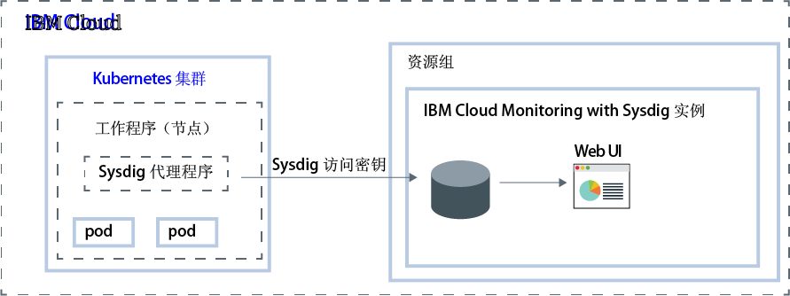

---

copyright:
  years:  2018, 2019
lastupdated: "2019-03-06"

keywords: Sysdig, IBM Cloud, monitoring, getting started

subcollection: Sysdig

---

{:new_window: target="_blank"}
{:shortdesc: .shortdesc}
{:screen: .screen}
{:pre: .pre}
{:table: .aria-labeledby="caption"}
{:codeblock: .codeblock}
{:tip: .tip}
{:download: .download}
{:important: .important}
{:note: .note}

# 入门教程
{: #getting-started}

{{site.data.keyword.mon_full_notm}} 是一种第三方云本机和容器智能管理系统，您可以将其包含在 {{site.data.keyword.cloud_notm}} 体系结构中。使用此系统可了解应用程序、服务和平台的性能和运行状况。它为管理员、DevOps 团队和开发者提供了全堆栈遥测功能，其中有多种高级功能，可用于监视和执行故障诊断，定义警报以及设计定制仪表板。{{site.data.keyword.mon_full_notm}} 由 Sysdig 与 {{site.data.keyword.IBM_notm}} 合作运行。
{:shortdesc}

下面显示了在 {{site.data.keyword.cloud_notm}} 上运行的 {{site.data.keyword.mon_full_notm}} 服务的组件概览图：

## 功能
{: #features}

**加速诊断和解决性能事件。**

通过 {{site.data.keyword.mon_full_notm}}，可以深入了解基础架构和应用程序，并能够从服务级别一直到系统级别进行故障诊断。预定义的仪表板和警报简化了潜在威胁或问题的识别。通过使用 {{site.data.keyword.mon_full_notm}}，开发者和 DevOps 团队可实时监视性能问题并对其进行故障诊断，从而识别错误的根源，并消除问题。 

**控制监视基础架构的成本。**

{{site.data.keyword.mon_full_notm}} 包含有助于控制 {{site.data.keyword.cloud_notm}} 中监视基础架构成本的功能。可以配置要监视其性能的度量源。还可以启用预定义的警报，向您发出有关将影响计费的使用量变化的警告。 

**轻松探索和直观显示整个环境。**

通过 {{site.data.keyword.mon_full_notm}}，可轻松、直观地探索您的环境。动态拓扑映射提供了服务之间依赖关系的视图。借助对高代码改动率、高基数和高频率度量值的多维度查询，可加快故障诊断速度。可定制仪表板允许您对最重要的内容进行可视化。 

**获取关键的 Kubernetes 和容器洞察，以实现动态微服务监视。**

{{site.data.keyword.mon_full_notm}} 会自动发现 Kubernetes 环境，并为集群、节点、名称空间、服务、部署、pod 等提供现成的仪表板和警报。通过每个节点一个代理程序，可动态发现所有微服务，并自动收集来自各种源的度量值和事件，包括 Kubernetes、主机、网络、容器、进程、应用程序和定制度量值（如 Prometheus、JMX 和 StatsD）。 

**通过主动通知降低异常情况造成的影响。**

{{site.data.keyword.mon_full_notm}} 包含警报和多通道通知，可用于降低对日常操作的影响，缩短对异常、停机和性能下降的反应及响应时间。可以轻松配置的通知通道包括*电子邮件*、*slack*、*PagerDuty*、*Webhook*、*OpsGenie* 和 *VictorOps*。

## 开始之前
{: #prereqs}

您必须具有作为 {{site.data.keyword.cloud_notm}} 帐户的成员或所有者的用户标识。要获取 {{site.data.keyword.cloud_notm}} 用户标识，请转至：[注册 ](https://cloud.ibm.com/login){:new_window}。

该服务目前在美国南部可用。请完成美国南部区域中的任何入门步骤。

## 步骤 1：管理用户访问权
{: #step1}

对于访问您帐户中的 {{site.data.keyword.mon_full_notm}} 服务的每个用户，必须向其分配定义了 IAM 用户角色的访问策略。该策略确定用户可以在所选服务或实例的上下文中执行的操作。允许的操作可定制且定义为允许在服务上执行的操作。然后，这些操作将映射到 IAM 用户角色。有关更多信息，请参阅[在 {{site.data.keyword.cloud_notm}} 中管理用户访问权](/docs/services/Monitoring-with-Sysdig?topic=Sysdig-iam#iam)。

在 {{site.data.keyword.cloud_notm}} 中授予用户使用 {{site.data.keyword.mon_full_notm}} 服务的许可权时，将自动向该用户授予 Sysdig 角色。此角色将确定用户有权运行的操作。有效角色为 *Sysdig 管理员*和 *Sysdig 用户*。有关更多信息，请参阅[将 Sysdig 角色映射到 {{site.data.keyword.cloud_notm}} 角色](/docs/services/Monitoring-with-Sysdig?topic=Sysdig-iam#iam_sysdig)。

要能够供应实例，请先考虑以下信息：
* 帐户所有者可以在 {{site.data.keyword.cloud_notm}} 中创建、查看和删除服务的实例，并且可以向其他用户授予使用 {{site.data.keyword.mon_full_notm}} 服务的许可权。
* 您必须具有在 *Default* 资源组中创建资源的许可权。
* 具有`管理员`或`编辑者`许可权的其他 {{site.data.keyword.cloud_notm}} 用户可以在 {{site.data.keyword.cloud_notm}} 中管理 {{site.data.keyword.mon_full_notm}} 服务。这些用户还必须具有平台许可权，才能在他们计划供应实例的资源组的上下文中创建资源。

要向用户授予对服务的管理员角色并管理帐户中资源组内的实例，该用户必须在资源组的上下文中具有针对 {{site.data.keyword.mon_full_notm}} 服务且包含**管理员**平台角色的 IAM 策略。 

要在资源组上下文中为用户分配对 {{site.data.keyword.mon_full_notm}} 服务的管理员角色，请完成以下步骤： 

1. 在菜单栏中，单击**管理** &gt; **访问权 (IAM)**，然后选择**用户**。
2. 在要为其分配访问权的用户所在的行中，选择**操作**菜单，然后单击**分配访问权**。
3. 选择**在资源组内分配访问权**。
4. 选择资源组。
5. 如果尚未向用户授予对所选资源组的角色，请为**分配对资源组的访问权**字段选择一个角色。 

    根据您选择的角色，用户可以在其仪表板上查看资源组，编辑资源组名称或管理用户对资源组的访问权。 
    
    如果希望用户仅有权访问资源组中的 {{site.data.keyword.mon_full_notm}} 服务，那么可以选择**无访问权**。

6. 选择 **{{site.data.keyword.mon_full_notm}}**。
7. 选择**管理员**平台角色。
8. 单击**分配**。

## 步骤 2：供应 {{site.data.keyword.mon_full_notm}} 服务的实例
{: #step2}

要在 {{site.data.keyword.cloud_notm}} 中添加 {{site.data.keyword.mon_full_notm}} 的监视功能，必须供应 {{site.data.keyword.mon_full_notm}} 服务的实例。 

供应实例时，您的数据会发送给第三方。
{: tip}

您可在资源组的上下文中供应实例。通过资源组，可以组织服务以用于访问控制和计费。您可以在 *default* 资源组或定制资源组中供应 {{site.data.keyword.mon_full_notm}} 实例。

供应实例时，会自动获得一个采集密钥，称为 *Sysdig 访问密钥*。

要通过 {{site.data.keyword.cloud_notm}} UI 供应实例，请完成以下步骤：

1. 登录到 {{site.data.keyword.cloud_notm}} 帐户。

    单击 [{{site.data.keyword.cloud_notm}} 仪表板 ](https://cloud.ibm.com/login){:new_window} 以启动 {{site.data.keyword.cloud_notm}}“仪表板”。

	使用用户标识和密码登录后，{{site.data.keyword.cloud_notm}} UI 将打开。

2. 单击**目录**。这将打开 {{site.data.keyword.cloud_notm}} 中可用的服务的列表。

3. 要过滤显示的服务列表，请选择 **Developer Tools** 类别。

4. 单击 **{{site.data.keyword.mon_full_notm}}** 磁贴。

5. 选择服务套餐。缺省情况下，已设置**试用**套餐。

    有关服务套餐的更多信息，请参阅[定价](/docs/services/Monitoring-with-Sysdig?topic=Sysdig-pricing_plans#pricing_plans)。

6. 选择资源组。缺省情况下，已设置 **default** 资源组。

7. 单击**创建**以供应实例。

这将打开服务 UI。

**注：**要通过 CLI 来供应 Sysdig 的实例，请参阅[通过 {{site.data.keyword.cloud_notm}} CLI 供应 Sysdig](/docs/services/Monitoring-with-Sysdig?topic=Sysdig-provision#provision_cli)。

## 步骤 3：配置 Sysdig 代理程序
{: #step3}

供应实例后，必须为要监视的每个度量源配置 Sysdig 代理程序。度量源是要监视和控制其性能和运行状况的云资源。例如，度量源可以是 Kubernetes 集群。  

Sysdig 代理程序会自动收集和报告预定义的度量值。您可以使用 *Sysdig 访问密钥*来配置负责收集度量数据并将其转发到实例的 Sysdig 代理程序。有关更多信息，请参阅[使用访问密钥](/docs/services/Monitoring-with-Sysdig?topic=Sysdig-access_key#access_key)。

可以为以下任一环境配置 Sysdig 代理程序：

* Kubernetes、GKE 和 OpenShift。
* Docker 容器或非容器化服务。
* Mesos、Marathon 和 DCOS。
* Linux 安装。

例如，要将 Kubernetes 集群配置为将度量值发送到 Sysdig 实例，必须在集群的每个节点上安装 `sysdig-agent` pod。Sysdig 代理程序会从安装了该代理程序的 pod 收集数据，并将这些数据转发到 Sysdig 实例。

要了解如何部署 Sysdig 代理程序，请完成以下其中一个教程：

|资源|	教程|环境|场景|
|-------------------------|---------------------------------|----------------------------|------------|
|在 {{site.data.keyword.containershort}} 上运行的容器|[分析在 Kubernetes 集群中部署的应用程序的度量值](/docs/services/Monitoring-with-Sysdig?topic=Sysdig-kubernetes_cluster#kubernetes_cluster)| {{site.data.keyword.cloud_notm}} Public | |
|Linux Ubuntu/Debian|[分析 Ubuntu 服务器的度量值](/docs/services/Monitoring-with-Sysdig?topic=Sysdig-ubuntu#ubuntu)|内部部署| |
{: caption="表 1. 开始使用 {{site.data.keyword.mon_full_notm}} 的教程" caption-side="top"} 

有关更多信息，请参阅[配置 Sysdig 代理程序](/docs/services/Monitoring-with-Sysdig?topic=Sysdig-config_agent#config_agent)和[除去 Sysdig 代理程序](/docs/services/Monitoring-with-Sysdig?topic=Sysdig-remove#remove)。

部署 Sysdig 代理程序之后，会自动收集度量值并将其转发到实例。Sysdig 代理程序会自动收集和报告预定义的度量值。还可以配置环境中要监视的度量值。另外还会自动收集定制度量值的数据。

## 步骤 4：启动 Web UI
{: #step4}

在 {{site.data.keyword.Bluemix}} 中供应 {{site.data.keyword.mon_full_notm}} 服务的实例，并为节点配置了 Sysdig 代理程序后，可以通过该服务的 Web UI 来查看、监视和管理数据。

可以通过 {{site.data.keyword.cloud_notm}} UI 在 Sysdig 实例的上下文中启动 Web UI。 

要启动 Sysdig Web UI，请完成以下步骤：

1. 登录到 {{site.data.keyword.cloud_notm}} 帐户。

    单击 [{{site.data.keyword.cloud_notm}} 仪表板 ](https://cloud.ibm.com/login){:new_window} 以启动 {{site.data.keyword.cloud_notm}}“仪表板”。

	使用用户标识和密码登录后，{{site.data.keyword.cloud_notm}}“仪表板”将打开。

2. 在导航菜单中，选择**可观察性**。 

3. 选择**监视**。 

    这将显示 {{site.data.keyword.cloud_notm}} 上可用的监视实例的列表。

4. 选择一个实例。然后，单击**查看 Sysdig**。

这将打开 {{site.data.keyword.mon_full_notm}} Web UI。缺省情况下，会显示*探索*选项卡。

缺省情况下，用户会自动添加为针对每个 {{site.data.keyword.mon_full_notm}} 实例预定义的**监视操作**团队的成员。用户具有完全许可权在 Web UI 中查看所有数据。**注：**管理员可以通过管理团队中的用户并控制哪些数据显示，从而限制对数据的访问权。例如，要限制用户的查看许可权，管理员可以创建一个具有有限作用域和可视性的缺省团队。然后，手动将用户分配给其他团队。有关更多信息，请参阅[使用团队](/docs/services/Monitoring-with-Sysdig?topic=Sysdig-teams#teams)。

## 步骤 5：监视环境
{: #step5}

可以在 Web UI 的*探索*选项卡和*仪表板*选项卡中分析数据。您可通过度量值视图和仪表板来监视数据。 

* 使用度量值视图可监视单个度量值。
* 使用仪表板可通过多个面板监视数据，以获取对网络数据、应用程序数据、拓扑、服务、主机和容器的专业洞察。在仪表板中，面板显示一个度量值或一组度量值。
{: tip}

在*探索*选项卡中，可以使用缺省度量值和缺省仪表板来监视数据。可以使用标签来定义新的基础架构组，然后可以使用这些组以不同方式聚集数据并监视环境。您还可以使用通过*仪表板*选项卡定义的定制仪表板。

在*仪表板*选项卡中，可以使用任一缺省仪表板或通过创建新仪表板来监视数据。

有关更多信息，请参阅[监视环境](/docs/services/Monitoring-with-Sysdig?topic=Sysdig-monitoring#monitoring)。

## 步骤 6：管理数据
{: #step6}

可以使用标签将基础架构资源分组为逻辑层次结构，过滤掉数据以及将聚集的数据拆分成分段。定制在配置图形或为度量值创建警报时聚集数据的方式。设置仪表板、面板或警报的作用域，以过滤掉数据点。通过团队管理用户的数据访问权，从而限制对数据的访问权。 

例如，对于度量值视图，可以定义数据作用域、数据聚集方式以及要应用于数据的时间和组过滤器。 

有关更多信息，请参阅[管理数据](/docs/services/Monitoring-with-Sysdig?topic=Sysdig-manage#manage)。

## 后续步骤：配置警报和探索事件
{: #next}

可以使用事件来复查、跟踪和解决问题。事件是一种通知，用于通知在将数据转发到 {{site.data.keyword.mon_full_notm}} 实例的任何节点中发生的活动。 

有多种不同类型的事件： 

* *警报事件*是由用户配置的警报触发的事件。例如，配置警报，用于通知需要注意的问题。有关更多信息，请参阅[使用警报](/docs/services/Monitoring-with-Sysdig?topic=Sysdig-monitoring#monitoring_alerts)。
* *基于基础架构的事件*是从 Docker 和 Kubernetes 节点收集的事件。缺省情况下，Sysdig 代理程序会自动从精选事件组中发现并收集数据。可以编辑代理程序配置文件来启用更多事件。
* *定制事件*是通过以下任一集成配置的事件：Slackbot、预构建的 Python 脚本、用户创建的定制 Python 脚本或 cURL 请求。

定义警报时，必须定义触发通知的条件、要借以获得通知的一个或多个通知通道、警报的严重性以及警报的类型。 

在 Web UI 的*设置*部分中配置一个或多个通知通道。有效的通知通道为：*电子邮件*、*slack*、*PagerDuty*、*Webhook*、*OpsGenie* 和 *VictorOps*。有关更多信息，请参阅[使用通知通道](/docs/services/Monitoring-with-Sysdig?topic=Sysdig-notifications#notifications)。

Web UI 中的*警报*部分显示预定义警报的列表。在此视图中，可以启用和禁用预定义的警报，可以修改现有警报，还可以创建新警报。有关更多信息，请参阅 [Alerts ](https://sysdigdocs.atlassian.net/wiki/spaces/Monitor/pages/205324292/Alerts){:new_window}。

接下来，探索 [Custom Events ](https://sysdigdocs.atlassian.net/wiki/spaces/Monitor/pages/222822463/Custom+Events){:new_window}。

