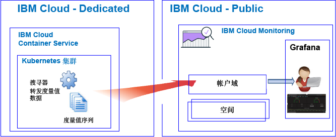

---

copyright:
  years: 2017, 2019

lastupdated: "2019-03-06"

keywords: IBM Cloud, monitoring

subcollection: cloud-monitoring

---

{:new_window: target="_blank"}
{:shortdesc: .shortdesc}
{:screen: .screen}
{:pre: .pre}
{:table: .aria-labeledby="caption"}
{:codeblock: .codeblock}
{:tip: .tip}
{:download: .download}
{:important: .important}
{:note: .note}

# 入门教程
{: #getting-started-with-ibm-cloud-monitoring}

使用本教程可了解如何在 {{site.data.keyword.Bluemix}} 中开始使用 {{site.data.keyword.monitoringlong}} 服务。
{:shortdesc}

缺省情况下，{{site.data.keyword.Bluemix_notm}} 为所选的服务提供集成监视功能。 您可以使用 {{site.data.keyword.monitoringlong_notm}} 服务在处理度量值时扩展收集和保留功能，并能够定义规则和警报以用于通知您需要注意的条件。 {{site.data.keyword.monitoringshort}} 服务提供的功能可让您深入了解应用程序的性能情况以及如何使用资源，并帮助您快速识别趋势，检测并诊断问题；这一切都能即时实现价值，并且总拥有成本较低。 您可通过 Grafana 来监视环境。 

## 开始之前
{: #cm_prereqs}

您必须具有作为 {{site.data.keyword.Bluemix_notm}} 帐户成员或所有者的用户标识。 要获取 {{site.data.keyword.Bluemix_notm}} 用户标识，请转至：[注册 ](https://console.bluemix.net/registration/){:new_window}

## 步骤 1：选择要监视的云资源
{: #cm_step1}

在 {{site.data.keyword.Bluemix_notm}} 中，CF 应用程序、在 {{site.data.keyword.containershort}} 上运行的容器以及所选服务会自动收集度量值序列数据，并将其转发到 {{site.data.keyword.monitoringshort}} 服务。

下表列出了不同的云资源。 请完成资源教程以开始使用 {{site.data.keyword.monitoringshort}} 服务：

<table>
  <caption>使用 {{site.data.keyword.monitoringshort}} 服务的入门教程 </caption>
  <tr>
    <th>资源</th>
    <th>教程</th>
    <th>云环境</th>
    <th>场景</th>
  </tr>
  <tr>
    <td>在 {{site.data.keyword.containershort}} 上运行的容器</td>
    <td>[在 Grafana 中分析部署在 Kubernetes 集群中的应用程序的度量值](/docs/services/cloud-monitoring/tutorials/container_service_metrics.html#container_service_metrics)</td>
    <td>Public  Dedicated</td>
    <td></td>
  </tr>
  <tr>
    <td>CF 应用程序</td>
    <td>[在 Grafana 中分析 CF 应用程序的度量值](/docs/services/cloud-monitoring/tutorials/cfapps_metrics.html#cfapps_metrics)</td>
    <td>Public</td>
    <td></td>
  </tr>
</table>

## 步骤 2：设置用户查看度量值的许可权
{: #cm_step2}

要控制允许用户执行的 {{site.data.keyword.monitoringshort}} 操作，您可以向用户分配角色和策略。 

{{site.data.keyword.Bluemix_notm}} 中有两种类型的安全许可权，用于控制用户在使用 {{site.data.keyword.monitoringshort}} 服务时可以执行的操作：

* Cloud Foundry (CF) 角色：您向用户授予 CF 角色，以定义用户查看空间中度量值的许可权。
* IAM 角色：您向用户授予 IAM 策略，以定义用户查看帐户域中度量值的许可权。

要授予用户查看空间中度量值的许可权，请完成以下步骤：

1. 登录到 {{site.data.keyword.Bluemix_notm}} 控制台。

    打开 Web 浏览器并启动 {{site.data.keyword.Bluemix_notm}}“仪表板”：[http://bluemix.net ](http://bluemix.net){:new_window}
	
	使用用户标识和密码登录后，{{site.data.keyword.Bluemix_notm}} UI 即会打开。

2. 从菜单栏中，单击**管理 > 帐户 > 用户**。 

    *用户*窗口将显示一个用户列表，其中包含当前选定帐户的电子邮件地址。
	
3. 如果用户是帐户的成员，请从列表中选择用户名，或从*操作*菜单中单击**管理用户**。

    如果用户不是帐户的成员，请参阅[邀请用户](/docs/iam/iamuserinv.html#iamuserinv)。

4. 选择 **Cloud Foundry 访问权**，然后选择组织。

    这将列出该组织中可用的空间列表。

5. 选择已供应 {{site.data.keyword.monitoringshort}} 服务的空间。 然后，从菜单操作中，选择**编辑空间角色**。

6. 选择*审计员*。 

    可以选择一个或多个空间角色。 以下所有角色都允许用户查看日志：*管理者*、*开发者*和*审计员*
	
7. 单击**保存角色**。

有关更多信息，请参阅[授予许可权](/docs/services/cloud-monitoring/security/assign_policy.html#grant_permissions)。

要验证用户是否可以查看度量值数据，请在已完成其中一个教程的云区域中启动 Grafana。 例如，对于美国南部地区，请打开 Web 浏览器并输入以下 URL：[https://metrics.ng.bluemix.net/](https://metrics.ng.bluemix.net/)

有关如何在其他地区中启动 Grafana 的更多信息，请参阅[通过 Web 浏览器导航至 Grafana](/docs/services/cloud-monitoring/grafana/navigating_grafana.html#navigating_grafana)。

**注：**启动 Grafana 时，如果收到一条指示*不记名令牌无效*的消息，请检查您在空间中的许可权。 此消息指示您的用户标识没有查看度量值的许可权。
    

## 后续步骤 
{: #cm_next_steps}

为度量值定义警报。 有关更多信息，请参阅[配置警报](/docs/services/cloud-monitoring/config_alerts_ov.html#config_alerts_ov)。
