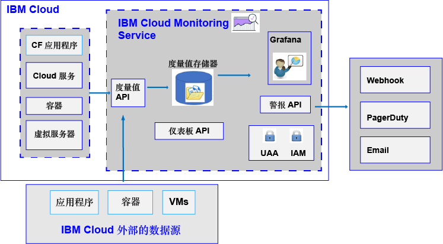

---

copyright:
  years: 2017, 2019

lastupdated: "2019-03-06"

keywords: IBM Cloud, monitoring

subcollection: cloud-monitoring

---

{:new_window: target="_blank"}
{:shortdesc: .shortdesc}
{:screen: .screen}
{:pre: .pre}
{:table: .aria-labeledby="caption"}
{:codeblock: .codeblock}
{:tip: .tip}
{:download: .download}
{:important: .important}
{:note: .note}

# 关于
{: #monitoring_ov}

使用 {{site.data.keyword.monitoringlong}} 服务在处理度量值时扩展您的收集和保留功能，并能够定义用于通知您需要注意的条件的规则和警报。DevOps 团队将受益于多种功能，让您能够洞察应用程序的性能和资源消耗情况。快速识别趋势，检测并诊断问题；这一切都能即时实现价值，并且总拥有成本较低。使用 Grafana 可监视环境。
{:shortdesc}

下图显示了可以将其中度量值发送到 {{site.data.keyword.monitoringshort}} 服务进行分析的不同资源的高级别视图：

缺省情况下，{{site.data.keyword.Bluemix}} 会为 {{site.data.keyword.containershort}} 收集并显示 CPU 使用率、内存利用率和网络 I/O 的度量值。您可以使用 {{site.data.keyword.Bluemix_notm}} 中的 {{site.data.keyword.monitoringshort}} 服务从环境和应用程序自动收集并度量关键度量值。无需进行特殊检测，即可收集度量值。例如，可以使用性能度量值提供的信息来监视服务在云中的运行情况，检测资源瓶颈，并密切关注服务级别协议 (SLA)。分析服务的性能数据时，可以检测会导致资源瓶颈并因而影响客户的服务 SLA 的情况。通过及早采取措施，可以避免会对业务造成负面影响的情况。  

您可以将 Cloud Foundry (CF) 应用程序和虚拟机 (VM) 的度量值发送到 {{site.data.keyword.monitoringshort}} 服务。有关如何发送度量值的更多信息，请参阅[向 {{site.data.keyword.monitoringshort}} 服务发送度量值](/docs/services/cloud-monitoring?topic=cloud-monitoring-send_retrieve_metrics_ov#send_retrieve_metrics_ov)。

您可以通过 {{site.data.keyword.Bluemix_notm}}“目录”供应 {{site.data.keyword.monitoringshort}} 服务。  

您可以通过 {{site.data.keyword.Bluemix_notm}}“仪表板”查看和分析由 {{site.data.keyword.monitoringshort}} 服务收集的度量值。  

## 为什么要使用 Monitoring 服务
{: #value}

1. **减少应用程序检测时间，将更多时间用于增强应用程序的价值**

    {{site.data.keyword.monitoringlong_notm}} 服务会自动从 {{site.data.keyword.IBM_notm}} Cloud 服务收集度量值数据，无需代理程序。通过 API，能轻松添加定制度量值并查询监视数据。 
	
	{{site.data.keyword.monitoringlong_notm}} 服务每分钟提供一次度量值收集。轻量套餐会在全分辨率下保留 15 天的度量值。“高端”套餐会在全分辨率下保留 45 天的度量值。

2. **利用 API 轻松将监视扩展到应用程序**

    通过 {{site.data.keyword.monitoringshort}} 服务 API 将监视数据集成到应用程序和操作中。使用 API 将相关应用程序和业务度量值添加到 Cloud 监视数据。您还可以使用 API 将度量值数据从 {{site.data.keyword.IBM_notm}} Cloud 外部发送到 {{site.data.keyword.monitoringshort}} 服务。

3. **获取关于环境的洞察，以快速检测、诊断和识别问题**

    使用灵活、用户可定制的仪表板，可视化应用程序和基础架构的动向。通过 {{site.data.keyword.monitoringlong_notm}}，您可利用 Grafana 的功能、灵活性和对 Grafana 的熟悉程度，根据您的应用程序需求快速构建并调整自己的仪表板。

	
4. **构建可复用的仪表板并使它们互动**

    {{site.data.keyword.monitoringlong_notm}} 服务托管的 Grafana 支持使用大量可视化选项构建定制仪表板。通过将度量值查询与变量配合使用，使仪表板能够动态地进行模板制作。

5. **接收警报**

    定义规则，以通知您需要注意的状况。{{site.data.keyword.monitoringlong_notm}} 服务提供可用于设置性能阈值的 API，并在违反这些阈值时获得通知。为单个服务实例或应用程序实例定义警报规则，以及针对一组实例报告的警报规则。触发警报时，通过电子邮件、PagerDuty 事件、Webhook 通知或这三项的任意组合来获取通知。

6. **选择满足您需求的服务套餐** 

    您可以选择 Lite 服务套餐或“高级”服务套餐，以满足您的使用需求。轻量套餐提供基本平台度量值收集和补充警报。或者，您可以选择“高端”套餐，以支持具有更长保留期的更大度量值消耗，增加可定义的警报数（包括报告多个服务和应用程序的警报），以及获取对服务 API 的访问权。

 
## 服务套餐
{: #plan}

{{site.data.keyword.monitoringshort}} 服务提供了多种套餐。每种套餐都有不同的度量值收集、保留时间和警报定义功能。 

可以通过 {{site.data.keyword.Bluemix_notm}} UI 或通过命令行来更改套餐。您可以随时升级或降级套餐。有关 {{site.data.keyword.Bluemix_notm}} 中服务套餐升级的更多信息，请参阅[更改套餐](/docs/services/cloud-monitoring/plan?topic=cloud-monitoring-change_plan#change_plan)。 

下表概括了在空间中供应 {{site.data.keyword.monitoringshort}} 服务时可用的套餐：

<table>
    <caption>表 1. 每个空间 {{site.data.keyword.monitoringshort}} 服务的套餐汇总。</caption>
      <tr>
        <th>套餐</th>
        <th>使用 API 发送度量值</th>
        <th>度量值保留期</th>
        <th>警报</th>
		    <th>通知方法</th>
      </tr>
      <tr>
        <td>Lite（缺省）</td>
        <td>不可用</td>
        <td>15 天</td>
        <td>您最多可以定义 10 个使用单个度量值查询的警报规则或 1 个包含通配符的警报规则。</td>
		    <td>Email</td>
      </tr>
      <tr>
        <td>高级</td>
        <td>可用</td>
        <td>45 天</td>
        <td>可以定义警报规则，包括具有通配符的规则。</td>
		    <td>电子邮件、Webhook、PagerDuty</td>
      </tr>
</table>

**注**：轻量套餐提供的功能与 {{site.data.keyword.Bluemix_notm}} 中的集成监视功能相同。帐户域提供的功能与轻量套餐的相同。

## 度量值保留期
{: #metrics_retention}

下表按照服务套餐汇总了保留期：

<table>
    <caption>表 2. {{site.data.keyword.monitoringshort}} 服务的保留期汇总。</caption>
      <tr>
        <th>套餐</th>
        <th>保留期</th>
      </tr>
      <tr>
        <td>Lite（缺省）</td>
        <td>每分钟存储度量值，保留 15 天。(1m:15d)</td>
      </tr>
      <tr>
        <td>高级</td>
        <td>每分钟存储度量值，保留 45 天。(1m:45d)</td>
      </tr>
</table>

将删除在过去 7 天内未收到数据的度量值。
{{site.data.keyword.monitoringshort}} 服务通过识别在过去 7 天内未写入的度量值，删除看起来性质是瞬态的度量值路径的所有数据。例如：

* 删除容器时，与该容器关联的度量值会保留 7 天，在此之后会将其删除。
* 如果您有一个名为 `<space_id>.test.statsd.gauge-hello` 的 statsd 量表，并且一周内未向其写入内容，那么该度量值将被识别为瞬态，因此将删除该度量值及其所有历史信息。 

## 供应 Monitoring 服务
{: #provision1}

在 {{site.data.keyword.Bluemix_notm}}“目录”的 **DevOps** 部分中，可以找到 {{site.data.keyword.monitoringshort}} 服务。有关在 {{site.data.keyword.Bluemix_notm}} 中供应服务的更多信息，请参阅[供应 {{site.data.keyword.monitoringshort}} 服务](/docs/services/cloud-monitoring/how-to?topic=cloud-monitoring-provision#provision)。

请考虑有关 {{site.data.keyword.monitoringshort}} 服务的以下信息：

* 每个空间只能供应一个 {{site.data.keyword.monitoringshort}} 服务实例。
* 要收集在 Cloud Foundry 空间中运行的云资源的度量值，必须在运行这些资源的空间中供应此服务。

## 区域
{: #regions}

{{site.data.keyword.monitoringshort}} 服务在以下区域中可用：

* 德国
* 悉尼
* 英国
* 美国南部

## Monitoring 服务的 URL
{: #region}

{{site.data.keyword.monitoringshort}} 服务可供具有 {{site.data.keyword.Bluemix_notm}} 标识并有权使用 {{site.data.keyword.Bluemix_notm}} 中服务的任何人使用。

* 对于 {{site.data.keyword.monitoringshort}} 服务可用的每个区域，有一组不同的端点。 
* 有一个 URL 由摄入和 API/Web UI 端点共享。
* 端口 443 是 TLS 端口，用于通过 API 和 Web UI (Grafana) 访问度量值。

下表列出了每个区域的 URL：

<table>
  <caption>表 3. 可使用 {{site.data.keyword.monitoringshort}} 服务的端点列表</caption>
  <tr>
    <th>区域</th>
	<th>端点</th>
  </tr>
  <tr>
    <td>德国</td>
	<td>[https://metrics.eu-de.bluemix.net](https://metrics.eu-de.bluemix.net)</td>
  </tr>
  <tr>
    <td>悉尼</td>
	<td>[https://metrics.au-syd.bluemix.net](https://metrics.au-syd.bluemix.net)</td>
  </tr>
  <tr>
    <td>英国</td>
	<td>[https://metrics.eu-gb.bluemix.net](https://metrics.eu-gb.bluemix.net)</td>
  </tr>
  <tr>
    <td>美国南部</td>
	<td>[https://metrics.ng.bluemix.net/](https://metrics.ng.bluemix.net/)</td>
  </tr>
</table>

