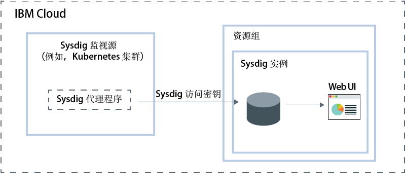

---

copyright:
  years:  2018, 2019
lastupdated: "2019-05-09"

keywords: Sysdig, IBM Cloud, monitoring, overview

subcollection: Sysdig

---

{:new_window: target="_blank"}
{:shortdesc: .shortdesc}
{:screen: .screen}
{:pre: .pre}
{:table: .aria-labeledby="caption"}
{:codeblock: .codeblock}
{:tip: .tip}
{:download: .download}
{:important: .important}
{:note: .note}

# {{site.data.keyword.mon_full_notm}}
{: #about}

{{site.data.keyword.mon_full}} 是一种第三方云本机和容器智能管理系统，您可以将其包含在 {{site.data.keyword.cloud_notm}} 体系结构中。使用此系统可了解应用程序、服务和平台的性能和运行状况。它为管理员、DevOps 团队和开发者提供了全堆栈遥测功能，其中有多种高级功能，可用于监视和执行故障诊断，定义警报以及设计定制仪表板。{{site.data.keyword.mon_full_notm}} 由 Sysdig 与 {{site.data.keyword.IBM_notm}} 合作运行。
{:shortdesc}

要在 {{site.data.keyword.cloud_notm}} 中添加 {{site.data.keyword.mon_full_notm}} 的监视功能，必须供应 {{site.data.keyword.mon_full_notm}} 服务的实例。

在供应实例之前，请考虑以下信息：

* 您的数据会发送给第三方。
*  帐户所有者可以在 {{site.data.keyword.cloud_notm}} 中创建、查看和删除服务的实例。此用户还可以授予其他用户使用 {{site.data.keyword.mon_full_notm}} 服务的许可权。
* 具有`管理员`或`编辑者`许可权的其他 {{site.data.keyword.cloud_notm}} 用户可以在 {{site.data.keyword.cloud_notm}} 中管理 {{site.data.keyword.mon_full_notm}} 服务。这些用户还必须具有平台许可权，才能在他们计划供应实例的资源组的上下文中创建资源。

您可在资源组的上下文中供应实例。使用资源组，可以组织服务以用于访问控制和计费。您可以在 *default* 资源组或定制资源组中供应 {{site.data.keyword.mon_full_notm}} 实例。

[供应实例](/docs/services/Monitoring-with-Sysdig?topic=Sysdig-provision#provision)时，会自动获得一个采集密钥，称为 [Sysdig 访问密钥](/docs/services/Monitoring-with-Sysdig?topic=Sysdig-access_key#access_key)。

供应实例后，必须为每个度量源配置 {{site.data.keyword.mon_full_notm}} 代理程序。度量源是要监视和控制其性能和运行状况的云资源。必须在要监视的每个环境中配置 {{site.data.keyword.mon_full_notm}} 代理程序。例如，度量源可以是 Kubernetes 集群。您可以使用访问密钥来配置负责收集度量数据并将其转发到实例的 Sysdig 代理程序。

在度量源中部署 {{site.data.keyword.mon_full_notm}} 代理程序之后，会自动收集度量值并将其转发到实例。{{site.data.keyword.mon_full_notm}} 代理程序会自动收集和报告预定义的度量值。您可以配置环境中要监视的度量值。

可以通过 {{site.data.keyword.mon_full_notm}} Web UI 来[监视](/docs/services/Monitoring-with-Sysdig?topic=Sysdig-monitoring#monitoring)和[管理](/docs/services/Monitoring-with-Sysdig?topic=Sysdig-manage#manage)数据。  

下面显示了在 {{site.data.keyword.cloud_notm}} 上运行的 {{site.data.keyword.mon_full_notm}} 服务的组件概览图：

## 数据收集
{: #overview_collection}

配置 Sysdig 代理程序以收集数据并将其转发到 {{site.data.keyword.mon_full_notm}} 实例时，数据会自动收集并可用于通过 Web UI 进行分析。

数据收集频率为 10 秒。 

## 数据可用性
{: #overview_availability}

数据最长可用时间为 15 个月。

从主机或容器中除去 Sysdig 代理程序后，不会删除历史数据。在代理程序安装并执行报告的时间段内，数据可供通过 Web UI 进行分析。

删除 {{site.data.keyword.mon_full_notm}} 服务的实例后，数据即不可用于搜索和分析。

## 数据保留
{: #overview_retention}

将根据*累积*策略为每个实例保留数据。

随着时间的推移，数据保留时间达到 3 个月时，会从细颗粒度累积到更粗颗粒度。

累积策略描述随时间变化的数据详细程度：

* 对于最初 6 小时的数据，以 10 秒分辨率保留。
* 对于 2 天的数据，以 1 分钟分辨率保留。
* 对于 2 周的数据，以 10 分钟分辨率保留。
* 对于 3 个月的数据，以 1 小时分辨率保留。
* 对于 1 年的数据，以 1 天分辨率保留。

## 数据删除
{: #overview_data_deletion}

从 {{site.data.keyword.cloud_notm}} 中删除 {{site.data.keyword.mon_full_notm}} 的实例时，必须通过支持人员开具案例，以请求删除数据。有关更多信息，请参阅
[联系支持人员](/docs/services/Monitoring-with-Sysdig?topic=Sysdig-gettinghelp#gettinghelp)。

删除捕获时，会自动删除该捕获的数据文件。

注：不支持删除从 {{site.data.keyword.mon_short}} 实例中单一 Sysdig 代理程序收集的数据。
{: note}

## 数据位置
{: #overview_data_location}

{{site.data.keyword.mon_full_notm}} 会收集和聚集度量值。 

* 度量数据在 {{site.data.keyword.cloud_notm}} 上进行托管。
* 每个多专区区域 (MZR) 位置会收集并聚集在该位置运行的每个 {{site.data.keyword.mon_full_notm}} 实例的度量值。
* 数据在供应 {{site.data.keyword.mon_full_notm}} 实例的区域中进行主机托管。例如，在美国南部供应的实例的度量值数据在美国南部区域进行托管。

## {{site.data.keyword.mon_full_notm}} 代理程序
{: #overview_sysdig_agent}

{{site.data.keyword.mon_full_notm}} 代理程序会自动收集和报告预定义的度量值。 

以下列表概述了可用的 {{site.data.keyword.mon_full_notm}} 代理程序：

* 用于 Kubernetes、GKE 和 OpenShift 的 {{site.data.keyword.mon_full_notm}} 代理程序。
* 用于 Docker 容器或非容器化服务的 {{site.data.keyword.mon_full_notm}} 代理程序。
* 用于 Mesos、Marathon 和 DCOS 的 {{site.data.keyword.mon_full_notm}} 代理程序。
* 用于手动 Linux 安装的 {{site.data.keyword.mon_full_notm}} 代理程序。

有关更多信息，请参阅[配置 Sysdig 代理程序](/docs/services/Monitoring-with-Sysdig?topic=Sysdig-config_agent#config_agent)和[除去 Sysdig 代理程序](/docs/services/Monitoring-with-Sysdig?topic=Sysdig-remove#remove)。

## 查看使用情况
{: #overview_usage}

要监视服务的使用情况和成本，请参阅[查看使用情况](/docs/billing-usage/viewing_usage.html#viewingusage)。

## 服务套餐
{: #overview_plans}

有不同的价格套餐可用于 {{site.data.keyword.mon_full_notm}} 实例。[了解更多](/docs/services/Monitoring-with-Sysdig?topic=Sysdig-pricing_plans#pricing_plans)。

## 安全注意事项
{: #overview_security}

**捕获**

捕获是一种跟踪文件，您可以生成该文件来分析在某一时间范围内主机中发生的事件。捕获包含系统调用和其他操作系统事件。在配置用于从节点收集度量值的 Sysdig 代理程序时，可以为每个节点启用或禁用此功能。缺省情况下，在配置 Sysdig 代理程序时，*捕获*已启用。节点可以是主机、容器、虚拟机、裸机或安装 Sysdig 代理程序的任何度量源。

启用捕获后，请注意 Sysdig 可深入了解您的操作。为了避免安全事件以及可能会在组织外部公开数据的风险，请先检查组织的安全策略，然后再在节点上启用捕获。请考虑禁用所有 Sysdig 代理程序的*捕获*功能。
{: important}

