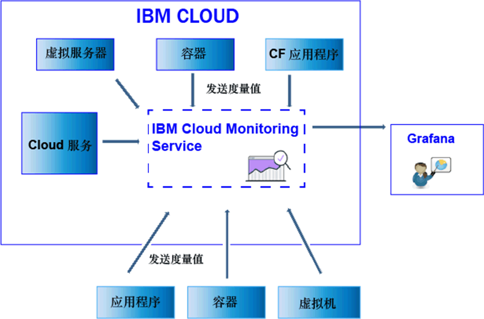

---

copyright:
  years: 2017, 2019

lastupdated: "2019-03-06"

keywords: IBM Cloud, monitoring

subcollection: cloud-monitoring

---

{:new_window: target="_blank"}
{:shortdesc: .shortdesc}
{:screen: .screen}
{:pre: .pre}
{:table: .aria-labeledby="caption"}
{:codeblock: .codeblock}
{:tip: .tip}
{:download: .download}
{:important: .important}
{:note: .note}

# 发送和检索数据
{: #send_retrieve_metrics_ov}

您可以通过使用度量值 API 或通过配置 {{site.data.keyword.monitoringshort}} 插件（即 collectd 插件），向空间发送度量值。您可以使用“度量值”API 来检索度量值。
{:shortdesc}

		
## 发送度量值
{: #send}

下图显示了可以将其中度量值发送到 {{site.data.keyword.monitoringshort}} 服务的不同数据源的高级别视图：

对于在 {{site.data.keyword.Bluemix_notm}} 中的 Kubernetes 集群中运行的容器，对于所选服务，将自动收集基本系统度量值。您还可以收集更多度量值，或将度量值从 {{site.data.keyword.IBM_notm}} Cloud 发送到 {{site.data.keyword.monitoringshort}} 服务。可以使用不同的方法。下表按度量值源列出了方法：

<table>
  <caption>表 1. 将度量值发送到 {{site.data.keyword.IBM_notm}} Cloud 资源的 {{site.data.keyword.monitoringshort}} 服务的方法。</caption>
  <tr>
    <th>度量值源</th>
	<th>度量值 API</th>
    <th>{{site.data.keyword.monitoringshort}} 插件 (collectd)</th>	
	<th>更多信息</th>
  </tr>
  <tr>
    <td>在 {{site.data.keyword.Bluemix_notm}} 中的 Kubernetes 集群中运行的容器</td>
	<td>是</td>
	<td>是</td>
	<td>自动收集基本系统度量值。您可以显式方式安装 collectd，并发送缺省情况下未提供的高级或定制度量值。</td>
  </tr>
  <tr>
    <td>Cloud Foundry 应用程序</td>
	<td>是</td>
	<td>否</td>
	<td></td>
  </tr>
  <tr>
    <td>虚拟服务器</td>
	<td>是</td>
	<td>是</td>
	<td>**注：**对于 Windows 不受支持。</td>
  </tr>
</table>

<table>
  <caption>表 2. 从 {{site.data.keyword.IBM_notm}} Cloud 外部将度量值发送到 {{site.data.keyword.monitoringshort}} 服务的方法。</caption>
  <tr>
    <th>度量值源</th>
	<th>度量值 API</th>
    <th>{{site.data.keyword.monitoringshort}} 插件 (collectd)</th>	
	<th>更多信息</th>
  </tr>
  <tr>
    <td>容器</td>
	<td>是</td>
	<td>是</td>
	<td>您可以使用 *supervisord* 作为容器端点来运行和管理应用程序和 collectd。</td>
  </tr>
  <tr>
    <td>应用程序</td>
	<td>是</td>
	<td>否</td>
	<td></td>
  </tr>
  <tr>
    <td>服务</td>
	<td>是</td>
	<td>否</td>
	<td></td>
  </tr>
  <tr>
    <td>虚拟机 (VM)</td>
	<td>是</td>
	<td>是</td>
	<td>**注：**对于 Windows 不受支持。</td>
  </tr>
</table>

要将度量值发送到 {{site.data.keyword.monitoringshort}} 服务，请考虑以下信息： 

* 必须指定要发送度量值的空间。

* 您必须提供安全性令牌或 API 密钥才能使用 {{site.data.keyword.monitoringshort}} 服务。 

* 发送度量值的用户的 {{site.data.keyword.IBM_notm}} 标识必须已为 {{site.data.keyword.monitoringshort}} 服务分配 IAM 策略。以下 IAM 角色允许用户发送度量值：*管理员*、*编辑者*和*操作员*。

* 必须指定要发送度量值的 API 端点。每个区域都有一个端点。例如，对于美国南部区域，端点为以下内容：`https://metrics.ng.bluemix.net/v1/metrics`。有关端点的更多信息，请参阅 [{{site.data.keyword.monitoringshort}} 服务的 URL](/docs/services/cloud-monitoring?topic=cloud-monitoring-monitoring_ov#region){: new_window}。

您可以使用以下任何方法将度量值发送到 {{site.data.keyword.monitoringshort}} 服务：

* *方法 1：配置 {{site.data.keyword.monitoringshort}} 插件*。

    有关更多信息，请参阅[配置 {{site.data.keyword.monitoringshort}} 插件](/docs/services/cloud-monitoring/send-metrics?topic=cloud-monitoring-conf_monitoring_plugin#conf_monitoring_plugin)。

    下图显示了如何使用 {{site.data.keyword.monitoringshort}} 插件，将度量值发送到 {{site.data.keyword.monitoringshort}} 服务的高级视图：

    

* *方法 2：使用“度量值”API。*

    有关更多信息，请参阅[使用度量值 API 发送度量值](/docs/services/cloud-monitoring/send-metrics?topic=cloud-monitoring-send_data_api#send_data_api)。

## 检索度量值
{: #retrieve}

如果需要在 {{site.data.keyword.monitoringshort}} 服务外部执行进一步分析，或者如果您的应用程序希望使用度量值来进行决策，那么可以使用“度量值”API 对每个请求最多检索五个度量值。 

* 有关如何检索度量值的更多信息，请参阅[检索域的度量值](/docs/services/cloud-monitoring/retrieve-metrics?topic=cloud-monitoring-retrieve_data_api#retrieve_data_api)
* 有关“度量值”API 的更多信息，请参阅[度量值 API](https://console.bluemix.net/apidocs/927-ibm-cloud-monitoring-rest-api?&language=node#introduction){: new_window}。

要检索度量值，请考虑以下信息： 

* 必须设置要从中检索数据的空间。 
* 您必须提供安全性令牌或 API 密钥才能使用 {{site.data.keyword.monitoringshort}} 服务。 
* 必须指定 1 个或多个度量值的路径。有关更多信息，请参阅[定义度量值](/docs/services/cloud-monitoring/retrieve-metrics?topic=cloud-monitoring-retrieve_data_api#metrics)。
* （可选）您可以指定定制时间段。缺省情况下，如果未指定时间段，那么检索的数据是与过去 24 小时相对应的数据。有关更多信息，请参阅[配置时间段](/docs/services/cloud-monitoring/retrieve-metrics?topic=cloud-monitoring-retrieve_data_api#time)。

## 列出度量值
{: #show_metrics}

您可以列出空间中可用的度量值。

要列出度量值，请考虑以下信息： 

* 必须设置要列出其可用度量值的 {{site.data.keyword.Bluemix_notm}} 空间。

* 您必须提供安全性令牌或 API 密钥才能使用 {{site.data.keyword.monitoringshort}} 服务。 

* 必须指定一个查询，该查询定义从何处列出度量值的路径。例如，要列出空间中的所有度量值，可以将查询设置为：`query=*` 

    缺省值为 `*`，其指定空间根级别的起点。
	
* 您可以使用 API 调用 `Endpoint/v1/metrics/list`，其中 Endpoint 表示服务的入口点。 

    每个区域都有不同的 URL。例如，对于美国南部区域，可以使用 API 端点 `https://metrics.ng.bluemix.net/v1/metrics/list` 

    要获取每个区域的端点列表，请参阅[端点](/docs/services/cloud-monitoring?topic=cloud-monitoring-send_retrieve_metrics_ov#endpoints)。

    有关 API 的更多信息，请参阅[度量值 API](https://console.bluemix.net/apidocs/927-ibm-cloud-monitoring-rest-api?&language=node#introduction){: new_window}。

## 用于发送度量的端点
{: #endpoints}

 下表按区域列出端点：
	
<table>
    <caption>端点列表</caption>
	<tr>
	  <th>区域</th>
	  <th>URL</th>
	  <th>collectd 端口</th>
	</tr>
	<tr>
	  <td>德国</td>
	  <td>[https://metrics.eu-de.bluemix.net](https://metrics.eu-de.bluemix.net)</td>
	  <td>9095</td>
	</tr>
	<tr>
	  <td>悉尼</td>
	  <td>[https://metrics.au-syd.bluemix.net](https://metrics.au-syd.bluemix.net)</td>
	  <td>9095</td>
	</tr>
	<tr>
	  <td>英国</td>
	  <td>[https://metrics.eu-gb.bluemix.net](https://metrics.eu-gb.bluemix.net)</td>
	  <td>9095</td>
	</tr>
	<tr>
	  <td>美国南部</td>
	  <td>[https://metrics.ng.bluemix.net](https://metrics.ng.bluemix.net)</td>
	  <td>9095</td>
	</tr>
</table>

 
