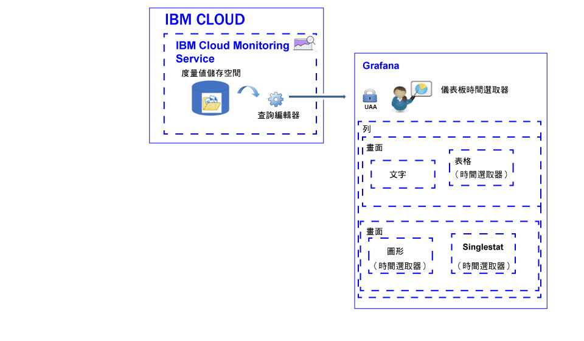

---

copyright:
  years: 2017, 2019

lastupdated: "2019-03-06"

keywords: IBM Cloud, monitoring

subcollection: cloud-monitoring

---

{:new_window: target="_blank"}
{:shortdesc: .shortdesc}
{:screen: .screen}
{:pre: .pre}
{:table: .aria-labeledby="caption"}
{:codeblock: .codeblock}
{:tip: .tip}
{:download: .download}
{:important: .important}
{:note: .note}

# 分析度量值
{: #analyze_metrics_ov}

在 {{site.data.keyword.Bluemix}} 中，您可以使用 Grafana（一種開放程式碼視覺化與監視平台），以各種圖形（例如圖表和表格）監視、搜尋、分析及視覺化您的度量值。
{:shortdesc}

## 元件概觀
{: #overview}

{{site.data.keyword.monitoringshort}} 服務會在度量值儲存空間資料庫中儲存一系列資料。您可以透過「查詢編輯器」來查詢此資料。 

在 Grafana 中，若要存取度量值儲存空間資料庫中的可用資料，您必須使用用來登入 {{site.data.keyword.Bluemix_notm}} 的使用者 ID 及密碼，來登入空間、組織及地區。 

若要將資料視覺化，您可以配置儀表板，儀表板中可以包含一列以上。在每一列中，您可以定義多個畫面。 

* 一列會在儀表板中聚集多個畫面。 
* 畫面是用來監視度量值的基本視覺效果資源。 
* 儀表板可以加以標記，並且可以包含註釋，而註釋中包含您能用來使各畫面之間的資料產生關聯的資料。

您可以定義下列類型的畫面：文字、圖形、表格和 singlestat。每一個畫面都提供不同樣式和格式化選項，您可以對其進行自訂。 

畫面中顯示的資料量是由查詢以及設定的時間範圍所決定。您可以在儀表板層次設定所有畫面的一般時間範圍，或是為每個畫面設定個別時間範圍。

下圖顯示 Grafana 從 {{site.data.keyword.monitoringshort}} 服務用來過濾資料的不同元件，以及您可以在 Grafana 中用來視覺化與分析資料的資源：

