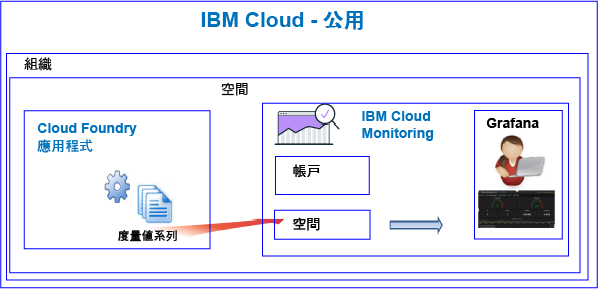

---

copyright:
  years: 2017, 2019

lastupdated: "2019-03-06"

keywords: IBM Cloud, monitoring

subcollection: cloud-monitoring

---

{:new_window: target="_blank"}
{:shortdesc: .shortdesc}
{:screen: .screen}
{:pre: .pre}
{:table: .aria-labeledby="caption"}
{:codeblock: .codeblock}
{:tip: .tip}
{:download: .download}
{:important: .important}
{:note: .note}


# Cloud Foundry 應用程式
 {:#monitoring_bluemix_apps}

在 {{site.data.keyword.Bluemix}} 中，會自動收集在「公用」地區中執行之 Cloud Foundry (CF) 應用程式的度量值，並將其轉遞至 {{site.data.keyword.monitoringlong}} 服務。您可以使用 Grafana 進行分析，以監視 CF 應用程式效能。您也可以使用 Metrics API 來查詢 CF 應用程式度量值，並根據資料來採取動作。
{:shortdesc}


## 監視在公用上執行的 CF 應用程式
{: #public}


當您使用 {{site.data.keyword.monitoringshort}} 服務監視 CF 應用程式時，請考量下列資訊：

* 您必須在 CF 應用程式執行所在的相同空間中佈建 {{site.data.keyword.monitoringshort}} 服務。
* 針對 CF 應用程式所收集的度量值會自動轉遞至 {{site.data.keyword.monitoringshort}} 服務中的空間網域。 
* 度量值會轉遞至空間網域。空間網域會對應至 CF 應用程式執行所在的空間網域。 
* 您也可以使用 Metrics API 來查詢度量值，並根據資料來採取動作。例如，您可以建立自動化查詢，以查詢 CF 應用程式的 CPU 用量，並在 CPU 將要過高時進行擴充。

下圖顯示 {{site.data.keyword.Bluemix_notm}} 中 CF 應用程式的高階監視視圖：



## 監視在 {{site.data.keyword.Bluemix_notm}} 外部執行的 CF 應用程式
{: #outside}

若要監視在 {{site.data.keyword.Bluemix_notm}} 外部執行的 CF 應用程式，您可以使用 Metrics API，將 CF 應用程式度量值轉遞至 {{site.data.keyword.monitoringshort}} 服務。

* 如需 API 的相關資訊，請參閱 [Metrics API](https://console.bluemix.net/apidocs/927-ibm-cloud-monitoring-metrics-api?&language=node#introduction)。
* 如需使用 API 的相關資訊，請參閱[使用 Metrics API 傳送資料](/docs/services/cloud-monitoring/send-metrics?topic=cloud-monitoring-send_data_api#send_data_api)。


## 檢視及分析 CF 應用程式度量值
{: #monitoring_cfapps}

若要在 {{site.data.keyword.Bluemix_notm}} 中監視 CF 應用程式的效能，請使用 Grafana。 

{{site.data.keyword.monitoringlong}} 服務使用 Grafana（一種開放程式碼分析與視覺化平台），可用來以各種圖形（例如圖表和表格）監視、搜尋、分析及視覺化您的度量值。

您可以從瀏覽器啟動 Grafana。如需相關資訊，請參閱[從 Web 瀏覽器導覽至 Grafana 儀表板](/docs/services/cloud-monitoring/grafana?topic=cloud-monitoring-navigating_grafana#launch_grafana_from_browser)。

**附註：**您必須在 CF 應用程式實例執行所在的相同 {{site.data.keyword.Bluemix_notm}} 地區中啟動 Grafana。


若要監視 CF 應用程式，您必須在 Grafana 中定義一個以上的查詢。如需相關資訊，請參閱[在 Grafana 中配置度量值查詢](/docs/services/cloud-monitoring/grafana?topic=cloud-monitoring-define_query#define_query)。 

您也可以定義查詢的警示。如需相關資訊，請參閱[配置警示](/docs/services/cloud-monitoring?topic=cloud-monitoring-config_alerts_ov#config_alerts_ov)。


## CPU 度量值
{: #cpu_metrics}

自動針對每一個 CF 應用程式所收集的度量值系列會包括 CPU 用量的資料。


<table>
  <caption>針對 CF 應用程式收集的 CPU 度量值</caption>
  <tr>
    <th>度量值</th>
    <th>說明</th>
  </tr>
  <tr>
    <td>cpu-utilization</td>
    <td>達到容器限制的 CPU 用量百分比。</td>
  </tr>
</table>


## 磁碟度量值
{: #disk_metrics}

自動針對每一個 CF 應用程式所收集的度量值系列，會包括所使用磁碟大小、可用總磁碟大小以及所使用磁碟百分比的資料。


<table>
  <caption>針對 CF 應用程式收集的磁碟度量值</caption>
  <tr>
    <th>度量值</th>
    <th>說明</th>
  </tr>
  <tr>
    <td>disk-bytes-total</td>
    <td>CF 應用程式執行所在容器的磁碟大小。值是以位元組為單位來定義。</td>
  </tr>
  <tr>
    <td>disk-bytes-used</td>
    <td>CF 應用程式在磁碟上使用之容器的磁碟大小。值是以位元組為單位來定義。</td>
  </tr>
  <tr>
    <td>disk-utilization</td>
    <td>CF 應用程式所使用磁碟的百分比。</td>
  </tr>
</table>

**附註：** 

* 當您推送 CF 應用程式時，可以指定磁碟大小。
* 當您的 disk-utilization 達到 90% 時，請考慮擴充 CF 應用程式。

## 記憶體度量值
{: #mem_metrics}

自動針對每一個 CF 應用程式所收集的度量值系列，會包括所使用記憶體、可用總記憶體以及所使用記憶體百分比的資料。

<table>
  <caption>針對 CF 應用程式收集的記憶體度量值</caption>
  <tr>
    <th>度量值</th>
    <th>說明</th>
  </tr>
  <tr>
    <td>memory-bytes-total</td>
    <td>可供 CF 應用程式使用的記憶體（以位元組為單位）。</td>
  </tr>
  <tr>
    <td>memory-bytes-used</td>
    <td>CF 應用程式實例所使用的記憶體（以位元組為單位）。</td>
  </tr>
  <tr>
    <td>memory-utilization</td>
    <td>CF 應用程式所使用記憶體的百分比。</td>
  </tr>
</table>


## 度量值查詢格式
{: #query_format}


Grafana 中所定義以監視 Cloud Foundry 應用程式的查詢，必須符合下列格式： 

```
{Source}.{Cloud Type}.{Service Name}.{Region}.{CFapp Name}.{CFapp Index}.{CFapp container}.{Metric Type}.{Metric Subtype}.[Functions]
```
{: codeblock}

例如，請查看針對「雪梨」地區中名稱為 logtester 的 CF 應用程式實例所收集的度量值系列範例：

```
ibmcloud.public.cloud-foundry.au-syd.logtester.0.container.cpu.utilization
ibmcloud.public.cloud-foundry.au-syd.logtester.0.container.disk.bytes-total
ibmcloud.public.cloud-foundry.au-syd.logtester.0.container.disk.bytes-used
ibmcloud.public.cloud-foundry.au-syd.logtester.0.container.disk.utilization
ibmcloud.public.cloud-foundry.au-syd.logtester.0.container.memory.bytes-total
ibmcloud.public.cloud-foundry.au-syd.logtester.0.container.memory.bytes-used
ibmcloud.public.cloud-foundry.au-syd.logtester.0.container.memory.utilization
```
{: screen}

如需相關資訊，請參閱 [CF 應用程式度量值格式](/docs/services/cloud-monitoring/reference?topic=cloud-monitoring-cfapps_metrics_format#cfapps_metrics_format)。

**附註：**CF 應用程式名稱中容許的所有字元並不是都可以在度量值系列名稱中使用。例如，不容許大寫。您在定義查詢時可於 Grafana 中看到的 CF 應用程式名稱都會變更為全部小寫。


