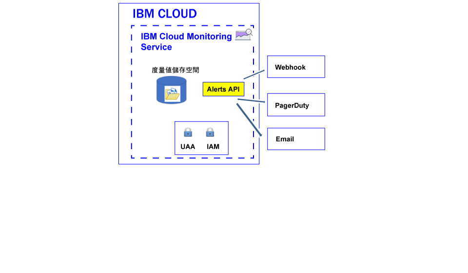

---

copyright:
  years: 2017, 2019

lastupdated: "2019-03-06"

keywords: IBM Cloud, monitoring

subcollection: cloud-monitoring

---

{:new_window: target="_blank"}
{:shortdesc: .shortdesc}
{:screen: .screen}
{:pre: .pre}
{:table: .aria-labeledby="caption"}
{:codeblock: .codeblock}
{:tip: .tip}
{:download: .download}
{:important: .important}
{:note: .note}


# 配置警示
{: #config_alerts_ov}

{{site.data.keyword.monitoringshort}} 服務提供以查詢為基礎的警示系統。您可以使用 {{site.data.keyword.monitoringshort}} API 或透過 Grafana，來配置警示。若要配置警示，您必須為所要監視的每一個度量值查詢設定規則及通知方法。若要通知，您可以傳送電子郵件、觸發 Webhook，或將警示傳送至 PagerDuty。
{:shortdesc}

您可以定義警示，以觸發度量值的通知。警示是由規則所定義，而該規則會說明要監視的度量值查詢、臨界值、超過臨界值時要採取的動作，以及一個以上的通知方法。  

下表列出可用來處理警示的不同方法及支援的動作：

<table>
  <caption>處理警示的方法</caption>
	<tr>
    <th>方法</th>
		<th>定義警示</th>
		<th>更新警示</th>
		<th>刪除警示</th>
	</tr>
	<tr>
    <td>Alerts API</td>
		<td>是</td>
		<td>是</td>
		<td>是</td>
	</tr>
	<tr>
    <td>Grafana</td>
		<td>是</td>
		<td>是</td>
		<td>是</td>
	</tr>
</table>

**附註：**Grafana 儀表板中未顯示使用 Alerts API 所定義的警示。


下圖顯示您可以在 {{site.data.keyword.monitoringshort}} 服務中配置以便警示您的不同通知類型：



您可以為單一實例或多個實例定義警示。您透過警示規則監視的查詢包含萬用字元時，萬用字元會識別多個目標，亦即多個服務實例或應用程式實例。每隔 5 分鐘，{{site.data.keyword.monitoringshort}} 服務便會執行警示規則中所配置的查詢，然後檢查每個實例或多個實例所傳回的最新資料點。{{site.data.keyword.monitoringshort}} 服務會追蹤每個實例的最新狀態，並在警示的狀態變更時，產生新的警示。 


## 使用 Alerts API 處理警示
{: #api}

您可以使用 Alerts API 來定義、更新或刪除警示。

若要使用 Alerts API 定義度量值查詢的警示，您必須：

1. 在 Grafana 儀表板上，定義一個以上的度量值查詢。 

    **附註：**您無法在 Grafana 儀表板上定義使用範本變數的警示。

2. 配置 Grafana 儀表板上所定義之度量值查詢的警示。

    * [配置用於傳送電子郵件的警示](/docs/services/cloud-monitoring/alerts/configure_email_alert.html#configure_email_alert)。
    * [配置用於傳送 PagerDuty 通知的警示](/docs/services/cloud-monitoring/alerts/configure_pagerduty_alert.html#configure_pagerduty_alert)。
    * [配置用於傳送 Webhook 通知的警示](/docs/services/cloud-monitoring/alerts/configure_webhook_alert.html#configure_webhook_alert)。

    **附註：**您只可以定義帳戶度量值網域中所定義之度量值查詢的電子郵件通知。


## 使用 Grafana 處理警示
{: #grafana}

您可以在 Grafana 儀表板上直接定義及刪除警示。您也可以更新規則定義。不過，任何通知通道變更都必須使用 Alerts API 完成。

當您在 Grafana 中處理警示時，請考量下列資訊：

* 若要修改指派給規則的通知通道，您必須使用 Alerts API。
* 當您刪除空間網域中的通知通道時，不會更新已配置該通道的規則。您必須使用 Alerts API 來修改規則，以及從中移除該通知通道。 

若要在 Grafana 儀表板上直接定義度量值查詢的警示，您必須：

1. 在 Grafana 儀表板上，定義一個以上的度量值查詢。 

    **附註：**您無法在 Grafana 儀表板上定義使用範本變數的警示。

2. 配置 Grafana 儀表板上所定義之度量值查詢的警示。

    如需相關資訊，請參閱[在 Grafana 中配置警示](/docs/services/cloud-monitoring/alerts/config_alerts_grafana.html#config_alerts_grafana)。


## 警示狀態
{: #status}

當規則已啟用時，警示可具有下列任何狀態：

* *OK*：在下列情況下，規則的狀態會設為 *OK*：
    
	* {{site.data.keyword.monitoringshort}} 服務中有資料可用於與該規則相關聯的度量值查詢。您已設定警告臨界值和錯誤臨界值。資料的值未超過臨界值。
	 
	* {{site.data.keyword.monitoringshort}} 服務中沒有資料可用於與該規則相關聯的度量值查詢，而您將規則內容 `allow_no_data` 配置為 *true*。           
	 
* *WARNING*：當 {{site.data.keyword.monitoringshort}} 服務中有資料可用於與該規則相關聯的度量值查詢時，規則的狀態會設為 *WARNING*。您已設定警告臨界值和錯誤臨界值。資料的值介於警告臨界值和錯誤臨界值之間。
	
* *ERROR*：當 {{site.data.keyword.monitoringshort}} 服務中有資料可用於與該規則相關聯的度量值查詢時，規則的狀態會設為 *ERROR*。您已設定警告臨界值和錯誤臨界值。達到了錯誤臨界值。  

* *UNKNOWN*：當 {{site.data.keyword.monitoringshort}} 服務中沒有資料可用於與該規則相關聯的度量值查詢時，規則的狀態會設為 *UNKNOWN*。根據您為規則配置的 `allow_no_data` 內容，您可以配置是否收到通知。如果您將這個內容設為 `false`，便會通知您找不到規則的資料。


	
## 警示歷程
{: #history}

每次警示狀態變更時，警示的歷程記錄即會更新。您可以使用 Alerts API (*/v1/alert/history*)，擷取度量值歷程的相關資訊。

警示的狀態用來定義下列任何情境中的狀態：

* 規則觸發通知之前的查詢狀態。
* 已觸發規則之後的查詢狀態。 

例如，如果超出警告臨界值，則會產生歷程記錄，以記錄從 *OK* 到 *WARNING* 的轉移。同樣地，當值再次低於臨界值時，即會產生歷程記錄，以記錄從 *WARNING* 到 *OK* 的轉移。

如需相關資訊，請參閱[擷取規則的歷程](/docs/services/cloud-monitoring/alerts/retrieve_history.html#retrieve_history)。


## 規則
{: #rules1}

規則說明要監視的度量值查詢、臨界值，以及超過臨界值時所要採取的動作。 

* 您可以使用 Alerts API 來建立、刪除、更新規則、顯示規則的詳細資料，以及列出所有規則。如需相關資訊，請參閱[使用規則](/docs/services/cloud-monitoring/alerts/rules.html#rules)。

    * 若要建立規則，請參閱[建立規則](/docs/services/cloud-monitoring/alerts/rules.html#create)。
	* 若要刪除規則，請參閱[刪除規則](/docs/services/cloud-monitoring/alerts/rules.html#delete)。
	* 若要更新規則，請參閱[更新規則](/docs/services/cloud-monitoring/alerts/rules.html#update)。
	* 若要列出所有規則，請參閱[列出所有規則](/docs/services/cloud-monitoring/alerts/rules.html#list)。
	* 若要顯示規則的相關資訊，請參閱[顯示規則的詳細資料](/docs/services/cloud-monitoring/alerts/rules.html#showing-the-details-of-a-rule)。

* 警示系統每隔 5 分鐘會檢查一次空間中已啟用的規則。

* 依預設，當您建立規則時便已啟用規則。然而，您可以定義規則然後停用它，方法是將 *enable* 欄位配置為 `false`。

* 當規則參數 *comparison* 設為 below 時，error_level 值必須低於警告層次值。當規則參數 *comparison* 設為 above 時，error_level 值應該高於警告層次值。

* 依預設，規則建立時，*allow_no_data* 欄位會設為 `true`。沒有可用的資料點時，不會傳送通知，除非已觸發規則條件。如果您想要收到通知，告知您找不到規則 X 的資料，則必須將 *allow_no_data* 欄位設為 `false`。 

**提示：**請在 Grafana 中透過警示規則來驗證您監視的查詢。請確認它未逾時。例如，因為配置很長一段時間，或是您定義包含萬用字元的查詢，則查詢可能會逾時。請注意，查詢在 Grafana 中發生逾時的話，不會觸發針對該查詢配置的警示。

下列是定義規則所需的欄位：

<table>
  <caption>表 1. 用來定義規則的欄位清單。</caption>
  <tr>
    <th>欄位名稱</th>
	<th>說明</th>
  </tr>
  <tr>
    <td>name</td>
	<td>規則的名稱。這必須是唯一名稱。</td>
  </tr>
  <tr>
    <td>description</td>
	<td>規則的摘要。</td>
  </tr>
  <tr>
    <td>expression</td>
	<td>您想要監視並在超過臨界值時傳送警示的度量值查詢。<br>有效的表示式包含：單一度量值名稱、使用萬用字元識別的多個度量值，或用來聚集資料的函數。<br>**提示：**您可以從 Grafana 複製已驗證的查詢。</td>
  </tr>
  <tr>
    <td>enabled</td>
	<td>說明規則的狀態：<br>設為 `true` 以啟用規則。<br>設為 `false` 以停用規則。<br>依預設，它設為 `true`。</td>
  </tr>
  <tr>
    <td>from</td>
	<td>用來根據您針對 expression 欄位中定義之查詢所設定的臨界值，分析資料的起始復原點。例如：`"from": "-5min"`</td>
  </tr>
  <tr>
    <td>until</td>
	<td>用來根據您針對 expression 欄位中定義之查詢所設定的臨界值，分析資料的結束復原點。例如：`"until": "now"`</td>
  </tr>
  <tr>
    <td>comparison</td>
	<td>用來識別進行哪種類型檢查的比較作業。有效值包含：*below* 及 *above*。</td>
  </tr>
  <tr>
    <td>comparison_scope</td>
	<td>定義所分析資料的範圍。<br>設為 *last*，以查看系列（可供查詢使用的資料）中的最後一個值。</td>
  </tr>
  <tr>
    <td>error_level</td>
	<td>定義您設定以觸發錯誤警示的臨界值。<br>設定一值，如果達到該值，則會產生錯誤警示。例如：`"error_level" : 27.94`</td>
  </tr>
  <tr>
    <td>warning_level</td>
	<td>定義您設定以觸發警告警示的臨界值。<br>設定一值，如果達到該值，則會產生警告警示。例如：`"warning_level" : 24`</td>
  </tr>
  <tr>
    <td>frequency</td>
	<td>定義執行檢查的頻率。<br>它的測量單位是分鐘、小時或天，例如 5min、1h、7d。<br>例如，若要每分鐘檢查一次，您可以設定 `"frequency": "1min"`。<br>**附註：**目前，頻率固定為 5 分鐘。</td>
  </tr>
  <tr>
    <td>dashboard_url</td>
	<td>定義 Grafana 儀表板的 URL，此儀表板中會定義所監視的查詢。</td>
  </tr>
    <tr>
    <td>allow_no_data</td>
	<td>定義在沒有可用的資料點時傳送通知的條件。<br>依預設，它設為 `true`。<br>如果您想要收到通知，告知您找不到規則 X 的資料，請設為 `false`。</td>
  </tr>
  <tr>
    <td>notifications</td>
	<td>定義您要針對規則觸發之動作的通知名稱。<br>**附註：**您可以列出通知名稱並以逗點區隔，為每個規則定義 1 個以上的通知。</td>
  </tr>
</table>

例如，下列是規則的範例：

```
{
  "name": "checkbytesin1",
  "description": "MH check Bytes In per second",
  "expression": "movingAverage(messagehub.65ad9211-1234-5678-a751-c82123411eee.1.kafka-java-console-sa
mple-topic.BytesInPerSec.15MinuteRate,\"5min\")",
  "enabled": true,
  "from": "-5min",
  "until": "now",
  "comparison": "below",
  "comparison_scope": "last",
   "error_level" : 22.94,
   "warning_level" : 25,
  "frequency": "1min",
  "dashboard_url": "https://metrics.ng.bluemix.net",
  "notifications": [
    "emailXXX"
  ]
}
```
{: screen}


## 通知
{: #alert_notifications}

通知會說明在觸發警示時用來通知的方法及詳細資料。例如，若要取得度量值的警告通知及錯誤通知，請定義一個監視警告臨界值的規則，以及定義一個監視錯誤臨界值的規則。 

* 只有在警示狀態變更時才會傳送通知，例如，當度量值的警示狀態從 OK 變更為 ERROR，或從 ERROR 變更為 WARNING 時。 

    **附註：**如果警示規則保持在相同的狀態（*OK*、*WARNING*、*ERROR* 或 *UNKNOWN*），則在下一次反覆運算時不會重新觸發。

* 通知被視為 24 小時事件。您無法指定可以觸發通知的時間間隔。

* 您可以列出通知名稱並以逗點區隔，為每個規則配置 1 個以上的通知方法。 

* 您可以使用[警示 REST API](https://console.bluemix.net/apidocs/940-ibm-cloud-monitoring-alerts-api?&language=node#introduction){: new_window} 來建立、刪除及更新通知、顯示通知的詳細資料，以及列出空間中所定義的通知。

    * 若要建立通知，請參閱[建立通知](/docs/services/cloud-monitoring/alerts/notifications.html#notifications_create)。
	* 若要刪除通知，請參閱[刪除通知](/docs/services/cloud-monitoring/alerts/notifications.html#notifications_delete)。
	* 若要更新通知，請參閱[更新通知](/docs/services/cloud-monitoring/alerts/notifications.html#notifications_update)。
	* 若要列出所有通知，請參閱[列出所有通知](/docs/services/cloud-monitoring/alerts/notifications.html#notifications_list)。
	* 若要顯示通知的相關資訊，請參閱[顯示通知的詳細資料](/docs/services/cloud-monitoring/alerts/notifications.html#show)。

* 您可以配置電子郵件通知、PagerDuty 配置及 Webhook 通知。 

**附註：**您可以定義與規則無關的警示通知，以重複使用通知與多個規則搭配。

	
## 通知 - JSON 範本
{: #notification_template}
	
通知是一個 JSON 檔案。 

下表包括適用於通知方法類型的通知範本：

<table>
  <caption>表 3. 通知範本</caption>
  <tr>
    <th>類型</th>
	<th>範本</th>
	<th>範例</th>
  </tr>
  <tr>
    <td>Email</td>
	<td>
	```
	{
	"name": "Template_Name",
	"type": "Email",
	"description" : "Description",
	"detail": "EmailAddress"
	}
	```
	{: screen}
	</td>
	<td>
	```
	{
	"name": "my-email",
	"type": "Email",
	"description" : "Send email notification when there is an infrastructure problem.",
	"detail": "xxx@yyy.com"
	}
	```
	{: screen}
	</td>
  </tr>
  <tr>
    <td>Webhook</td>
	<td>
	```
	{
	"name": "Template_Name",
	"type": "Webhook",
	"description" : "Description",
	"detail": "Endpoint"
	}
	```
	{: codeblock}
	</td>
	<td>
	```
	{
	"name": "my-webhook",
	"type": "Webhook",
	"description" : "Fire a webhook when there is an infrastructure problem..",
	"detail": "https://myendpoint.bluemix.net?key=abcd1234"
	}
	```
	{: screen}
	</td>
  </tr>
  <tr>
    <td>Pagerduty</td>
	<td>
	```
	"name": "Template_Name",
	"type": "PagerDuty",
	"description" : "Description",
	"detail": "Pagerduty_APIkey"
	}
	```
	{: codeblock}
	</td>
	<td>
	```
	{
	"name": "my-pagerduty",
	"type": "PagerDuty",
	"description" : "Fire a PagerDuty alert when there is an infrastructure problem..",
	"detail": "abcd1234"
	}
	```
	{: screen}
	</td>
  </tr>
</table>

其中

* *Template_Name* 定義通知範本的名稱。
* *Description* 說明此通知類型的使用時機。
* *EmailAddress* 定義通知收件者的電子郵件位址。
* *Endpoint* 定義應該進行 POST 的 URL。 
* *Pagerduty_APIkey* 定義一個唯一的 API 金鑰。此 API 金鑰是由 PagerDuty 帳戶管理者或擁有者所產生。


## 規則 - JSON 範本
{: #rules_template}

使用 JSON 檔案來說明規則。 

下列程式碼是適用於規則的範本：

```
{
"name": "Enter rule name",
"description": "Desccribe rule",
"expression": "Add metric query",
"enabled": true,
"from": "-5min",
"until": "now",
"comparison": "below",
"comparison_scope": "last",
"error_level" : xxxx,
"warning_level" : xxxx,
"frequency": "1min",
"dashboard_url": "https://metrics.ng.bluemix.net",
"notifications": [
 "List of Notifications by name. Include all the motification methods for this rule separated by commas."
 ]
}
```
{: screen}


