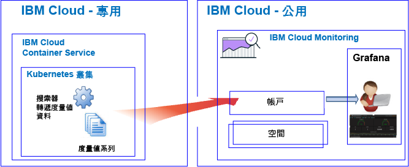

---

copyright:
  years: 2017, 2019

lastupdated: "2019-03-22"

keywords: IBM Cloud, monitoring

subcollection: cloud-monitoring

---

{:new_window: target="_blank"}
{:shortdesc: .shortdesc}
{:screen: .screen}
{:pre: .pre}
{:table: .aria-labeledby="caption"}
{:codeblock: .codeblock}
{:tip: .tip}
{:download: .download}
{:important: .important}
{:note: .note}

# 入門指導教學
{: #getting-started}

使用此指導教學，以學習如何在 {{site.data.keyword.cloud_notm}} 中開始使用 {{site.data.keyword.monitoringlong}} 服務。
{:shortdesc}

依預設，{{site.data.keyword.cloud_notm}} 提供所選取服務的整合監視功能。您可以使用 {{site.data.keyword.monitoringlong_notm}} 服務，以在使用度量值時擴充您的收集及保留功能，並且能夠定義規則及警示，在狀況需要注意時通知您。{{site.data.keyword.monitoringshort}} 服務提供一些特性讓您瞭解應用程式如何執行及使用資源，並協助您快速識別趨勢、偵測及診斷問題；全都具有立即的價值創造時間 (Time to Value) 與低廉的總擁有成本 (Total Cost of Ownership)。您可以透過 Grafana 監視環境。 

## 開始之前
{: #gs_prereqs}

您的使用者 ID 必須是 {{site.data.keyword.cloud_notm}} 帳戶的成員或擁有者。若要取得 {{site.data.keyword.cloud_notm}} 使用者 ID，請移至：[登錄 ](https://cloud.ibm.com/login){:new_window}

## 步驟 1：選擇您要監視的雲端資源
{: #gs_step1}

在 {{site.data.keyword.cloud_notm}} 中，CF 應用程式、{{site.data.keyword.containershort}} 上所執行之容器及所選取的服務會自動收集度量值系列資料，而且會將它轉遞至 {{site.data.keyword.monitoringshort}} 服務。

下表列出不同的雲端資源。請完成本指導教學，讓資源開始使用 {{site.data.keyword.monitoringshort}} 服務：

<table>
  <caption>開始使用 {{site.data.keyword.monitoringshort}} 服務的指導教學</caption>
  <tr>
    <th>資源</th>
    <th>指導教學</th>
    <th>雲端環境</th>
    <th>情境</th>
  </tr>
  <tr>
    <td>在 {{site.data.keyword.containershort}} 上執行的容器</td>
    <td>[在 Grafana 中分析 Kubernetes 叢集中所部署應用程式的度量值](/docs/services/cloud-monitoring/tutorials?topic=cloud-monitoring-container_service_metrics#container_service_metrics)</td>
    <td>公用  專用</td>
    <td></td>
  </tr>
  <tr>
    <td>CF 應用程式</td>
    <td>[在 Grafana 中分析 CF 應用程式的度量值](/docs/services/cloud-monitoring/tutorials?topic=cloud-monitoring-cfapps_metrics#cfapps_metrics)</td>
    <td>公用</td>
    <td></td>
  </tr>
</table>

## 步驟 2：設定使用者檢視度量值的許可權
{: #gs_step2}

若要控制容許使用者執行的 {{site.data.keyword.monitoringshort}} 動作，您可以將角色及原則指派給使用者。 

{{site.data.keyword.cloud_notm}} 中有兩種類型的安全許可權，可以控制使用者可在使用 {{site.data.keyword.monitoringshort}} 服務時執行的動作：

* Cloud Foundry (CF) 角色：您將 CF 角色授與使用者，以定義使用者檢視空間中度量值必須要有的許可權。
* IAM 角色：您將 IAM 原則授與使用者，以定義使用者檢視帳戶網域中度量值必須要有的許可權。

請完成下列步驟，以將檢視空間中度量值的許可權授與使用者：

1. [登入 {{site.data.keyword.cloud_notm}} 主控台 ](http://cloud.ibm.com/login){:new_window}
	
	使用您的使用者 ID 和密碼登入之後，{{site.data.keyword.cloud_notm}} 使用者介面隨即開啟。

2. 從功能表列中，按一下**管理 > 帳戶 > 使用者**。 

    *使用者* 視窗會顯示目前已選取帳戶的使用者及其電子郵件位址清單。
	
3. 如果使用者是帳戶成員，請從清單中選取使用者名稱，或按一下*動作* 功能表中的**管理使用者**。

    如果使用者不是帳戶的成員，請參閱[邀請使用者](/docs/iam?topic=iam-iamuserinv#iamuserinv)。

4. 選取 **Cloud Foundry 存取**，然後選取組織。

    即會列出該組織中的可用空間清單。

5. 選擇您已在其中佈建 {{site.data.keyword.monitoringshort}} 服務的空間。然後，從功能表動作中，選取**編輯空間角色**。

6. 選取*審核員*。 

    您可以選取一個以上的空間角色。下列所有角色都容許使用者檢視日誌：*管理員*、*開發人員*及*審核員*
	
7. 按一下**儲存角色**。

如需相關資訊，請參閱[授與許可權](/docs/services/cloud-monitoring/security?topic=cloud-monitoring-grant_permissions#grant_permissions)。

若要驗證使用者可以檢視度量值資料，請在已完成其中一個指導教學的「雲端」地區中啟動 Grafana。例如，對於「美國南部」地區，開啟 Web 瀏覽器，然後輸入下列 URL：[https://metrics.ng.bluemix.net/](https://metrics.ng.bluemix.net/)

如需如何在其他地區中啟動 Grafana 的相關資訊，請參閱[從 Web 瀏覽器導覽至 Grafana](/docs/services/cloud-monitoring/grafana?topic=cloud-monitoring-navigating_grafana#navigating_grafana)。

**附註：**當您啟動 Grafana 時，如果您取得指出 *bearer token not valid* 的訊息，請檢查空間中的許可權。此訊息指出使用者 ID 沒有可查看度量值的許可權。
    

## 後續步驟 
{: #gs_next_steps}

定義度量值的警示。如需相關資訊，請參閱[配置警示](/docs/services/cloud-monitoring?topic=cloud-monitoring-config_alerts_ov#config_alerts_ov)。
