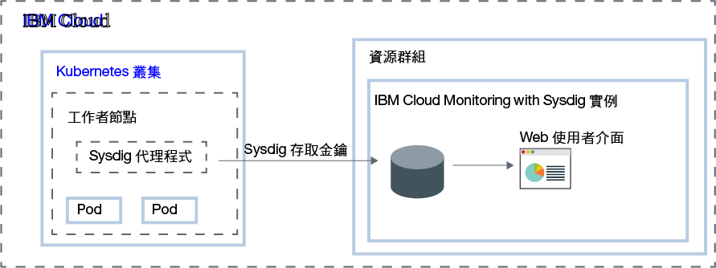

---

copyright:
  years:  2018, 2019
lastupdated: "2019-03-06"

keywords: Sysdig, IBM Cloud, monitoring, getting started

subcollection: Sysdig

---

{:new_window: target="_blank"}
{:shortdesc: .shortdesc}
{:screen: .screen}
{:pre: .pre}
{:table: .aria-labeledby="caption"}
{:codeblock: .codeblock}
{:tip: .tip}
{:download: .download}
{:important: .important}
{:note: .note}

# 入門指導教學
{: #getting-started}

{{site.data.keyword.mon_full_notm}} 是協力廠商雲端原生和容器智慧管理系統，您可以將其併入為 {{site.data.keyword.cloud_notm}} 架構的一部分。您可以使用它，在作業期間看見應用程式、服務及平台的效能及性能。它提供管理者、DevOps 團隊及開發人員完整堆疊遙測，提供進階功能來監視及疑難排解、定義警示，以及設計自訂儀表板。{{site.data.keyword.mon_full_notm}} 是由與 {{site.data.keyword.IBM_notm}} 具有夥伴關係的 Sysdig 所操作。
{:shortdesc}

下圖顯示正在 {{site.data.keyword.cloud_notm}} 上執行之 {{site.data.keyword.mon_full_notm}} 服務的元件概觀：

## 特性
{: #features}

**加速診斷及解決效能突發事件。**

{{site.data.keyword.mon_full_notm}} 可讓您深入瞭解基礎架構和應用程式，因而可從服務水準一直到系統層次進行疑難排解。預先定義的儀表板和警示可簡化潛在威脅或問題的識別。您可以使用 {{site.data.keyword.mon_full_notm}}、開發人員和 DevOps 團隊，來即時監視及疑難排解效能問題、識別錯誤來源，以及消除問題。 

**控制監視基礎架構的成本。**

{{site.data.keyword.mon_full_notm}} 包括的功能可協助您控制在 {{site.data.keyword.cloud_notm}} 監視基礎架構的成本。您可以配置要監視其效能的度量值資料來源。您可以啟用預先定義的警示，在使用變更將影響您的計費時警告您。 

**輕鬆地探索並視覺化您的整個環境。**

{{site.data.keyword.mon_full_notm}} 可讓您輕鬆地以視覺化方式探索環境。動態拓蹼對映提供服務之間相依關係的視圖。跨高流失、高基數、高頻率度量的多維查詢可加快疑難排解。可自訂儀表板可讓您將最重要的內容視覺化。 

**取得動態微服務監視的重要 Kubernetes 及容器見解。**

{{site.data.keyword.mon_full_notm}} 會自動探索 Kubernets 環境，為叢集、節點、名稱空間、服務、部署、Pod 等提供現成可用的儀表板及警示。每個節點的單一代理程式會動態探索所有微服務，並自動從各種來源收集度量及事件，包括 Kubernetes、主機、網路、容器、處理程序、應用程式及自訂度量（例如 Prometheus、JMX 及 StatsD）。 

**利用主動通知緩解異常狀況的影響。**

{{site.data.keyword.mon_full_notm}} 包括警示及多頻道通知，您可以用來減少對日常作業的影響，並加速您對異常狀況、關閉時間及效能退化的反應回應時間。您可以輕鬆配置的通知頻道包括*電子郵件*、*slack*、*PagerDuty*、*Webhook*、*OpsGenie* 及 *VictorOps*。

## 開始之前
{: #prereqs}

您具有的使用者 ID 必須是 {{site.data.keyword.cloud_notm}} 帳戶的成員或擁有者。若要取得 {{site.data.keyword.cloud_notm}} 使用者 ID，請移至：[登錄 ](https://cloud.ibm.com/login){:new_window}。

美國南部目前提供此服務。請完成美國南部地區的任何入門步驟。

## 步驟 1：管理使用者存取
{: #step1}

必須將已定義 IAM 使用者角色的存取原則，指派給在您帳戶中存取 {{site.data.keyword.mon_full_notm}} 服務的每位使用者。此原則決定使用者可以在您選取之服務或實例環境定義內執行的動作。容許的動作是自訂的，並定義為容許在服務上執行的作業。然後，這些動作會對映至 IAM 使用者角色。如需相關資訊，請參閱[管理 {{site.data.keyword.cloud_notm}} 中的使用者存取](/docs/services/Monitoring-with-Sysdig?topic=Sysdig-iam#iam)。

在 {{site.data.keyword.cloud_notm}} 授與使用者可以使用 {{site.data.keyword.mon_full_notm}} 服務的許可權時，會自動將 Sysdig 角色授與該使用者。這個角色決定使用者有權執行的動作。有效角色為 *Sysdig admin* 及 *Sysdig user*。如需相關資訊，請參閱[將 Sysdig 角色對映至 {{site.data.keyword.cloud_notm}} 角色](/docs/services/Monitoring-with-Sysdig?topic=Sysdig-iam#iam_sysdig)。

在您可以佈建實例之前，請考量下列資訊：
* 帳戶擁有者可以在 {{site.data.keyword.cloud_notm}} 中建立、檢視及刪除服務的實例，並可將許可權授與其他使用者來使用 {{site.data.keyword.mon_full_notm}} 服務。
* 您必須具有在 *Default* 資源群組中建立資源的許可權。
* 其他 {{site.data.keyword.cloud_notm}} 使用者若具有`管理者`或`編輯者`權限，即可在 {{site.data.keyword.cloud_notm}} 中管理 {{site.data.keyword.mon_full_notm}} 服務。這些使用者還必須具有平台許可權，才能在他們計劃佈建實例之資源群組的環境定義內建立資源。

若要授與服務的使用者管理者角色，以及管理帳戶中資源群組內的實例，使用者在資源群組的環境定義內，必須具有平台角色**管理者**對 {{site.data.keyword.mon_full_notm}} 服務的 IAM 原則。 

請完成下列步驟，將資源群組環境定義內 {{site.data.keyword.mon_full_notm}} 服務的管理者角色，指派給使用者： 

1. 從功能表列中，按一下**管理** &gt; **存取權 (IAM)**，然後選取**使用者**。
2. 從您要指派存取權的使用者列中，選取**動作**功能表，然後按一下**指派存取權**。
3. 選取**指派資源群組內的存取權**。
4. 選取資源群組。
5. 如果未授與使用者所選資源群組的角色，請針對**指派資源群組的存取權**欄位，選擇一個角色。 

    視您選取的角色而定，使用者可以在其儀表板上檢視資源群組、編輯資源群組名稱，或管理群組的使用者存取權。 
    
    如果您希望使用者只具有資源群組中對 {{site.data.keyword.mon_full_notm}} 服務的存取權，可以選取**不存取**。

6. 選取 **{{site.data.keyword.mon_full_notm}}**。
7. 選取平台角色**管理者**。
8. 按一下**指派**。

## 步驟 2：佈建 {{site.data.keyword.mon_full_notm}} 服務的實例
{: #step2}

若要在 {{site.data.keyword.cloud_notm}} 中使用 {{site.data.keyword.mon_full_notm}} 來新增監視功能，您必須佈建 {{site.data.keyword.mon_full_notm}} 服務的實例。 

佈建實例時，會將您的資料傳送給協力廠商。
{: tip}

您可以在資源群組的環境定義內佈建實例。資源群組可讓您基於存取控制及計費目的來組織服務。您可以在 *Default* 資源群組或自訂資源群組中佈建 {{site.data.keyword.mon_full_notm}} 實例。

佈建實例時，您會自動取得汲取金鑰，稱為 *Sysdig 存取金鑰*。

若要透過 {{site.data.keyword.cloud_notm}} 使用者介面佈建實例，請完成下列步驟：

1. 登入您的 {{site.data.keyword.cloud_notm}} 帳戶。

    按一下 [{{site.data.keyword.cloud_notm}} 儀表板 ](https://cloud.ibm.com/login){:new_window}，以啟動 {{site.data.keyword.cloud_notm}} 儀表板。

	在使用您的使用者 ID 和密碼登入之後，即會開啟 {{site.data.keyword.cloud_notm}} 使用者介面。

2. 按一下**型錄**。即會開啟 {{site.data.keyword.cloud_notm}} 中可用的服務清單。

3. 若要過濾顯示的服務清單，請選取**開發人員工具**種類。

4. 按一下 **{{site.data.keyword.mon_full_notm}}** 磚。

5. 選取服務方案。依預設，會設定**試用**方案。

    如需服務方案的相關資訊，請參閱[定價](/docs/services/Monitoring-with-Sysdig?topic=Sysdig-pricing_plans#pricing_plans)。

6. 選取資源群組。依預設，會設定 **default** 資源群組。

7. 按一下**建立**以佈建實例。

即會開啟服務使用者介面。

**附註：**若要透過 CLI 佈建 Sysdig 的實例，請參閱[透過 {{site.data.keyword.cloud_notm}} CLI 佈建 Sysdig](/docs/services/Monitoring-with-Sysdig?topic=Sysdig-provision#provision_cli)。

## 步驟 3：配置 Sysdig 代理程式
{: #step3}

在佈建實例之後，您必須為要監視的每一個度量來源配置一個 Sysdig 代理程式。度量來源是您要監視並控制其效能與性能的雲端資源。例如，度量來源可以是 Kubernetes 叢集。  

Sysdig 代理程式會自動收集及報告預先定義的度量。您可以使用 *Sysdig 存取金鑰* 來配置 Sysdig 代理程式，負責收集度量值資料，並將其轉遞至您的實例。如需相關資訊，請參閱[使用存取金鑰](/docs/services/Monitoring-with-Sysdig?topic=Sysdig-access_key#access_key)。

您可以針對下列任何環境配置 Sysdig 代理程式：

* Kubernetes、GKE 及 OpenShift。
* Docker 容器或非容器化的服務。
* Mesos、Marathon 及 DCOS。
* Linux 安裝。

例如，若要將您的 Kibernees 叢集配置為將度量傳送至您的 Sysdig 實例，您必須在叢集的每一個節點上安裝 `sysdig-agent` Pod。Sysdig 代理程式會從已安裝它的 Pod 中收集資料，然後將其轉遞至您的 Sysdig 實例。

請完成下列其中一個指導教學，瞭解如何部署 Sysdig 代理程式：

| 資源                |	指導教學                        | 環境                | 情境   |
|-------------------------|---------------------------------|----------------------------|------------|
| 在 {{site.data.keyword.containershort}} 上執行的容器 |[分析 Kubernetes 叢集中部署之應用程式的度量](/docs/services/Monitoring-with-Sysdig?topic=Sysdig-kubernetes_cluster#kubernetes_cluster) | {{site.data.keyword.cloud_notm}} Public |  |
|Linux Ubuntu/Debian | [分析 Ubuntu 伺服器的度量](/docs/services/Monitoring-with-Sysdig?topic=Sysdig-ubuntu#ubuntu) | 內部部署 |  |
{: caption="表 1. 開始使用 {{site.data.keyword.mon_full_notm}} 的指導教學" caption-side="top"} 

如需相關資訊，請參閱[配置 Sysdig 代理程式](/docs/services/Monitoring-with-Sysdig?topic=Sysdig-config_agent#config_agent)及[移除 Sysdig 代理程式](/docs/services/Monitoring-with-Sysdig?topic=Sysdig-remove#remove)。

在部署 Sysdig 代理程式之後，即會自動收集度量並將其轉遞至實例。Sysdig 代理程式會自動收集及報告預先定義的度量。您也可以配置要在環境中監視的度量。也會自動收集自訂度量的資料。

## 步驟 4：啟動 Web 使用者介面
{: #step4}

在 {{site.data.keyword.Bluemix}} 中佈建 {{site.data.keyword.mon_full_notm}} 服務的實例，並為您的節點配置 Sysdig 代理程式之後，您可以透過服務的 Web 使用者介面來檢視、監視及管理資料。

您可以從 {{site.data.keyword.cloud_notm}} 使用者介面，在 Sysdig 實例的環境定義內啟動 Web 使用者介面。 

請完成下列步驟來啟動 Sysdig Web 使用者介面：

1. 登入您的 {{site.data.keyword.cloud_notm}} 帳戶。

    按一下 [{{site.data.keyword.cloud_notm}} 儀表板 ](https://cloud.ibm.com/login){:new_window}，以啟動 {{site.data.keyword.cloud_notm}} 儀表板。

	在使用您的使用者 ID 和密碼登入之後，即會開啟「{{site.data.keyword.cloud_notm}} 儀表板」。

2. 在導覽功能表中，選取**觀察**。 

3. 選取**監視**。 

    即會顯示 {{site.data.keyword.cloud_notm}} 上可用的監視實例清單。

4. 選取一個實例。然後，按一下**檢視 Sysdig**。

即會開啟 {{site.data.keyword.mon_full_notm}} Web 使用者介面。依預設，會顯示*探索* 標籤。

依預設，會自動將使用者新增為針對每一個 {{site.data.keyword.mon_full_notm}} 實例所預先定義之**監視作業**團隊中的成員。使用者具有完整許可權，可以查看 Web 使用者介面中的所有資料。**附註：**管理者可以透過管理團隊中的使用者，以及控制可見的資料，來限制資料的存取。例如，若要限制使用者檢視許可權，管理者可以建立具有限制範圍及可見性的預設團隊。然後，手動將使用者指派給其他團隊。如需相關資訊，請參閱[使用團隊](/docs/services/Monitoring-with-Sysdig?topic=Sysdig-teams#teams)。

## 步驟 5：監視您的環境
{: #step5}

您可以在*探索* 標籤，以及在 Web 使用者介面的*儀表板* 標籤中分析資料。您可以透過度量視圖和儀表板來監視資料。 

* 使用度量視圖來監視個別度量。
* 使用儀表板，透過畫面監視資料，以取得對網路資料、應用程式資料、拓蹼、服務、主機及容器的專業見解。畫面會在儀表板中顯示度量或度量群組。
{: tip}

在*探索* 標籤中，您可以使用預設度量和預設儀表板來監視資料。您可以使用標籤來定義新的基礎架構群組，然後使用這些群組，以不同方式聚集資料，並監視您的環境。您也可以使用透過*儀表板* 標籤定義的自訂儀表板。

在*儀表板* 標籤中，您可以使用任何預設儀表板或建立新的儀表板來監視資料。

如需相關資訊，請參閱[監視您的環境](/docs/services/Monitoring-with-Sysdig?topic=Sysdig-monitoring#monitoring)

## 步驟 6：管理資料
{: #step6}

您可以使用標籤，將基礎架構資源分組為邏輯階層、濾出資料，以及將聚集資料分割為區段。自訂在您配置圖形或建立度量的警示時聚集資料的方式。設定儀表板的範圍、畫面或警示來濾出資料點。透過團隊來管理使用者的資料存取，以限制資料存取。 

例如，對於度量視圖，您可以定義資料的範圍、如何聚集資料，以及要套用至資料的時間和群組過濾器。 

如需相關資訊，請參閱[管理資料](/docs/services/Monitoring-with-Sysdig?topic=Sysdig-manage#manage)。

## 後續步驟：配置警示及探索事件
{: #next}

您可以使用事件來檢閱、追蹤及解決問題。事件是一種通知，指出將資料轉遞至 {{site.data.keyword.mon_full_notm}} 實例的任何節點中發生了什麼狀況。 

有不同類型的事件： 

* *警示事件* 是由使用者配置之警示所觸發的事件。例如，配置警示以通知需要注意的問題。如需相關資訊，請參閱[使用警示](/docs/services/Monitoring-with-Sysdig?topic=Sysdig-monitoring#monitoring_alerts)。
* *基礎架構型事件* 是從 Docker 和 Kubernetes 節點中收集的事件。依預設，Sysdig 會自動從選取事件群組探索及收集資料。您可以編輯代理程式配置檔來啟用其他事件。
* *自訂事件*，您可以透過下列任何整合進行配置：Slackbot、預先建置的 Python Script、自訂使用者建立的 Python Script，或 cURL 要求。

定義警示時，您必須定義觸發通知的條件、一個以上要透過其通知您的通知頻道、警示的嚴重性，以及警示類型。 

您可以在 Web 使用者介面的*設定* 區段中配置一個以上的通知頻道。有效的通知頻道為：*電子郵件*、*slack*、*PagerDuty*、*Webhook*、*OpsGenie* 及 *VictorOps*。如需相關資訊，請參閱[使用通知頻道](/docs/services/Monitoring-with-Sysdig?topic=Sysdig-notifications#notifications)。

Web 使用者介面中的*警示* 區段會顯示預先定義的警示清單。從這個視圖中，您可以啟用和停用預先定義的警示，可以修改現有的警示，也可以建立新的警示。如需相關資訊，請參閱[使用警示 ](https://sysdigdocs.atlassian.net/wiki/spaces/Monitor/pages/205324292/Alerts){:new_window}。

接下來，探索[使用自訂事件 ](https://sysdigdocs.atlassian.net/wiki/spaces/Monitor/pages/222822463/Custom+Events){:new_window}。

