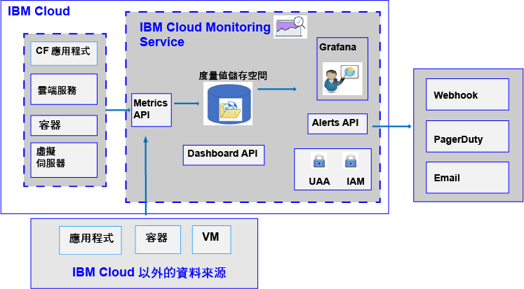

---

copyright:
  years: 2017, 2019

lastupdated: "2019-03-06"

keywords: IBM Cloud, monitoring

subcollection: cloud-monitoring

---

{:new_window: target="_blank"}
{:shortdesc: .shortdesc}
{:screen: .screen}
{:pre: .pre}
{:table: .aria-labeledby="caption"}
{:codeblock: .codeblock}
{:tip: .tip}
{:download: .download}
{:important: .important}
{:note: .note}

# 關於
{: #monitoring_ov}

請使用 {{site.data.keyword.monitoringlong}} 服務，以在使用度量值時擴充您的收集及保留功能，並且能夠定義規則及警示，在狀況需要注意時通知您。為您的 DevOps 團隊提供一些功能，讓您能夠洞察應用程式如何執行及耗用資源。快速識別趨勢、偵測及診斷問題；全都具有立即的價值創造時間 (Time to Value) 與低廉的總擁有成本 (Total Cost of Ownership)。請使用 Grafana 來監視您的環境。
{:shortdesc}

下圖顯示不同資源的高階視圖，您可以從這些資源將度量值傳送至 {{site.data.keyword.monitoringshort}} 服務，以進行分析：

依預設，{{site.data.keyword.Bluemix}} 會收集及顯示 {{site.data.keyword.containershort}} 的 CPU 用量、記憶體使用率及網路 I/O 等度量值。您可以使用 {{site.data.keyword.Bluemix_notm}} 中的 {{site.data.keyword.monitoringshort}} 服務，以自動收集及測量環境及應用程式中的重要度量值。不需要特殊檢測，即可收集度量值。例如，您可以使用效能度量值所提供的資訊來監視服務在雲端中的執行情況、偵測資源瓶頸，以及留意服務水準合約 (SLA)。當您分析服務的效能資料時，可以偵測到可能會導致資源瓶頸因而影響用戶端服務 SLA 的狀況。提早採取動作，可以避免可能會對您的業務造成負面影響的狀況。  

您可以將 Cloud Foundry (CF) 應用程式及虛擬機器 (VM) 的度量值傳送至 {{site.data.keyword.monitoringshort}} 服務。如需如何傳送度量值的相關資訊，請參閱[將度量值傳送至 {{site.data.keyword.monitoringshort}} 服務](/docs/services/cloud-monitoring?topic=cloud-monitoring-send_retrieve_metrics_ov#send_retrieve_metrics_ov)。

您可以透過 {{site.data.keyword.Bluemix_notm}} 型錄佈建 {{site.data.keyword.monitoringshort}} 服務。  

您可以透過 {{site.data.keyword.Bluemix_notm}} 儀表板檢視及分析 {{site.data.keyword.monitoringshort}} 服務所收集的度量值。  

## 為何使用監視服務
{: #value}

1. **用較少的時間來檢測應用程式，而將更多的時間用在加強其價值**

    {{site.data.keyword.monitoringlong_notm}} 服務會自動收集 {{site.data.keyword.IBM_notm}} Cloud 服務中的度量值資料，因此不需要代理程式。API 可讓您輕鬆新增自訂度量值，以及查詢您的監視資料。 
	
	{{site.data.keyword.monitoringlong_notm}} 服務每分鐘會提供一次度量值收集。精簡方案會以完整解析度保留度量值 15 天。超值方案則會以完整解析度保留度量值 45 天。

2. **使用 API 將監視輕鬆地延伸至您的應用程式**

    透過 {{site.data.keyword.monitoringshort}} 服務 API 將您的監視資料整合至應用程式及作業。請使用 API 將相關的應用程式及商業度量值新增到您的 Cloud 監視資料。您也可以使用 API 從 {{site.data.keyword.IBM_notm}} Cloud 之外將度量值資料傳送至 {{site.data.keyword.monitoringshort}} 服務。

3. **瞭解環境，以快速偵測、診斷及識別問題**

    使用靈活且使用者可自訂的儀表板，將應用程式及基礎架構的脈動視覺化。{{site.data.keyword.monitoringlong_notm}} 提供您 Grafana 的力量、靈活性及親切感，可以快速建置儀表板，並使其符合您的應用程式需求。
	
4. **建置可重複使用的儀表板並使它們成為互動式**

    {{site.data.keyword.monitoringlong_notm}} 服務管理的 Grafana 支援使用龐大視覺效果選項來建置自訂儀表板。您可以使用具有變數的度量值查詢，讓儀表板因為範本使用而變成動態。

5. **接收警示**

    定義規則以通知您有需要注意的狀況。{{site.data.keyword.monitoringlong_notm}} 服務提供一個 API，您可以使用該 API 來設定效能臨界值，並在違反那些臨界值時收到通知。定義單一服務實例或應用程式實例的警示規則，以及用來對一組實例進行報告的警示規則。觸發警示時，透過電子郵件、PagerDuty 事件、Webhook 通知或這三者的任意組合來接收通知。

6. **選擇符合您需要的服務方案** 

    您可以選擇「精簡」服務方案或「超值」服務方案來符合您的用量需求。「精簡」方案提供基本平台度量值收集和補充的警示。或者，您可以選取「超值」方案，以啟用具有較長保留期間的較大度量值耗用，增加您可以定義的警示數（包括針對多個服務及應用程式報告的警示），以及取得服務 API 的存取權。

 
## 服務方案
{: #plan}

{{site.data.keyword.monitoringshort}} 服務會提供多個方案。每一個方案都有不同的度量值收集、保留和警示定義功能。 

您可以透過 {{site.data.keyword.Bluemix_notm}} 使用者介面或透過指令行來變更方案。您隨時可以升級或降低方案。如需 {{site.data.keyword.Bluemix_notm}} 中服務方案升級的相關資訊，請參閱[變更方案](/docs/services/cloud-monitoring/plan?topic=cloud-monitoring-change_plan#change_plan)。 

下表概述當您在空間中佈建 {{site.data.keyword.monitoringshort}} 服務時可用的方案：

<table>
    <caption>表 1. 每個空間的 {{site.data.keyword.monitoringshort}} 服務的方案摘要。</caption>
      <tr>
        <th>方案</th>
        <th>使用 API 傳送度量值</th>
        <th>度量值保留期間</th>
        <th>警示</th>
		    <th>通知方法</th>
      </tr>
      <tr>
        <td>精簡（預設值）</td>
        <td>無法使用</td>
        <td>15 天</td>
        <td>您最多可以定義 10 個具有單一度量值查詢的警示規則，或 1 個包含萬用字元的警示規則。</td>
		    <td>Email</td>
      </tr>
      <tr>
        <td>超值</td>
        <td>可用</td>
        <td>45 天</td>
        <td>您可以定義警示規則，包括具有萬用字元的規則。</td>
		    <td>電子郵件、Webhook、PagerDuty</td>
      </tr>
</table>

**附註：**「精簡」方案提供與 {{site.data.keyword.Bluemix_notm}} 中整合式監視功能相同的特性。帳戶網域提供與「精簡」方案相同的特性。

## 度量值保留期間
{: #metrics_retention}

下表彙總根據您服務方案的保留期間：

<table>
    <caption>表 2. {{site.data.keyword.monitoringshort}} 服務的保留期間摘要。</caption>
      <tr>
        <th>方案</th>
        <th>保留期間</th>
      </tr>
      <tr>
        <td>精簡（預設值）</td>
        <td>度量值每分鐘儲存一次，為期 15 天。(1m:15d)</td>
      </tr>
      <tr>
        <td>超值</td>
        <td>度量值每分鐘儲存一次，為期 45 天。(1m:45d)</td>
      </tr>
</table>

會刪除過去 7 天內未收到資料的度量值。{{site.data.keyword.monitoringshort}} 服務會刪除本質上似乎是暫時性的度量值路徑（透過識別過去 7 天內未將資料寫入其中的度量值）的所有資料。例如：

* 當刪除容器時，與該容器相關聯的度量值會存在 7 天，之後即會刪除這些度量值。
* 如果您有一個稱為 `<space_id>.test.statsd.gauge-hello` 的 statsd 量規，而且您有一個星期未寫入其中，則度量值將被識別為暫時性，而且該度量值與其所有歷程資訊將會被刪除。 

## 佈建監視服務
{: #provision1}

在 {{site.data.keyword.Bluemix_notm}} 型錄中，您可以在 **DevOps** 區段中找到 {{site.data.keyword.monitoringshort}} 服務。如需在 {{site.data.keyword.Bluemix_notm}} 中佈建服務的相關資訊，請參閱[佈建 {{site.data.keyword.monitoringshort}} 服務](/docs/services/cloud-monitoring/how-to?topic=cloud-monitoring-provision#provision)。

請考量 {{site.data.keyword.monitoringshort}} 服務的下列相關資訊：

* 一個空間只能佈建一個 {{site.data.keyword.monitoringshort}} 服務實例。
* 若要收集 Cloud Foundry 空間中執行的雲端資源的度量值，您必須在資源執行所在的相同空間中佈建服務。

## 地區
{: #regions}

下列地區提供 {{site.data.keyword.monitoringshort}} 服務：

* 德國
* 雪梨
* 英國
* 美國南部

## 監視服務的 URL
{: #region}

具有 {{site.data.keyword.Bluemix_notm}} ID 並且有權可在 {{site.data.keyword.Bluemix_notm}} 中使用服務的任何人，皆可使用 {{site.data.keyword.monitoringshort}} 服務。

* 提供 {{site.data.keyword.monitoringshort}} 服務的每一個地區，都有不同的端點集。 
* 汲取及 API/Web 使用者介面端點共用單一個 URL。
* 埠 443 是用來透過 API 及 Web 使用者介面 (Grafana) 存取度量值的 TLS 埠。

下表列出每個地區的 URL：

<table>
  <caption>表 3. 使用 {{site.data.keyword.monitoringshort}} 服務的端點清單</caption>
  <tr>
    <th>地區</th>
	<th>端點</th>
  </tr>
  <tr>
    <td>德國</td>
	<td>[https://metrics.eu-de.bluemix.net](https://metrics.eu-de.bluemix.net)</td>
  </tr>
  <tr>
    <td>雪梨</td>
	<td>[https://metrics.au-syd.bluemix.net](https://metrics.au-syd.bluemix.net)</td>
  </tr>
  <tr>
    <td>英國</td>
	<td>[https://metrics.eu-gb.bluemix.net](https://metrics.eu-gb.bluemix.net)</td>
  </tr>
  <tr>
    <td>美國南部</td>
	<td>[https://metrics.ng.bluemix.net/](https://metrics.ng.bluemix.net/)</td>
  </tr>
</table>

