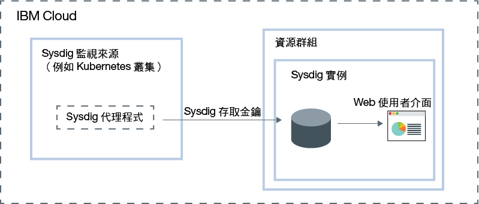

---

copyright:
  years:  2018, 2019
lastupdated: "2019-03-06"

keywords: Sysdig, IBM Cloud, monitoring, overview

subcollection: Sysdig

---

{:new_window: target="_blank"}
{:shortdesc: .shortdesc}
{:screen: .screen}
{:pre: .pre}
{:table: .aria-labeledby="caption"}
{:codeblock: .codeblock}
{:tip: .tip}
{:download: .download}
{:important: .important}
{:note: .note}

# 關於 {{site.data.keyword.mon_full_notm}}
{: #about}

{{site.data.keyword.mon_full}} 是協力廠商雲端原生和容器智慧管理系統，您可以將其併入為 {{site.data.keyword.cloud_notm}} 架構的一部分。您可以使用它，在作業期間看見應用程式、服務及平台的效能及性能。它提供管理者、DevOps 團隊及開發人員完整堆疊遙測，提供進階功能來監視及疑難排解、定義警示，以及設計自訂儀表板。{{site.data.keyword.mon_full_notm}} 是由與 {{site.data.keyword.IBM_notm}} 具有夥伴關係的 Sysdig 所操作。
{:shortdesc}

若要在 {{site.data.keyword.cloud_notm}} 中使用 {{site.data.keyword.mon_full_notm}} 來新增監視功能，您必須佈建 {{site.data.keyword.mon_full_notm}} 服務的實例。

在佈建實例之前，請考量下列資訊：

* 您的資料會傳送至協力廠商。
* 帳戶擁有者可以在 {{site.data.keyword.cloud_notm}} 中建立、檢視及刪除服務的實例，並可將許可權授與其他使用者來使用 {{site.data.keyword.mon_full_notm}} 服務。
* 其他 {{site.data.keyword.cloud_notm}} 使用者若具有`管理者`或`編輯者`權限，即可在 {{site.data.keyword.cloud_notm}} 中管理 {{site.data.keyword.mon_full_notm}} 服務。這些使用者還必須具有平台許可權，才能在他們計劃佈建實例之資源群組的環境定義內建立資源。

您可以在資源群組的環境定義內佈建實例。資源群組可讓您基於存取控制及計費目的來組織服務。您可以在 *Default* 資源群組或自訂資源群組中佈建 {{site.data.keyword.mon_full_notm}} 實例。

[佈建實例](/docs/services/Monitoring-with-Sysdig?topic=Sysdig-provision#provision)時，您會自動取得汲取金鑰，稱為 [Sysdig 存取金鑰](/docs/services/Monitoring-with-Sysdig?topic=Sysdig-access_key#access_key)。

在佈建實例之後，您必須為每一個度量來源配置一個 {{site.data.keyword.mon_full_notm}} 代理程式。度量來源是您要監視並控制其效能與性能的雲端資源。您必須在每一個要監視的環境中配置一個 {{site.data.keyword.mon_full_notm}} 代理程式。例如，度量來源可以是 Kubernetes 叢集。您可以使用存取金鑰來配置 Sysdig 代理程式，負責收集度量值資料，並將其轉遞至您的實例。

在度量來源中部署 {{site.data.keyword.mon_full_notm}} 代理程式之後，即會自動收集度量並將其轉遞至實例。{{site.data.keyword.mon_full_notm}} 代理程式會自動收集及報告預先定義的度量。您可以配置要在環境中監視的度量。

您可以透過 {{site.data.keyword.mon_full_notm}} Web 使用者介面，來[監視](/docs/services/Monitoring-with-Sysdig?topic=Sysdig-monitoring#monitoring)和[管理](/docs/services/Monitoring-with-Sysdig?topic=Sysdig-manage#manage)資料。  

下圖顯示正在 {{site.data.keyword.cloud_notm}} 上執行之 {{site.data.keyword.mon_full_notm}} 服務的元件概觀：

## 資料收集
{: #overview_collection}

配置 Sysdig 代理程式來收集資料並將其轉遞至 {{site.data.keyword.mon_full_notm}} 實例時，會自動收集資料，並可以透過 Web 使用者介面進行分析。

以 10 秒頻率收集資料。 

## 資料可用性
{: #overview_availability}

資料最多可使用 15 個月。

從主機或容器中移除 Sysdig 代理程式之後，不會刪除歷程資料。在安裝代理程式及報告的時段，可以透過 Web 使用者介面分析資料。

在刪除 {{site.data.keyword.mon_full_notm}} 服務的實例之後，資料無法用於搜尋及分析。

## 資料保留
{: #overview_retention}

根據*累積更新* 原則，保留每一個實例的資料。

隨著時間推移，資料會在 3 個月結束時從細的精度累積更新至較粗的精度。

累積更新原則說明一段時間內的資料精度：

* 以 10 秒解析度保留前 6 小時的資料。
* 以 1 分鐘解析度將資料保留 2 天。
* 以 10 分鐘解析度將資料保留 2 週。
* 以 1 小時解析度將資料保留 3 個月。
* 以 1 天解析度將資料保留一年。

## 資料刪除
{: #overview_data_deletion}

從 {{site.data.keyword.cloud_notm}} 中刪除 {{site.data.keyword.mon_full_notm}} 的實例時，必須透過支援中心開啟案例，才能要求刪除資料。如需詳細資料，請參閱[與支援中心聯絡](/docs/services/Monitoring-with-Sysdig?topic=Sysdig-gettinghelp#gettinghelp)。

刪除擷取時，會自動刪除該擷取的資料檔。

**附註：不支援刪除從 {{site.data.keyword.mon_short}} 實例中的單一 Sysdig 代理程式收集的資料。**

## 資料位置
{: #overview_data_location}

{{site.data.keyword.mon_full_notm}} 收集及聚集度量。 

* 度量值資料是在 {{site.data.keyword.cloud_notm}} 上進行管理。
* 每一個多區域地區 (MZR) 位置都會收集並聚集在該位置中執行之每一個 {{site.data.keyword.mon_full_notm}} 實例的度量。
* 資料位於佈建 {{site.data.keyword.mon_full_notm}} 實例的地區中。例如，在美國南部佈建之實例的度量值資料是在美國南部地區進行管理。

## {{site.data.keyword.mon_full_notm}} 代理程式
{: #overview_sysdig_agent}

{{site.data.keyword.mon_full_notm}} 代理程式會自動收集及報告預先定義的度量。 

下列清單概述可用的 {{site.data.keyword.mon_full_notm}} 代理程式：

* {{site.data.keyword.mon_full_notm}} 代理程式，適用於 Kubernetes、GKE 及 OpenShift。
* {{site.data.keyword.mon_full_notm}} 代理程式，適用於 Docker 容器或非容器化的服務。
* {{site.data.keyword.mon_full_notm}} 代理程式，適用於 Mesos、Marathon 及 DCOS。
* {{site.data.keyword.mon_full_notm}} 代理程式，適用於手動 Linux 安裝。

如需相關資訊，請參閱[配置 Sysdig 代理程式](/docs/services/Monitoring-with-Sysdig?topic=Sysdig-config_agent#config_agent)及[移除 Sysdig 代理程式](/docs/services/Monitoring-with-Sysdig?topic=Sysdig-remove#remove)。

## 檢視使用情形
{: #overview_usage}

若要監視服務的使用情形和成本，請參閱[檢視您的使用情形](/docs/billing-usage/viewing_usage.html#viewingusage)。

## 服務方案
{: #overview_plans}

{{site.data.keyword.mon_full_notm}} 實例提供不同的定價方案。如需相關資訊，請參閱[定價](/docs/services/Monitoring-with-Sysdig?topic=Sysdig-pricing_plans#pricing_plans)。

## 安全考量
{: #overview_security}

**擷取**

擷取是您可以產生的追蹤檔，用來分析主機在某個時間範圍內發生什麼情況。擷取包含系統呼叫及其他作業系統事件。配置從該節點收集度量的 Sysdig 代理程式時，您可以根據節點啟用或停用此功能。依預設，配置 Sysdig 代理程式時，會啟用*擷取*。節點可以是主機、容器、虛擬機器、裸機，或任何您安裝 Sysdig 代理程式的度量來源。

**重要事項**啟用「擷取」時，請注意，Sysdig 將深入瞭解您的作業。若要避免發生資安事件，並可能在組織外部公開資料，請先檢查您組織的安全原則，然後再對節點啟用擷取。請考慮停用所有 Sysdig 代理程式的*擷取* 功能。
{: tip}

