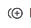

---

copyright:
  years:  2018, 2019
lastupdated: "2019-05-09"

keywords: Sysdig, IBM Cloud, monitoring, panels

subcollection: Sysdig

---

{:new_window: target="_blank"}
{:shortdesc: .shortdesc}
{:screen: .screen}
{:pre: .pre}
{:table: .aria-labeledby="caption"}
{:codeblock: .codeblock}
{:tip: .tip}
{:download: .download}
{:important: .important}
{:note: .note}

# 管理畫面
{: #panels}

使用畫面可在儀表板中顯示度量值或度量值群組。您可以複製、變更範圍、複製、刪除、匯出及探索畫面。
{:shortdesc}

您可以使用下列任何畫面類型：

| 類型 | 說明 |
|------|-------------|
| `折線圖` | 使用此畫面，可以檢視一個以上度量值的時間趨勢。|
| `區域圖` | 使用此畫面，可以檢視一個以上度量值的時間趨勢。|
| `前幾名清單` | 使用此畫面，可以跨實體群組比較度量值。長條圖依降冪排序。|
| `直方圖` | 使用此畫面，可以檢視儲存區中的度量值頻率分佈。|
| `拓蹼` | 使用此畫面，可將基礎架構視覺化為拓蹼對映，以及對映中實體之間的關係。|
| `數字` | 使用此畫面，可以檢視單一數字，其代表一個以上的實體在一段時間後的聚集度量值。|
| `表格` | 使用此畫面，可以根據度量值和區段，顯示基礎架構的數值資料。|
| `文字` | 使用此儀表板，可以新增文字。請使用 Markdown 來新增您的文字。|
{: caption="表 1. 畫面類型" caption-side="top"} 

##  將畫面複製到儀表板
{: #panels_copy}

請完成下列步驟來複製畫面：

1. 導覽至 Web 使用者介面中的*儀表板* 區段。選取儀表板。然後，識別顯示您要複製之度量值的畫面。

2. 選取*其他選項* 圖示 ，然後選取**複製畫面** 。

3. 選取其中一個列出的儀表板，或輸入新儀表板的名稱。 

4. 按一下**複製並開啟**。

## 變更畫面的範圍
{: #panels_scope}

請完成下列步驟來變更畫面的範圍：

1. 導覽至 Web 使用者介面中的*儀表板* 區段。選取儀表板。然後，識別顯示您要變更其範圍之度量的畫面。

2. 在畫面中，按一下**編輯範圍**來變更預設範圍。 

    依預設，會選取 **Everywhere**。
    
3. 選取範圍。 

4. 可以選擇性地按一下**置換自訂畫面範圍**，來置換已定義自訂範圍之所有畫面的範圍。 

    **附註：此動作無法復原。** 

    若要將儀表板範圍重設為整個基礎架構，或將現有儀表板的範圍更新為整個基礎架構，請選取 **Everywhere**。
    {: tip}

5. 按一下**儲存**。

## 複製畫面
{: #panels_duplicate}

請完成下列步驟，在現行儀表板中複製畫面：

1. 導覽至 Web 使用者介面中的*儀表板* 區段。選取儀表板。然後，識別顯示您要複製之度量值的畫面。

2. 選取*其他選項* 圖示 ，然後選取**複製畫面** 。

## 刪除畫面
{: #panels_delete}

請完成下列步驟，在現行儀表板中刪除畫面：

1. 導覽至 Web 使用者介面中的*儀表板* 區段。選取儀表板。然後，識別顯示您要複製之度量值的畫面。

2. 選取*其他選項* 圖示 ，然後選取**刪除畫面** 。

3. 按一下**是，刪除畫面**以確認刪除畫面。

## 從畫面匯出資料
{: #panels_export}

匯出資料時，請考量下列資訊：

* 您可以從折線圖中將資料匯出至 **json 檔案**。
* 您可以從表格圖表或折線圖中將資料匯出至 **csv 檔案**。

請完成下列步驟，從畫面匯出資料：

1. 導覽至 Web 使用者介面中的*儀表板* 區段。選取儀表板。然後，識別顯示您要複製之度量值的畫面。

2. 選取*其他選項* 圖示 。

3. 請選取下列其中一個選項：

    * 選取**匯出 JSON**，以將資料匯出至 JSON 格式化的檔案。

    * 選取**匯出 CSV**，以將資料匯出至 csv 格式化的檔案。

4. 按一下**儲存檔案**。

## 建立警示
{: #panels_alert}

您可以直接從畫面建立警示。

請完成下列步驟來建立警示：

1. 導覽至 Web 使用者介面中的*儀表板* 區段。選取儀表板。然後，識別顯示您要複製之度量值的畫面。

2. 選取*其他選項* 圖示 。

3. 選取**建立警示**。

4. 配置警示。

5. 按一下**建立**。

