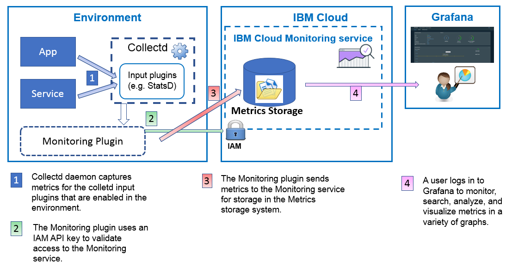

---

copyright:
  years: 2017, 2019

lastupdated: "2019-03-06"

keywords: IBM Cloud, monitoring

subcollection: cloud-monitoring

---

{:new_window: target="_blank"}
{:shortdesc: .shortdesc}
{:screen: .screen}
{:pre: .pre}
{:table: .aria-labeledby="caption"}
{:codeblock: .codeblock}
{:tip: .tip}
{:download: .download}
{:important: .important}
{:note: .note}

# 使用監視外掛程式 (collectd) 傳送資料
{: #conf_monitoring_plugin}

您可以配置 collectd 來收集環境中的度量值。使用 {{site.data.keyword.monitoringshort}} 外掛程式，將這些度量值從環境傳送至空間網域。
{: shortdesc}

下圖顯示如何使用 {{site.data.keyword.monitoringshort}} 外掛程式將度量值傳送至 {{site.data.keyword.monitoringshort}} 服務的高階視圖：




## 安裝監視外掛程式
{: #install}

從終端機中，完成下列步驟： 

1. （必要條件）安裝 {{site.data.keyword.Bluemix_notm}} CLI。

   如需相關資訊，請參閱[安裝 {{site.data.keyword.Bluemix_notm}} CLI](/docs/services/cloud-monitoring/qa/cli_qa.html#cli_qa)。
   
   如果已安裝 CLI，請繼續進行下一步。
	
2. 登入 {{site.data.keyword.Bluemix_notm}} 中的地區、組織及空間。 

    如需相關資訊，請參閱[如何登入 {{site.data.keyword.Bluemix_notm}}](/docs/services/cloud-monitoring/qa/cli_qa.html#login)。

    例如，若要登入「美國南部」地區，請執行下列指令：
	
	```
    ibmcloud login -a https://api.ng.bluemix.net
	ibmcloud target -o MyOrg -s MySpace
    ```
    {: codeblock}

    遵循指示。輸入您的 {{site.data.keyword.Bluemix_notm}} 認證，選取組織及空間。

### 步驟 1：安裝 collectd
{: #collectd}

身為管理者，請完成下列步驟來安裝 collectd：

1.	以 root 使用者身分登入。 

    ```
    sudo -s
    ```
    {: codeblock}

2.	安裝「網路時間通訊協定 (NTP)」套件，以同步化日誌的時間。 

    例如，針對 Ubunutu 系統，檢查 `timedatectl status` 是否顯示 *Network time on: yes*。如果是，Ubuntu 系統即已配置成使用 NTP，而且您可以跳過此步驟。
    
    ```
    # timedatectl status
    Local time: Mon 2017-06-12 03:01:22 PDT
    Universal time: Mon 2017-06-12 10:01:22 UTC
    RTC time: Mon 2017-06-12 10:01:22
    Time zone: America/Los_Angeles (PDT, -0700)
    Network time on: yes
    NTP synchronized: yes
    RTC in local TZ: no
    ```
    {: screen}
    
    完成下列步驟，以在 Ubuntu 系統中安裝 NTP：

    1.	執行下列指令，以更新套件。 

        ```
        apt-get update
        ```
        {: codeblock}
        
    2.	執行下列指令，以安裝 ntp 套件。 

        ```
        apt-get install ntp
        ```
        {: codeblock}
        
    3.	執行下列指令，以安裝 ntpdate 套件。 
    
        ```
        apt-get install ntpdate
        ```
        {: codeblock}
        
    4.	執行下列指令，以停止服務。 
        
        ```
        service ntp stop
        ```
        {: codeblock}
        
    5.	執行下列指令，以同步化系統時鐘。 
    
        ```
        ntpdate -u 0.ubuntu.pool.ntp.org
        ```
        {: codeblock}
        
        結果會確認時間已調整，例如：
        
        ```
4 May 19:02:17 ntpdate[5732]: adjust time server 50.116.55.65 offset 0.000685 sec
        ```
        {: screen}
        
    6.	執行下列指令，以重新啟動 ntpd。 
    
        ```
        service ntp start
        ```
        {: codeblock}
    
        結果會確認服務正在啟動。

3. 安裝 collectd。執行下列指令：

    ```
	apt-get install collectd 
	```
	{: codeblock}


### 步驟 2：安裝監視外掛程式
{: #plugin}

請完成下列步驟來安裝 {{site.data.keyword.monitoringshort}} 外掛程式：

1. 	以 root 使用者身分登入。 

    ```
    sudo -s
    ```
    {: codeblock}
	
2. 新增 {{site.data.keyword.monitoringshort}} 服務儲存庫。執行下列指令：

    ```
        wget -O - https://downloads.opvis.bluemix.net/client/IBM_Logmet_repo_install.sh | bash
    ```
   {: codeblock}
   
3. 安裝外掛程式。執行下列指令：

    ```
	apt-get install ibmcloud-monitoring
	```
	{: codeblock}


## 配置監視外掛程式
{: #configure}

若要配置 {{site.data.keyword.monitoringshort}} 外掛程式，請完成下列步驟：
	
### 步驟 1：將 IAM 原則指派給使用者
{: #iam_policy}

若要將度量值傳送至任何網域，您的使用者 ID 必須已獲授與 IAM 角色，並具有將度量值傳送至「監視」服務的許可權。
 
* 許可權的設定方式為在 IBM Cloud 中為該使用者指派 IAM 原則。 
* 下列 IAM 角色容許使用者傳送度量值：*管理者*、*編輯者*、*操作員*。 

若要為使用者指派 IAM 原則，請選擇下列其中一種方法：

* 透過 {{site.data.keyword.Bluemix_notm}} 使用者介面：如需相關資訊，請參閱[透過 {{site.data.keyword.Bluemix_notm}} 使用者介面為使用者指派 IAM 原則](/docs/services/cloud-monitoring/security/assign_policy.html#assign_policy_ui)。
* 使用指令行：如需相關資訊，請參閱[使用指令行為使用者指派 IAM 原則](/docs/services/cloud-monitoring/security/assign_policy.html#assign_policy_commandline)。
 
### 步驟 2：取得 API 金鑰
{: #api_key}
 
若要將度量值傳送至空間，您必須取得 API 金鑰，才能向 {{site.data.keyword.monitoringshort}} 服務進行鑑別。


如需如何取得 API 金鑰的相關資訊，請參閱[取得 API 金鑰](/docs/services/cloud-monitoring/security/auth_api_key.html#auth_api_key)。
	
從登入 {{site.data.keyword.Bluemix_notm}} 的相同終端機中，設定記號 APIKEY 變數。


例如，

```
export APIKEY="kjshdgf.....ldkdjdj"
```
{: screen}
	
### 步驟 3：取得端點的相關資訊
{: #endpoint}

若要判斷您將在其中傳送度量值的 {{site.data.keyword.monitoringshort}} 端點，請查看每個地區的端點清單，請參閱[端點](/docs/services/cloud-monitoring/send_retrieve_metrics_ov.html#endpoints)，並識別您要傳送度量值的地區。

從登入 {{site.data.keyword.Bluemix_notm}} 的相同終端機中，設定 **METRIC_ENDPOINT** 變數。例如，

```
export METRIC_ENDPOINT="metrics.ng.bluemix.net"
```
{: screen}


### 步驟 4：取得空間網域 ID 的相關資訊 
{: #domain}

若要取得空間的網域 ID，請[取得空間 GUID](/docs/services/cloud-monitoring/qa/cli_qa.html#space_guid)。然後，如下所示設定網域 ID：`s-SpaceID`，其中 SpaceID 是空間的 GUID。

從登入 {{site.data.keyword.Bluemix_notm}} 的相同終端機中，設定 SpaceID 變數：


```
export SpaceID="kjshdgf.....ldkdjdj"
```
{: screen}


### 步驟 5：執行配置 Script
{: #script}

執行下列 Script 來配置 {{site.data.keyword.monitoringshort}} 外掛程式，以將度量值傳送至空間：

```
/opt/ibmcloud_monitoring/configure -e $METRIC_ENDPOINT -a $APIKEY -s s-$SpaceID
```
{: codeblock}


Script 會自動將 **Include** 段落新增至主要 collectd.conf 檔案中：

```
<LoadPlugin IBMCloudMonitoring>
   FlushInterval 60
</LoadPlugin>
<Plugin IBMCloudMonitoring>
  <Endpoint "ng">
     Host "metrics.ng.bluemix.net"
     Port 9095
     ApiKey "xxxxxxxxxxxxxxxxxxxxxxxxxxxxxxxxxxxxxxxx"
     SkipInternalPrefixForStatsd false
     RateCounter false
     ScopeId "s-cedc73c5-6d55-4193-a9de-378620d6fab5"
  </Endpoint>
</Plugin>
```
{: screen}


### 步驟 6：重新啟動 collectd 常駐程式
{: #restart}

請完成下列步驟：

1. 	以 root 使用者身分登入。 

    ```
    sudo -s
    ```
    {: codeblock}
	
2.  重新啟動 collectd。

   如果 collectd 常駐程式已新增為服務，請執行下列指令：
	
	```
	service collectd restart
	```
	{: codeblock}

在 collectd 中啟用的度量值即是可用於 Grafana 中進行分析的度量值。


