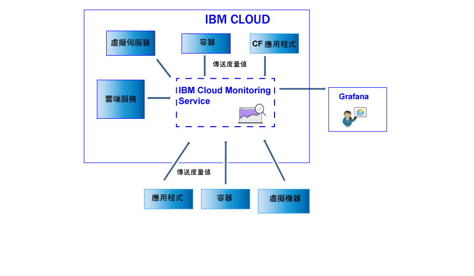

---

copyright:
  years: 2017, 2019

lastupdated: "2019-03-06"

keywords: IBM Cloud, monitoring

subcollection: cloud-monitoring

---

{:new_window: target="_blank"}
{:shortdesc: .shortdesc}
{:screen: .screen}
{:pre: .pre}
{:table: .aria-labeledby="caption"}
{:codeblock: .codeblock}
{:tip: .tip}
{:download: .download}
{:important: .important}
{:note: .note}

# 傳送及擷取資料
{: #send_retrieve_metrics_ov}

您可以使用 Metrics API 或配置 {{site.data.keyword.monitoringshort}} 外掛程式（其為 collectd 外掛程式），將度量值傳送至空間。您可以使用 Metrics API 來擷取度量值。
{:shortdesc}

		
## 傳送度量值
{: #send}

下圖顯示不同資料來源的高階視圖，您可以從這些資料來源將度量值傳送至 {{site.data.keyword.monitoringshort}} 服務：

對於在 {{site.data.keyword.Bluemix_notm}} 的 Kubernetes 叢集中執行的容器以及所選取的服務，基本系統度量值會自動收集。
您也可以收集其他度量值，或者從 {{site.data.keyword.IBM_notm}} Cloud 外部將度量值傳送至 {{site.data.keyword.monitoringshort}} 服務。有不同方法可供使用。下表依度量值來源列出方法：

<table>
  <caption>表 1. 針對 {{site.data.keyword.IBM_notm}} Cloud 資源，將度量值傳送至 {{site.data.keyword.monitoringshort}} 服務的方法</caption>
  <tr>
    <th>度量值來源</th>
	<th>Metrics API</th>
    <th>{{site.data.keyword.monitoringshort}} 外掛程式 (collectd)</th>	
	<th>進一步資訊</th>
  </tr>
  <tr>
    <td>在 {{site.data.keyword.Bluemix_notm}} 的 Kubernetes 叢集中執行的容器</td>
	<td>是</td>
	<td>是</td>
	<td>基本系統度量值會自動收集。您可以明確安裝 collectd，並且會傳送依預設未提供的進階或自訂度量值。</td>
  </tr>
  <tr>
    <td>Cloud Foundry 應用程式</td>
	<td>是</td>
	<td>否</td>
	<td></td>
  </tr>
  <tr>
    <td>虛擬伺服器</td>
	<td>是</td>
	<td>是</td>
	<td>**附註：**Windows 不支援。</td>
  </tr>
</table>

<table>
  <caption>表 2. 從 {{site.data.keyword.IBM_notm}} Cloud 外部將度量值傳送至 {{site.data.keyword.monitoringshort}} 服務的方法。</caption>
  <tr>
    <th>度量值來源</th>
	<th>Metrics API</th>
    <th>{{site.data.keyword.monitoringshort}} 外掛程式 (collectd)</th>	
	<th>進一步資訊</th>
  </tr>
  <tr>
    <td>容器</td>
	<td>是</td>
	<td>是</td>
	<td>您可以使用 *supervisord* 作為容器端點，以執行與管理應用程式及 collectd。</td>
  </tr>
  <tr>
    <td>應用程式</td>
	<td>是</td>
	<td>否</td>
	<td></td>
  </tr>
  <tr>
    <td>服務</td>
	<td>是</td>
	<td>否</td>
	<td></td>
  </tr>
  <tr>
    <td>虛擬機器 (VM)</td>
	<td>是</td>
	<td>是</td>
	<td>**附註：**Windows 不支援。</td>
  </tr>
</table>

若要將度量值傳送至 {{site.data.keyword.monitoringshort}} 服務，請考量下列資訊： 

* 您必須指定要在其中傳送度量值的空間。

* 您必須提供安全記號或 API 金鑰，以便使用 {{site.data.keyword.monitoringshort}} 服務。 

* 傳送度量值之使用者的 {{site.data.keyword.IBM_notm}} ID 必須已為 {{site.data.keyword.monitoringshort}} 服務指派 IAM 原則。下列 IAM 角色容許使用者傳送度量值：*管理者*、*編輯者*及*操作員*。

* 您必須指定要在其中傳送度量值的 API 端點。每個地區都有一個端點。例如，對於「美國南部」地區，端點如下：`https://metrics.ng.bluemix.net/v1/metrics`。如需端點的相關資訊，請參閱 [{{site.data.keyword.monitoringshort}} 服務的 URL](/docs/services/cloud-monitoring/monitoring_ov.html#region){: new_window}。

您可以使用下列任何方法，將度量值傳送至 {{site.data.keyword.monitoringshort}} 服務：

* *方法 1：配置 {{site.data.keyword.monitoringshort}} 外掛程式。*

    如需相關資訊，請參閱[配置 {{site.data.keyword.monitoringshort}} 外掛程式](/docs/services/cloud-monitoring/send-metrics/conf_monitoring_plugin.html#conf_monitoring_plugin)。

    下圖顯示如何使用 {{site.data.keyword.monitoringshort}} 外掛程式將度量值傳送至 {{site.data.keyword.monitoringshort}} 服務的高階視圖：

    

* *方法 2：使用 Metrics API。*

    如需相關資訊，請參閱[使用 Metrics API 傳送度量值](/docs/services/cloud-monitoring/send-metrics/send_data_api.html#send_data_api)。

## 擷取度量值
{: #retrieve}

如果您需要在 {{site.data.keyword.monitoringshort}} 服務外部執行進一步分析，或者您的應用程式想要使用度量值來進行決策，您可以使用 Metrics API 針對每個要求最多擷取五個度量值。 

* 如需如何擷取度量值的相關資訊，請參閱[從網域中擷取度量值](/docs/services/cloud-monitoring/retrieve-metrics/retrieve_data_api.html#retrieve_data_api)
* 如需 Metrics API 的相關資訊，請參閱 [Metrics API](https://console.bluemix.net/apidocs/927-ibm-cloud-monitoring-rest-api?&language=node#introduction){: new_window}。

若要擷取度量值，請考量下列資訊： 

* 您必須設定要從中擷取資料的空間。 
* 您必須提供安全記號或 API 金鑰，以便使用 {{site.data.keyword.monitoringshort}} 服務。 
* 您必須指定一個以上度量值的路徑。如需相關資訊，請參閱[定義度量值](/docs/services/cloud-monitoring/retrieve-metrics/retrieve_data_api.html#metrics)。
* 您可以選擇指定自訂的時段。依預設，如果沒有指定時段，則您擷取的資料是對應於過去 24 小時的資料。如需相關資訊，請參閱[配置時段](/docs/services/cloud-monitoring/retrieve-metrics/retrieve_data_api.html#time)。

## 列出度量值
{: #show_metrics}

您可以列出空間中可用的度量值。

若要列出度量值，請考量下列資訊： 

* 您必須設定要列出其可用度量值的 {{site.data.keyword.Bluemix_notm}} 空間。

* 您必須提供安全記號或 API 金鑰，以便使用 {{site.data.keyword.monitoringshort}} 服務。 

* 您必須指定查詢，以定義列出度量值的來源路徑。例如，若要列出空間中的所有度量值，您可以將查詢設定為：`query=*` 

    預設值是 `*`，它將起點指定為空間的根層次。
	
* 您可以使用 API 呼叫 `Endpoint/v1/metrics/list`，其中 Endpoint 代表服務的進入點。 

    每一個地區都有不同的 URL。例如，對於「美國南部」地區，您可以使用 API 端點：`https://metrics.ng.bluemix.net/v1/metrics/list` 

    若要取得每個地區的端點清單，請參閱[端點](/docs/services/cloud-monitoring/send_retrieve_metrics_ov.html#endpoints)。

    如需 API 的相關資訊，請參閱 [Metrics API](https://console.bluemix.net/apidocs/927-ibm-cloud-monitoring-rest-api?&language=node#introduction){: new_window}。

## 傳送度量值的端點
{: #endpoints}

 下表依地區列出端點：
	
<table>
    <caption>端點清單</caption>
	<tr>
	  <th>地區</th>
	  <th>URL</th>
	  <th>collectd 埠</th>
	</tr>
	<tr>
	  <td>德國</td>
	  <td>[https://metrics.eu-de.bluemix.net](https://metrics.eu-de.bluemix.net)</td>
	  <td>9095</td>
	</tr>
	<tr>
	  <td>雪梨</td>
	  <td>[https://metrics.au-syd.bluemix.net](https://metrics.au-syd.bluemix.net)</td>
	  <td>9095</td>
	</tr>
	<tr>
	  <td>英國</td>
	  <td>[https://metrics.eu-gb.bluemix.net](https://metrics.eu-gb.bluemix.net)</td>
	  <td>9095</td>
	</tr>
	<tr>
	  <td>美國南部</td>
	  <td>[https://metrics.ng.bluemix.net](https://metrics.ng.bluemix.net)</td>
	  <td>9095</td>
	</tr>
</table>

 
