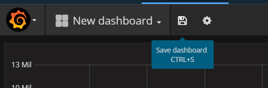

---

copyright:
  years: 2017, 2019

lastupdated: "2019-03-06"

keywords: IBM Cloud, monitoring

subcollection: cloud-monitoring

---

{:new_window: target="_blank"}
{:shortdesc: .shortdesc}
{:screen: .screen}
{:pre: .pre}
{:table: .aria-labeledby="caption"}
{:codeblock: .codeblock}
{:tip: .tip}
{:download: .download}
{:important: .important}
{:note: .note}

# 在 Grafana 中分析 CF 應用程式的度量值
{: #cfapps_metrics}

使用此指導教學，以學習如何使用 {{site.data.keyword.monitoringlong}} 服務來監視在「{{site.data.keyword.Bluemix_notm}} 公用」中執行之 Cloud Foundry (CF) 應用程式的效能。
{:shortdesc}

## 目標
{: #objectives}

學習如何搜尋及分析 CF 應用程式的度量值：

1. 部署 CF 應用程式。
2. 啟動 Grafana，並設定您可檢視 CF 應用程式度量值的 {{site.data.keyword.monitoringshort}} 網域。
3. 搜尋及分析 {{site.data.keyword.Bluemix_notm}} 空間中執行之 CF 應用程式的度量值。

此指導教學假設您是在「美國南部」地區工作。

## 必要條件
{: #cfapps_prereqs}

1. 是 {{site.data.keyword.Bluemix_notm}} 帳戶的成員或擁有者，並具有許可權可以在空間中佈建服務、部署 CF 應用程式，以及透過 {{site.data.keyword.monitoringshort}} 服務查詢 {{site.data.keyword.Bluemix_notm}} 中的度量值。

    您的 {{site.data.keyword.Bluemix_notm}} 使用者 ID 必須具有 {{site.data.keyword.monitoringshort}} 服務及 CF 應用程式佈建所在空間的 CF 角色。此必要角色是 *developer*。
    
    如需相關資訊，請參閱[使用 IBM Cloud 使用者介面將 CF 角色授與使用者](/docs/services/cloud-monitoring/security?topic=cloud-monitoring-grant_permissions#grant_permissions_ui_space)。

2. 在您具有於「美國南部」地區佈建服務之許可權的空間中，佈建 {{site.data.keyword.monitoringshort}} 服務。

    如需相關資訊，請參閱[佈建 {{site.data.keyword.monitoringshort}} 服務](/docs/services/cloud-monitoring/how-to?topic=cloud-monitoring-provision#provision)。

## 步驟 1：將使用 CF 應用程式及 {{site.data.keyword.monitoringshort}} 服務的許可權授與使用者
{: #cfapps_step1}

若要將在空間中部署 CF 應用程式或檢視空間網域中之度量值的許可權授與使用者，您必須將 CF 角色指派給該使用者，而這個角色說明此使用者可以在空間及 {{site.data.keyword.Bluemix_notm}} 中使用 {{site.data.keyword.monitoringshort}} 服務的動作。 

**附註：**此指導教學假設您是帳戶擁有者或具有將角色新增至使用者 ID 的許可權。如果您沒有許可權，請要求擁有者完成此步驟。

請完成下列步驟，以將完成指導教學的許可權授與使用者：

1. 登入 {{site.data.keyword.Bluemix_notm}} 主控台。

    開啟 Web 瀏覽器，並啟動 {{site.data.keyword.Bluemix_notm}} 儀表板：[http://bluemix.net ](http://bluemix.net){:new_window}
	
	使用您的使用者 ID 和密碼登入之後，{{site.data.keyword.Bluemix_notm}} 使用者介面隨即開啟。

2. 從功能表列中，按一下**管理 > 帳戶 > 使用者**。 

    *使用者* 視窗會顯示目前已選取帳戶的使用者及其電子郵件位址清單。
	
3. 從清單中尋找使用者名稱，然後按一下*動作*功能表中的**管理使用者**。

4. 選取 **Cloud Foundry 存取**，然後選取**指派組織**。

5. 輸入下列值： 

    <table>
      <caption>要選取的值清單</caption>
      <tr>
        <th>欄位</th>
        <th>值</th>
      </tr>
      <tr>
        <td>組織</td>
        <td>MyOrg</td>
      </tr>
      <tr>
        <td>組織角色</td>
        <td>無組織角色</td>
      </tr>
      <tr>
        <td>地區</td>
        <td>美國南部</td>
      </tr>
      <tr>
        <td>空間</td>
        <td>dev</td>
      </tr>
      <tr>
        <td>空間角色</td>
        <td>developer</td>
      </tr>
    </table>
	
6. 按一下**儲存角色**。
 

## 步驟 2：部署 CF 應用程式
{: #cfapps_step2}

請從 {{site.data.keyword.Bluemix_notm}} 主控台中完成下列步驟：

1. 按一下 {{site.data.keyword.Bluemix_notm}} 工具列中的**型錄**。

2. 按一下 **Cloud Foundry 應用程式 > Liberty for Java**。 

3. 輸入下列資訊：

    * **應用程式名稱**：應用程式的名稱。必須是唯一的。
    * **地區**：選擇「美國南部」。
    * **組織**：選擇您已在其中佈建 {{site.data.keyword.monitoringshort}} 服務的組織。
    * **空間**：選擇您已在其中佈建 {{site.data.keyword.monitoringshort}} 服務的空間。

3. 按一下**建立**。

只要 CF 應用程式正在執行，就會收集度量值，並將其轉遞至 {{site.data.keyword.monitoringshort}} 服務。

## 步驟 3：啟動 Grafana 並設定度量值網域
{: #cfapps_step3}

從瀏覽器啟動 Grafana，並設定您可檢視 CF 應用程式度量值的 {{site.data.keyword.monitoringshort}} 網域。

1. 從瀏覽器啟動 Grafana。 

    輸入 {{site.data.keyword.monitoringshort}} 服務佈建所在地區的 {{site.data.keyword.monitoringshort}} 服務 URL。
    
    若要取得每個地區的 URL，請參閱[監視服務的 URL](/docs/services/cloud-monitoring?topic=cloud-monitoring-monitoring_ov#region)。

    例如，對於「美國南部」地區，啟動：[https://metrics.ng.bluemix.net/](https://metrics.ng.bluemix.net/)。

2. 設定您可檢視叢集度量值的 {{site.data.keyword.monitoringshort}} 網域。

    在 Grafana 中，選取 ID。然後，確認您使用正確的帳戶，並選擇 `Domain = space`。

    驗證組織名稱及空間名稱對應至已部署 CF 應用程式及已佈建 {{site.data.keyword.monitoringshort}} 服務的組織名稱及空間名稱。

## 步驟 4：建立 Grafana 儀表板以監視度量值
{: #cfapps_step4}

請完成下列步驟，以在 Grafana 中建立新的儀表板：

1. 選取側邊功能表列切換 。
2. 選取**儀表板**。
3. 按一下**新建**。

即會開啟儀表板。儀表板包括已備妥可進行配置的空白列。

在 Grafana 中，您可以新增幾列，將儀表板區分為數個區段。一列集合了 1 個以上的畫面。在一列中，畫面是您可配置以顯示度量值資料的最小視覺效果單位，例如，您可以選擇圖形畫面或表格畫面。您可以拖放畫面，以重新排列儀表板中的畫面。畫面顯示的資料是透過查詢而配置。您可以在一個畫面中定義一個以上的查詢。每一個查詢都代表不同的資料集。您也可以設定畫面的時間範圍。通常，時間範圍是由*儀表板* 時間選取器所設定。

定義過濾圖形中所顯示資料的查詢。此查詢會監視達到容器限制的 CPU 用量百分比。

如需查詢格式的相關資訊，請參閱 [CF 應用程式的 Grafana 查詢格式](/docs/services/cloud-monitoring/reference?topic=cloud-monitoring-cfapps_metrics_format#cfapps_metrics_format)。
    
1. 新增*圖形*畫面，以監視容器的所有核心的 CPU 時間（十億分之一秒）。
    
    1. 選取**圖形**。
    
    2. 按一下圖形標題，然後選取**編輯**。
    
        即會開啟*度量值*標籤。您可以在這裡看到預設資料來源。
    
        
    
2. 定義過濾圖形中所顯示資料的查詢。 
    
    在*度量值*標籤中，選取**新增查詢**。 即會新增查詢項目。每一個查詢都會以一個字母標示。
    
    
        
    1. 按一下**選取度量值**，然後選擇來源：`ibmcloud`。
    
    2. 按一下**選取度量值**，然後選擇雲端類型：`public`。
    
    3. 按一下**選取度量值**，然後選擇 `cloud-foundry`。
    
    4. 按一下**選取度量值**，然後選擇您工作的地區，例如，`us-south` 表示「美國南部」地區。
    
    5. 按一下**選取度量值**，然後選擇 CF 應用程式名稱，例如，`logtester`。
    
    6. 按一下**選取度量值**，然後選擇 CF 應用程式實例索引，例如，`0`。

    7. 按一下**選取度量值**，然後選擇 `container`。
    
    9. 按一下**選取度量值**，然後選擇度量值。若要監視容器的 *CPU 用量百分比*，請選擇 `cpu-utilization`。

    10. 按一下加號影像 ，然後選擇函數。您可以新增函數，以在可供度量值使用的資料上轉換、結合及執行運算。
        
        例如，您可以新增 **alias(newName)** 函數來新增度量值的別名。此別名用來列印字串，而不是圖形中所顯示圖註中的度量值名稱。
        
        若要新增度量值的別名，請完成下列步驟：
        
        1. 按一下加號。
        2. 選取**特殊**。
        3. 選取**別名**。
        4. 輸入字串，例如，`My sample metric`。
        

## 步驟 5：儲存儀表板
{: #cfapps_step5}

儲存儀表板，以供之後重複使用。

1. 按一下儲存儀表板影像 。

    

2. 輸入儀表板的名稱。
3. 按一下**儲存**。

## 後續步驟
{: #cfapps_next_steps}

定義度量值的警示。如需相關資訊，請參閱[配置警示](/docs/services/cloud-monitoring?topic=cloud-monitoring-config_alerts_ov#config_alerts_ov)。
