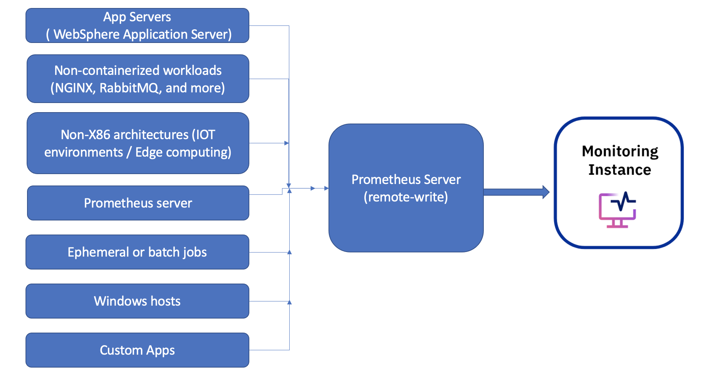

---

copyright:
  years:  2018, 2024
lastupdated: "2024-05-31"

keywords: IBM Cloud, monitoring, prometheus, remote-write

subcollection: monitoring

---

{{site.data.keyword.attribute-definition-list}}

---

# Collecting metrics by using Prometheus remote write
{: #prometheus_remote_write}

You can configure Prometheus remote write to collect metrics from environments where a {{site.data.keyword.mon_short}} agent is not available and send them to a {{site.data.keyword.mon_short}} instance.
{: shortdesc}

You can collect metrics from:
- An existing Prometheus server.
- Ephemeral or batch jobs that may not exist long enough to be scraped by a {{site.data.keyword.mon_short}} agent.
- Windows hosts and other operating systems where the {{site.data.keyword.mon_short}} agent is not available
- Non-x86 based architectures, typically seen on IoT environments or Edge computing.
- Non-containerized workloads, such as NGNIX, custom applications, RabbitMQ, and others.

{: caption="Figure 1. Prometheus remote write" caption-side="bottom"}

You can monitor the metrics that are collected by using Prometheus remote write through the {{site.data.keyword.mon_short}} web UI. You can also use PromQL to query the data by using the standard Prometheus query language.


## Configuring Prometheus remote write
{: #prometheus_remote_write_configure}

You can configure your Prometheus server to remote write to a {{site.data.keyword.mon_short}} instance. For example,

- You can configure the Prometheus server that runs in a Kubernetes cluster in different ways. Depending on how you installed it, you can choose any of the following options to configure the remote write feature in Prometheus to send metrics to an {{site.data.keyword.mon_full_notm}} instance:

    - Configure a Prometheus server that is managed by Prometheus Operator

    - Configure a Prometheus server by using Helm

    - Configure a Prometheus server through a Kubernetes ConfigMap

    For more information, see [Collecting metrics from a Kubernetes cluster by using Prometheus remote write](/docs/monitoring?topic=monitoring-prometheus_remote_write_kube1).

- You can configure Prometheus remote write on a Linux host. For more information, see [Collecting metrics on Linux based infrastructures by using Prometheus remote write](/docs/monitoring?topic=monitoring-prometheus_remote_write_linux).

- You can monitor the health, behavior, and performance of a WebSphere Application Server 9.0.5.9 or later by using {{site.data.keyword.mon_full_notm}}. The WebSphere Application Server can run in the {{site.data.keyword.cloud_notm}}, outside the {{site.data.keyword.cloud_notm}}, or on-prem.

    For more information, see [Collecting metrics from WebSphere Application Server by using Prometheus remote write](/docs/monitoring?topic=monitoring-prometheus_remote_write_was).


### Prometheus v2.25 and previous versions
{: #prometheus_remote_write_configure_1}

For Prometheus v2.25 and previous versions, you must configure the `remote_write` section in your `prometheus.yml` configuration file as follows:

```yaml
global:
  external_labels:
    [ <labelname>: <labelvalue> ... ]
remote_write:
- url: "https://<INGESTION_URL>/prometheus/remote/write"
  bearer_token: "<MONITOR_API_TOKEN>"
```
{: codeblock}

Where
- `<MONITOR_API_TOKEN>` contains the authorization token. For more information, see [Working with Monitor API tokens](/docs/monitoring?topic=monitoring-api_monitoring_token).
- `<INGESTION_URL>` indicates the ingestion endpoint. You must set this value to the ingestion endpoint for the region where the {{site.data.keyword.mon_short}} instance is available. For more information, see [Endpoints](/docs/monitoring?topic=monitoring-endpoints#endpoints_ingestion).

### Prometheus version 2.26 and later versions
{: #prometheus_remote_write_configure_2}

For Prometheus version 2.26 and later versions, you must configure the `remote_write` section in your `prometheus.yml` configuration file as follows:

```yaml
global:
  external_labels:
    [ <labelname>: <labelvalue> ... ]
remote_write:
- url: "https://<INGESTION_URL>/prometheus/remote/write"
  authorization:
    credentials: "<MONITOR_API_TOKEN>"
```
{: codeblock}

Where
- `<MONITOR_API_TOKEN>` contains the authorization token. For more information, see [Working with Monitor API tokens](/docs/monitoring?topic=monitoring-api_monitoring_token).
- `<INGESTION_URL>` indicates the ingestion endpoint. You must set this value to the ingestion endpoint for the region where the {{site.data.keyword.mon_short}} instance is available. For more information, see [Endpoints](/docs/monitoring?topic=monitoring-endpoints#endpoints_ingestion).


## Managing metrics collected via remote write
{: #prometheus_remote_write_manage}

By default, when you configure your Prometheus server to remote write to a {{site.data.keyword.mon_short}} instance, all metrics are collected and include a `remote_write: true` label to easily identify them.

### Controling the metrics that are sent
{: #prometheus_remote_write_control}

You can manage and control the metrics that you collect and send to a {{site.data.keyword.mon_short}} instance. To select which series and labels to collect, and reduce the number of active series that are sent to the {{site.data.keyword.mon_short}} instance, you can set up relabel configurations by using the `write_relabel_configs` block within your `remote_write` section.

For example, to collect metrics from 1 namespace `my-namespace`, you can add the following:

```yaml
remote_write:
    - url: https://<INGESTION_URL>/prometheus/remote/write
      authorization:
        credentials_file: /etc/secrets/<SECRET_NAME>
      write_relabel_configs:
        - action: keep
          regex: my-namespace
          source_labels:
          - namespace
```
{: codeblock}

### Labeling metrics by Prometheus server
{: #prometheus_remote_write_label}

You can specify custom labels that are sent along with each time series that is collected by a Prometheus server by using the `external_labels` block within `global`.

You can use these labels to filter and define the scope of the metrics that you monitor through dashboards in the {{site.data.keyword.mon_short}} UI.

For example, if you have 2 different Prometheus servers configured to remote write to a {{site.data.keyword.mon_short}} instance, you can include an external label to identify each server:

```yaml
# Prometheus server 1
global:
  external_labels:
    provider: prometheus1
remote_write:
- url: ...
```
{: codeblock}

```yaml
# Prometheus server 2
global:
  external_labels:
    provider: prometheus2
remote_write:
- url: ...
```
{: codeblock}


## Rate limits
{: #prometheus_remote_write_rate}

The following table lists the default rate limits per instance:

| Rate  | Limit | Info |
|-------|-------|-------|
| Parallel writes | 100 concurrent requests |
| Data points per minute (DPM) | 1 million | The number of data points that are sent depends on how often metrics are sent. For example, a scrape interval of 10s will submit more DPM than an interval of 60 seconds |
| Number of writes per minute | 10,000 |
{: caption="Table 1. Rate limits" caption-side="top"}


## Ingestion endpoints for remote write
{: #prometheus_remote_write_endpoints}

{{site.data.keyword.mon_full_notm}} deprecated Prometheus client support of endpoints in the form `https://ingest.<region>` and `https://ingest.private.<region>` and replaced them with new endpoints on 31 May 2024. Customers using Prometheus Write need to migrate to use the new endpoints as soon as possible. End of support for the old endpoints will be announced before support for the old endpoints is terminated.
{: deprecated}

The following table lists the public {{site.data.keyword.mon_short}} ingestion endpoints that you can configure to collect metrics via Prometheus Remote Write:

Remote write ingestion uses TCP 443 port.
{: important}

| Region                | Endpoint                            |
|-----------------------|-------------------------------------|
| Dallas (`US-South`)            | `https://ingest.us-south.monitoring.cloud.ibm.com/prometheus/remote/write` [Deprecated]{: tag-deprecated}  \n `https://ingest.prws.us-south.monitoring.cloud.ibm.com/prometheus/remote/write` |
| Frankfurt (`EU-DE`)               | `https://ingest.eu-de.monitoring.cloud.ibm.com/prometheus/remote/write` [Deprecated]{: tag-deprecated}  \n `https://ingest.prws.eu-de.monitoring.cloud.ibm.com/prometheus/remote/write`    |
| London (`EU-GB`)               | `https://ingest.eu-gb.monitoring.cloud.ibm.com/prometheus/remote/write` [Deprecated]{: tag-deprecated}  \n `https://ingest.prws.eu-gb.monitoring.cloud.ibm.com/prometheus/remote/write`    |
| Madrid (`EU-ES`)               | `https://ingest.eu-es.monitoring.cloud.ibm.com/prometheus/remote/write` [Deprecated]{: tag-deprecated}  \n `https://ingest.prws.eu-es.monitoring.cloud.ibm.com/prometheus/remote/write`    |
| Osaka (`JP-OSA`)              | `https://ingest.jp-osa.monitoring.cloud.ibm.com/prometheus/remote/write` [Deprecated]{: tag-deprecated}  \n `https://ingest.prws.jp-osa.monitoring.cloud.ibm.com/prometheus/remote/write`   |
| Sao Paulo (`BR-SAO`)              | `https://ingest.br-sao.monitoring.cloud.ibm.com/prometheus/remote/write` [Deprecated]{: tag-deprecated}  \n `https://ingest.prws.br-sao.monitoring.cloud.ibm.com/prometheus/remote/write`   |
| Sydney (`AU-SYD`)              | `https://ingest.au-syd.monitoring.cloud.ibm.com/prometheus/remote/write` [Deprecated]{: tag-deprecated}  \n `https://ingest.prws.au-syd.monitoring.cloud.ibm.com/prometheus/remote/write`   |
| Tokyo (`JP-TOK`)              | `https://ingest.jp-tok.monitoring.cloud.ibm.com/prometheus/remote/write` [Deprecated]{: tag-deprecated}  \n `https://ingest.prws.jp-tok.monitoring.cloud.ibm.com/prometheus/remote/write`   |
| Toronto (`CA-TOR`)              | `https://ingest.ca-tor.monitoring.cloud.ibm.com/prometheus/remote/write` [Deprecated]{: tag-deprecated}  \n `https://ingest.prws.ca-tor.monitoring.cloud.ibm.com/prometheus/remote/write`   |
| Washington (`US-EAST`)             | `https://ingest.us-east.monitoring.cloud.ibm.com/prometheus/remote/write` [Deprecated]{: tag-deprecated}  \n `https://ingest.prws.us-east.monitoring.cloud.ibm.com/prometheus/remote/write`  |
{: caption="Table 2. Prometheus remote write public endpoints" caption-side="top"}

The following table lists the private {{site.data.keyword.mon_short}} ingestion endpoints that you can configure to collect metrics via Prometheus Remote Write:

| Region                | Endpoint                            |
|-----------------------|-------------------------------------|
| Dallas (`US-South`)            | `https://ingest.private.us-south.monitoring.cloud.ibm.com/prometheus/remote/write` [Deprecated]{: tag-deprecated}  \n `https://ingest.prws.private.us-south.monitoring.cloud.ibm.com/prometheus/remote/write` |
| Frankfurt (`EU-DE`)               | `https://ingest.private.eu-de.monitoring.cloud.ibm.com/prometheus/remote/write` [Deprecated]{: tag-deprecated}  \n `https://ingest.prws.private.eu-de.monitoring.cloud.ibm.com/prometheus/remote/write`  |
| London (`EU-GB`)               | `https://ingest.private.eu-gb.monitoring.cloud.ibm.com/prometheus/remote/write` [Deprecated]{: tag-deprecated}  \n `https://ingest.prws.private.eu-gb.monitoring.cloud.ibm.com/prometheus/remote/write`  |
| Madrid (`EU-ES`)               | `https://ingest.private.eu-es.monitoring.cloud.ibm.com/prometheus/remote/write` [Deprecated]{: tag-deprecated}  \n `https://ingest.prws.private.eu-es.monitoring.cloud.ibm.com/prometheus/remote/write`  |
| Osaka (`JP-OSA`)              | `https://ingest.private.jp-osa.monitoring.cloud.ibm.com/prometheus/remote/write` [Deprecated]{: tag-deprecated}  \n `https://ingest.prws.private.jp-osa.monitoring.cloud.ibm.com/prometheus/remote/write`  |
| Sao Paulo (`BR-SAO`)              |`https://ingest.private.br-sao.monitoring.cloud.ibm.com/prometheus/remote/write` [Deprecated]{: tag-deprecated}  \n `https://ingest.prws.private.br-sao.monitoring.cloud.ibm.com/prometheus/remote/write`  |
| Sydney (`AU-SYD`)              | `https://ingest.private.au-syd.monitoring.cloud.ibm.com/prometheus/remote/write` [Deprecated]{: tag-deprecated}  \n `https://ingest.prws.private.au-syd.monitoring.cloud.ibm.com/prometheus/remote/write` |
| Tokyo (`JP-TOK`)              | `https://ingest.private.jp-tok.monitoring.cloud.ibm.com/prometheus/remote/write` [Deprecated]{: tag-deprecated}  \n `https://ingest.prws.private.jp-tok.monitoring.cloud.ibm.com/prometheus/remote/write` |
| Toronto (`CA-TOR`)              | `https://ingest.private.ca-tor.monitoring.cloud.ibm.com/prometheus/remote/write` [Deprecated]{: tag-deprecated}  \n `https://ingest.prws.private.ca-tor.monitoring.cloud.ibm.com/prometheus/remote/write`  |
| Washington (`US-EAST`)             | `https://ingest.private.us-east.monitoring.cloud.ibm.com/prometheus/remote/write` [Deprecated]{: tag-deprecated}  \n `https://ingest.prws.private.us-east.monitoring.cloud.ibm.com/prometheus/remote/write` |
{: caption="Table 3. Prometheus remote write private endpoints" caption-side="top"}

## Limitations
{: #prometheus_remote_write_limitations}

The {{site.data.keyword.mon_full_notm}} Prometheus Remote Write feature has the following limitations:
- Metrics that are sent to an instance can be accessed in Explore, but they are not compatible with the scope tree.
- Only labels that are collected at source can be used to filter metrics.
- The metadata of a metric is not sent via remote write.
- Metrics that have a name that ends with `_total`, `_sum`, or `_count` are stored as a counters, otherwise they are managed as gauge.
- You can set units in Dashboards manually.
- You cannot mix metrics with different sampling in a dashboard, for example, 10s and 1min.

    Consider configuring the scrape interval to be 10s so that you can combine Prometheus Remote Write metrics with {{site.data.keyword.mon_short}} agent metrics.
    {: tip}
