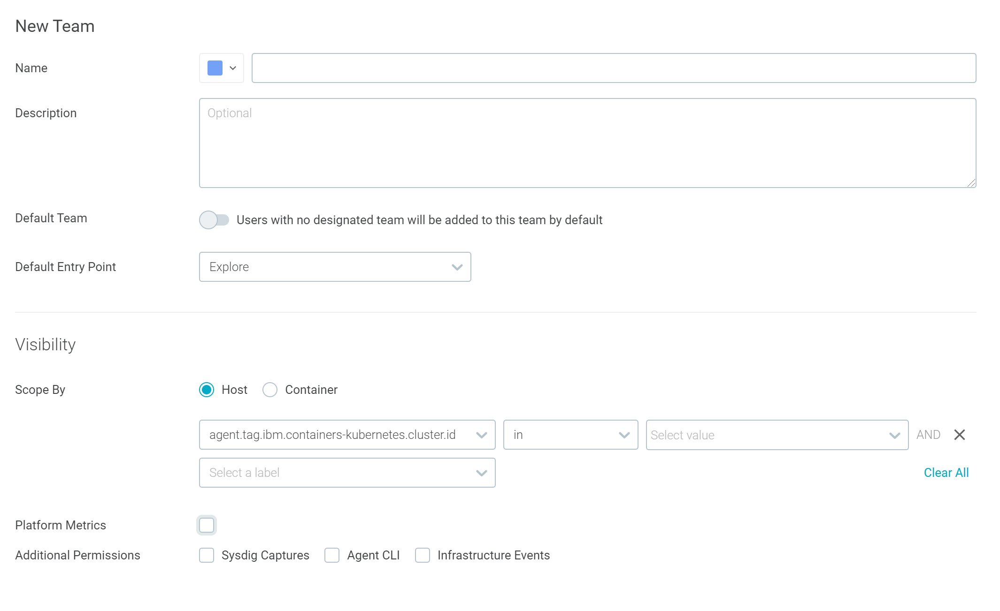

---

copyright:
  years:  2018, 2021
lastupdated: "2021-03-28"

keywords: IBM Cloud, monitoring, teams

subcollection: Monitoring-with-Sysdig

---

{:new_window: target="_blank"}
{:shortdesc: .shortdesc}
{:screen: .screen}
{:pre: .pre}
{:table: .aria-labeledby="caption"}
{:codeblock: .codeblock}
{:tip: .tip}
{:download: .download}
{:important: .important}
{:note: .note}
{:external: target="_blank" .external}

# Working with teams
{: #teams}

You can use teams to add another dimension of control on the data that is available through a monitoring instance on top of platform and service access controls. A user with the **manager** service access role for an {{site.data.keyword.mon_full_notm}} instance can create, delete, add members, and change the scope of teams in that instance. Once a team is created, an admin can add a user to it through {{site.data.keyword.iamlong}} (IAM).
{:shortdesc} 

In the world of microservices, it is becoming harder to track down valuable metrics and ensure that no sensitive data is exposed. By using teams, administrators can apply a fine grain control on resources. Consider the following information when you work with teams:
* You can create 1 or more teams in a monitoring instance.
* You can specify what resources and metrics are visible for users that are granted IAM permissions to work in the team. 
* You can enhance the users experience by customizing the initial dashboard that users in a team get when they launch the web UI.  

These instructions assume that you have provisioned a monitoring service instance on {{site.data.keyword.cloud_notm}}.
{: note}

## Assigning a user to a team
{: #teams_assign}

To add a user to a team, complete the following steps:
1. Check that you have the **administrator** platform role to work with the monitoring service or with a specific instance. 
2. Define a team level IAM policy for the user. For more information, see [Granting permissions to work in a team](/docs/Monitoring-with-Sysdig?topic=Monitoring-with-Sysdig-iam_grant_team).

When the policy is defined, the user is added to the list of users that have access to work with resources configured for a team.

## Creating a team
{: #teams_create}

You must have **manager** role to create a team in a monitoring instance.

An administrator or a manager of an {{site.data.keyword.mon_full_notm}} instance must switch to the *Monitor Operations* team before he can create teams and manage existing teams.
{: note}

Complete the following steps to create a team:

1. [Launch the web UI](/docs/Monitoring-with-Sysdig?topic=Monitoring-with-Sysdig-launch#launch). 
    
2. From the *Selector* button in the navigation bar, select **Monitor Operations**. Then, choose **Settings**.

3. Select **Teams**. The list of existing teams is displayed.

4. Click **Add Team**. The team configuration page is displayed.

5. Configure the team details. 

    * Choose a color.

    * Enter the name of the team

    * [Optional] Enter a description for this team.

    * [Optional] Set the **Default team** parameter if you want this team to become the default team for new users.

    * Set the **Default Entry Point** to specify the view in the web UI that opens every time a user logs in. Valid entrypoints are: *Explore* view, *Dashboards* view, *Events* view, *Alerts* view, and *Settings* view. By default, the *Explore* view is set.

6. Configure the team scope. 

    * [Optional] Set **Scope by** to specify the level of data that members of the team have access to. Valid values are *host* and *container*. 
    
        If the parameter is set to *Host*, members can see all Host-level and Container-level information. 
        
        If the parameter is set to *Container*, members can see only Container-level information.

    * Set the **Scope** to limit what data users can see. You can set one or more conditions by specifying expressions for metrics. 
    
        By default, the scope is set to *everywhere*.
	
    * [Optional] Enable or disable **Sysdig captures**. Check this box to allow this team to take Sysdig Captures. 
    
        Capture files will only be visible to members of this team. 
        
        Captures include detailed information from every container on a host, regardless of the team’s scope.

    * [Optional] Enable or disable **Infrastructure Events**. Check this box to allow members to view all custom infrastructure events from every user and monitoring agent. When is not checked, users can see infrastructure events that are sent specifically to this team. 

## Changing the scope of a team
{: #teams_scope}

You must have **manager** role to change the scope of a team in a monitoring instance.

To change the scope of the data that is visible to members of a team, complete the following steps: 

1. [Launch the web UI](/docs/Monitoring-with-Sysdig?topic=Monitoring-with-Sysdig-launch#launch). 
    
2. From the *Selector* button in the navigation bar, select **Monitor Operations**. Then, choose **Settings**.

3. Select **Teams**. The list of existing teams is displayed.

4. Identify the team and select it. The details of the team are displayed.

5. Change configuration details in the *Visibility* section.

6. Click **Save**. 

## Deleting a team
{: #teams_delete}

You must have **manager** role to delete a team in a monitoring instance.

Complete the following steps to delete a team:

The default team, **Monitor Operations**, cannot be deleted. 
{: note}

1. Launch the web UI. For more information on how to launch the Web UI, see [Navigating to the Web UI](/docs/Monitoring-with-Sysdig?topic=Monitoring-with-Sysdig-launch#launch). 
    
2. From the *Selector* button in the navigation bar, select **Monitor Operations**. Then, choose **Settings**.

3. Select **Teams**. The list of existing teams is displayed.

4. Identify the team that you want to delete and select it. The details of the team are displayed.

5. Click **Delete team**.

When you delete a team, users that only belong to this team will be moved to the default team.
{: important}

