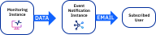
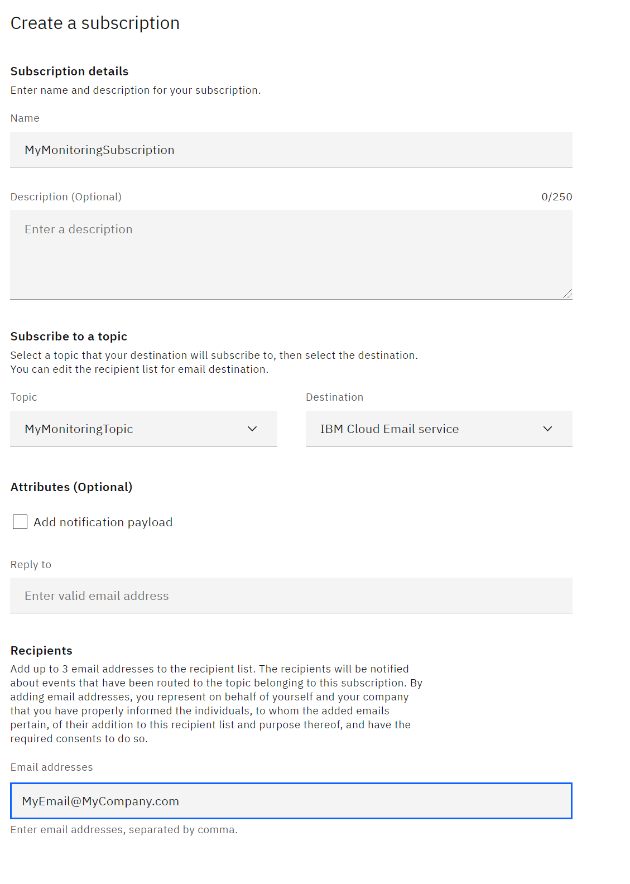
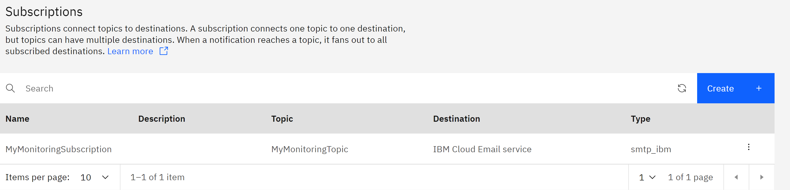

---

copyright:
   years: 2020
lastupdated: "2021-12-17"

keywords: IBM Cloud, monitoring, alerts, event notification

subcollection: monitoring

content-type: tutorial
services: event-notifications, monitoring
account-plan: lite
completion-time: 1h

---

{{site.data.keyword.attribute-definition-list}}

# Sending email notifications to {{site.data.keyword.en_full_notm}}
{: #tutorial-en}
{: toc-content-type="tutorial"}
{: toc-services="event-notifications, monitoring"}
{: toc-completion-time="1h"}

In this tutorial, you learn how to set up {{site.data.keyword.mon_full}} to send alert notifications to {{site.data.keyword.en_full_notm}}. For this tutorial {{site.data.keyword.en_full_notm}} is configured to send email notifications to subscribers.
{: shortdesc}

{: caption="Figure 1. Data flow for this tutorial" caption-side="bottom"}

In this tutorial you will configure the following flow:

1. An alert is raised in {{site.data.keyword.mon_full_notm}}.
2. {{site.data.keyword.mon_full_notm}} sends a notification to {{site.data.keyword.en_full_notm}}.
3. {{site.data.keyword.en_full_notm}} creates an email and sends the email to the subscribed user.

{{site.data.content.en-prereqs}}

{{site.data.content.en-login}}

{{site.data.content.en-create-instance}}

{{site.data.content.en-permissions}}

{{site.data.content.en-notification}}

{{site.data.content.en-topic}}

## Create an {{site.data.keyword.en_full_notm}} destination
{: #en-destination}
{: step}

In this step you will make sure that an email destination exists where notifications will be forwarded.

1. Click **Destinations**. 
2. Notice in the **Destinations** list that, by default, there is an *IBM Cloud Email service* defined.  You do not need to do anything else to configure an email destination.

   If you wanted to add a webhook as a destination, you would click **Add** and provide the appropriate information in the **Add a destination** panel.
   {: note}

## Create an {{site.data.keyword.en_full_notm}} email subscription
{: #en-subscription}
{: step}

In this step you will configure who will receive an email when a notification is processed.

1. Click **Subscriptions**.
2. Click **Create**. The **Create a subscription** panel opens.
3. In the **Create a subscription** panel enter the following:
    
    * Enter the **Name** for your subscription.  For example, `MyMonitoringSubscription`.
    * For **Topic** select the topic you created.  For example, `MyMonitoringTopic`.
    * For **Destination** select `IBM Cloud Email service`.
    * For **Recipients** enter a valid email address, for example, `MyEmail@MyCompany.com`

    {: caption="Figure 5. Create subscription" caption-side="bottom"}

4. Click **Create**.  Your subscription will be added to the **Subscriptions** list.

    {: caption="Figure 5. Subscriptions list" caption-side="bottom"}

{{site.data.content.en-mon-notification}}

## Next steps
{: #en-next-steps}

You should start receiving email notifications at the email address that you configured whenever the criteria defined in both {{site.data.keyword.mon_full_notm}} and {{site.data.keyword.en_full_notm}} match.

